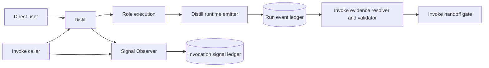
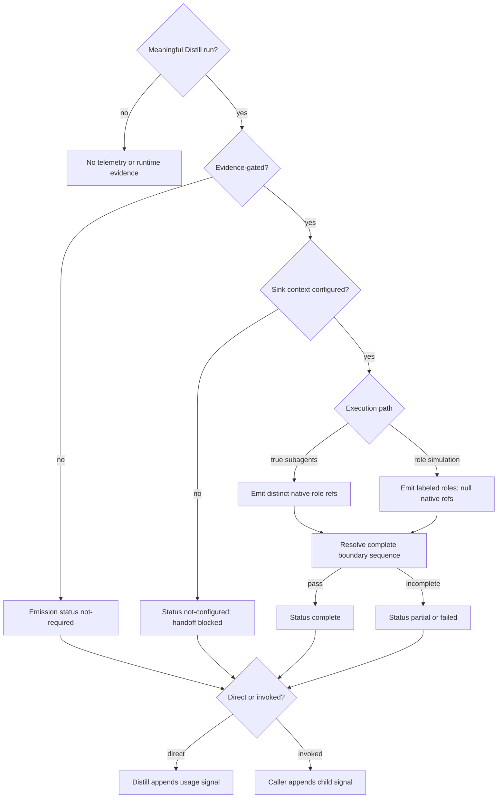

# Design: Distill Runtime-Event Emission

## Design Intent

Add a producer-side runtime boundary to Distill without moving the accepted
Invoke evidence backend or conflating role/process evidence with usage
telemetry. The design is additive: existing Distill behavior remains the
semantic source, while deterministic helpers make execution and observation
states explicit.

## Smallest Coherent Architecture Unit

> A Distill-owned emitter writes one accepted runtime event at each existing
> role/process boundary and reports emission status at closeout, while the
> existing Invoke validator remains the only handoff authority.

The emitter, direct observer, documentation, and mirror projection are child
mechanisms of this rule.

## 1. Context View

Direct Distill owns its usage-signal append. Invoke owns the child signal when
it called Distill. Both signal routes remain separate from the event ledger.

## 2. High-Level Structure View

| Component | Responsibility | Explicit Non-Authority |
| --- | --- | --- |
| Distill skill contract | Declares emission boundaries, closeout status, and direct telemetry ownership | Does not validate handoff evidence. |
| Distill runtime emitter | Validates and appends one event against caller-supplied accepted schema/ledger context | Does not derive verdict or mutation readiness. |
| Direct observer helper | Validates a direct Distill envelope and delegates to Signal Observer | Does not append invoked child signals. |
| Invoke evidence backend | Resolves event sequence and derives validation result | Does not change Distill role policy. |
| Signal Observer | Deduplicates and stores invocation summaries | Does not replace runtime events or validator results. |
| Bootstrap projection | Copies accepted canonical Distill files into runtime profiles | Does not create authority or accept lifecycle changes. |

## 3. Low-Level Component View

### Canonical Distill surfaces

- `arcanum/arcana/distill/SKILL.md`
  - declares evidence-gated emission behavior;
  - declares direct versus invoked telemetry ownership;
  - adds evidence-emission and telemetry closeout fields.
- `arcanum/arcana/distill/scripts/emit-runtime-event.py`
  - accepts event, schema, ledger, and expected-ledger digest paths;
  - validates the accepted event shape;
  - performs an append-only optimistic-digest write;
  - returns event/run/path/status evidence only.
- `arcanum/arcana/distill/scripts/observe-direct-invocation.sh`
  - requires Distill identity and no lineage;
  - validates evidence-emission status;
  - delegates exactly-once append to the generic observer.
- `arcanum/arcana/distill/templates/usage-telemetry.md`
  - defines direct and invoked signal fields and status meanings.

### Existing consumer surfaces retained in place

- `arcanum/spells/invoke/schemas/distill-runtime-event.schema.json`
- `arcanum/spells/invoke/development/distill_runtime_events.py`
- `arcanum/spells/invoke/development/distill_semantic_validator.py`
- `arcanum/spells/invoke/scripts/observe-distill-invocation.sh`

The new emitter consumes the accepted schema path supplied by the evidence
context. It does not copy, move, or redefine the schema.

## 4. Workflow Process View

1. Distill confirms intent, target, artifact, mode, and finite budget exactly as
   today.
2. The run determines whether an accepted evidence context was supplied.
3. If evidence is not required, Distill records `not-required` and continues
   normal role execution.
4. If evidence is required but the schema/ledger context is absent, Distill
   records `not-configured`; the conceptual run may still close, but the
   evidence-gated handoff remains blocked.
5. The runtime selects `true_subagent` or `role_simulation` under the existing
   role policy.
6. At each existing boundary, the runtime submits one event to the emitter.
7. The emitter validates and appends or returns a deterministic failure.
8. Closeout derives evidence-emission status:
   - `complete`: all required boundaries appended and resolve;
   - `partial`: at least one event appended but the complete sequence does not
     resolve;
   - `failed`: configured emission appended no usable evidence;
   - `not-required`: run had no evidence gate;
   - `not-configured`: evidence was required but no sink contract was usable.
9. Direct Distill asks the direct observer helper to append one usage signal.
   Invoked Distill prepares the child envelope and leaves the append to its
   caller.
10. Invoke resolves evidence and alone derives mutation handoff eligibility.

## 5. Decision Flow View

## 6. Dependency And Interface View

| Boundary | Producer | Consumer | Contract | Failure Behavior |
| --- | --- | --- | --- | --- |
| Distill role boundary → emitter | Distill runtime | emitter | one event object plus accepted schema/ledger context | return deterministic emission failure |
| emitter → event ledger | emitter | Invoke resolver | append-only, same run/path, contiguous sequence, optimistic digest | no write on mismatch |
| event ledger → validator | runtime evidence | Invoke validator | accepted schema and full ordered sequence | block evidence-gated handoff |
| Distill → direct observer | Distill | Signal Observer | direct envelope, no lineage, evidence-emission status | visible telemetry residue |
| Invoke → child observer | Invoke | Signal Observer | child envelope and parent lineage | visible telemetry residue |
| canonical → runtime profiles | bootstrap | Codex/Claude packages | exact projection of selected files | block on parity drift |

## State Model

| State | Entry | Exit | Forbidden Claim |
| --- | --- | --- | --- |
| evidence-not-required | no evidence gate | role execution | complete evidence |
| configured | accepted schema/ledger context exists | emitting or failed | validator pass |
| emitting | first event append succeeds | complete, partial, or failed | mutation readiness |
| complete | full sequence resolves | validation | verdict authority |
| partial | some evidence exists but sequence does not resolve | repair or stop | evidence-ready handoff |
| failed | configured producer yields no usable event evidence | repair or stop | evidence-ready handoff |
| not-configured | evidence required but sink is unavailable | configure or stop | evidence-ready handoff |

## Design Decisions

| ID | Decision | Status | Owner |
| --- | --- | --- | --- |
| DEC-DRE-001 | Distill owns producer timing and helper; Invoke keeps schema, resolver, and handoff authority. | proposed for Sigil Development acceptance | Sigil Development |
| DEC-DRE-002 | Direct and invoked telemetry have one append owner each. | accepted by Invoke design | Distill/Invoke |
| DEC-DRE-003 | Evidence-emission status is additive and non-authoritative. | accepted by Invoke design | Distill |
| DEC-DRE-004 | Both execution paths emit the same boundary sequence but differ in native invocation references. | accepted by Invoke design | Distill runtime |
| DEC-DRE-005 | Runtime mirrors regenerate only after canonical validation. | accepted by Invoke design | bootstrap owner |

## Risks And Guards

| Risk | Guard |
| --- | --- |
| event/telemetry conflation | separate ledgers, fields, helpers, and authority statements |
| duplicate invoked signal | caller-only append and child run-ID dedupe |
| invented simulation agent IDs | schema plus negative fixture |
| same true-subagent identity for both roles | distinct-reference resolver gate |
| producer/consumer drift | validate emitted ledgers with the existing Invoke resolver |
| premature gap closure | close `GAP-DEE-002` only after integrated live-emission evidence |
| semantic drift | focused non-regression assertions for modes, budgets, roles, techniques, and output headings |

## Design Gate

**PASS for planning.** All six views, exact owners, paths, states, interfaces,
failure behavior, and non-regression boundaries are defined. Sigil Development
still owns lifecycle acceptance and implementation.
