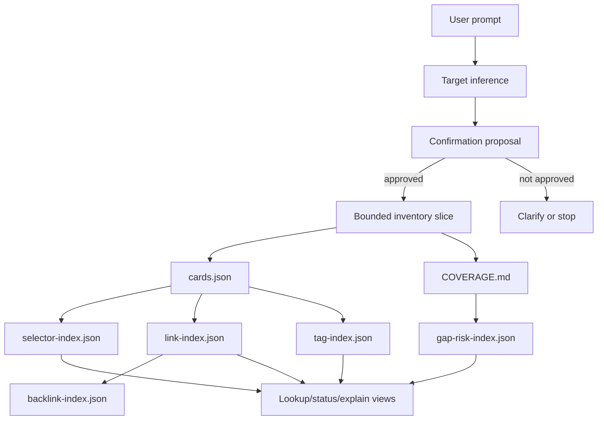

# Architecture Bundle: Inventory Interface, Linking, And Indexing

## Invoke Result

- Mode: refresh
- Spell: invoke
- Canonical ID: invoke
- Scope: library
- Phase status: pass
- Mode contract: `../../../spells/invoke/refresh.md`
- Outputs: `ARCHITECTURE.md`, `IMPLEMENTATION-PLAN.md`, `WORK-PACK.md`, `READINESS.md`, `REFRESH-REPORT.md`
- Mutation mode: apply-approved
- Source signals: user correction, interface-indexing refine synthesis, DomainSpec linking discipline, existing Inventory evidence-card/index work
- Next route: task-session

## Design Intent

Inventory should become a chat-first interface backed by JSON indexes and
Markdown records.

The active development objective is no longer whole-Arcanum inventorization or
whole-`domainspec-core` tagging. Those are archived research inputs. The active
objective is the reusable Inventory interface:

```text
$inventory
  -> infer target
  -> ask confirmation
  -> inventorize a bounded slice
  -> update JSON indexes
  -> write Markdown coverage/explanation
  -> expose lookup/status/explain views
```

## Active Architecture References

| Artifact | Role |
| --- | --- |
| `INTERFACE-ARCHITECTURE.md` | product/interface architecture and default `$inventory` behavior |
| `INDEX-TECHNIQUE-RESEARCH.md` | index techniques to add to Inventory |
| `LINKING-DISCIPLINE.md` | DomainSpec-style linking discipline adapted to Inventory |
| `INTERFACE-REFINE-SYNTHESIS.md` | refined synthesis and next implementation units |

Historical scope-specific research now lives under:

```text
archive/domainspec-core-research-20260605/
archive/whole-arcanum-research-20260605/
```

These archives may be cited as evidence, but they are not active development
roots.

## Context View



## Core Components

| Component | Purpose | Format | Owner |
| --- | --- | --- | --- |
| Auto interface | infer target and ask confirmation | Markdown + transient JSON | Inventory |
| Target proposal | show source anchors, write scope, exclusions, and risks | Markdown | Inventory |
| Evidence cards | source-backed reusable records | JSON | Inventory |
| Coverage report | human explanation, omissions, gaps | Markdown | Inventory |
| Selector index | map source selectors to cards/records | JSON | Inventory |
| Link index | typed read-model links among sources/cards/records | JSON | Inventory |
| Backlink index | generated reverse links | JSON | Inventory |
| Traceability matrix | source -> card -> validation mapping | JSON | Inventory |
| Gap/risk queue | operational residue and next owner | JSON | Inventory |
| Projection index | future HTML/SQLite/vector projections | JSON | Inventory |

## Interface Modes

| Mode | User Shape | Internal Route |
| --- | --- | --- |
| `auto` | `$inventory` or vague ask | infer target -> confirmation |
| `inventorize` | "inventorize X" | confirmation -> ingest/backfill slice |
| `lookup` | "what do we know about X?" | lookup/query |
| `status` | "what is missing?" | index/readiness/lint summary |
| `continue` | "continue inventory" | next backlog/tracker item |
| `explain` | "I am lost" | package state and next safe move |

## Linking Discipline

Inventory adopts DomainSpec's useful minimum:

- stable IDs,
- source-of-truth links,
- controlled typed links,
- traceability rows,
- generated backlinks,
- explicit exclusions,
- owner handoffs for authority questions.

Inventory links are read models. They do not promote ontology relations,
canonical definitions, lifecycle status, runtime authority, or repository
organization decisions.

## JSON And Markdown Rule

| Use JSON For | Use Markdown For |
| --- | --- |
| cards | confirmation proposals |
| indexes | coverage reports |
| link/backlink rows | architecture/design/plan docs |
| query/retrieval fixtures | human-readable lookup summaries |
| traceability rows | handoff explanations |
| gap/risk queue | rationale and omissions |

JSON is the machine index. Markdown is the human interface and review surface.

## Design Decisions

| ID | Decision | Rationale |
| --- | --- | --- |
| D1 | Add default `$inventory` auto interface. | The user should not need internal command modes to inventorize. |
| D2 | Require confirmation before mutation. | Prevents broad accidental ingest and wrong target assumptions. |
| D3 | Use JSON indexes and Markdown records. | Reviewable, git-friendly, shell/JQ-validatable. |
| D4 | Add selector/link/backlink/traceability/gap indexes. | Tags alone are not enough for reliable reuse. |
| D5 | Keep projections read-only. | Future HTML/SQLite/vector surfaces must not become canonical source. |
| D6 | Archive scope-specific research. | Whole-Arcanum and whole-repo research are evidence, not the active objective. |

## Open Risks

| Risk | Impact | Mitigation |
| --- | --- | --- |
| Auto mode infers too broadly | high | confidence field plus confirmation proposal and stop condition |
| Tags become definitions | high | route canonical terms to Definitions Governance |
| Links become ontology | high | non-authority notice and Ontology Vault handoff |
| JSON indexes drift from Markdown | medium | generated backlinks and validation task |
| Interface grows into full UI too early | medium | chat-first views only for MVP |
