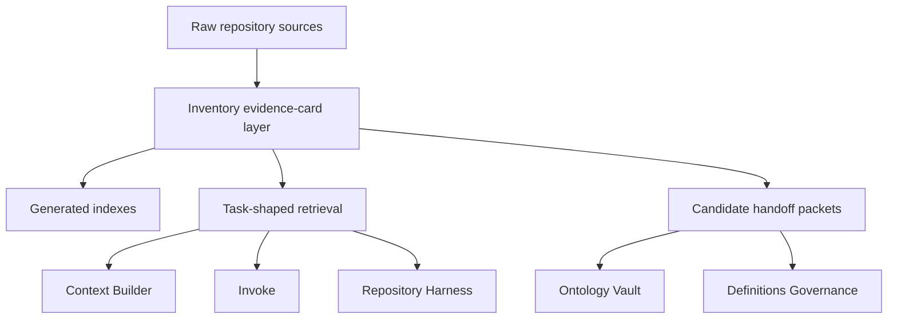
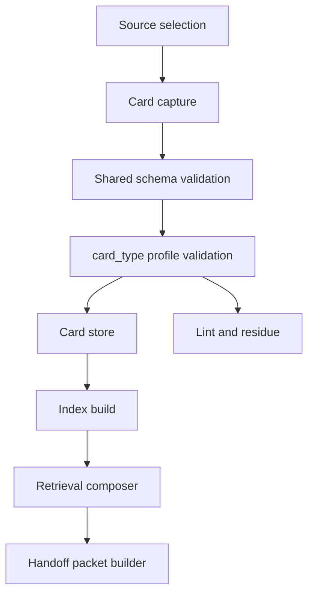
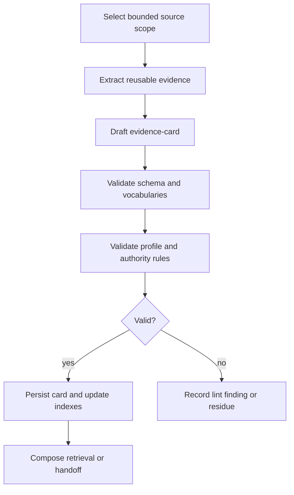
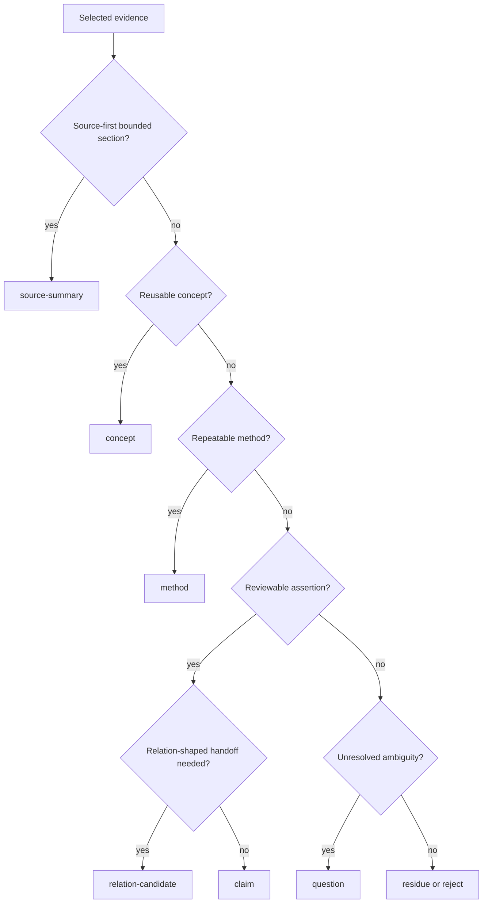

# Architecture Bundle: Inventory Evidence-Card

## Invoke Result

- Mode: design
- Spell: invoke
- Canonical ID: invoke
- Scope: library
- Phase status: pass
- Mode contract: `../../../spells/invoke/design.md`
- Outputs: `ARCHITECTURE.md`, `TEMPLATE-MANIFEST.md`, `GLOSSARY-CONSISTENCY.md`, `DESIGN-TRANSPORT.md`
- Design views: context, high-level structure, low-level components, workflow process, decision flow, dependency interface
- Template/profile selection: Module Formulae architecture profile plus Inventory evidence-card templates
- Implementation layering: `IMPLEMENTATION-LAYERING.md`
- Work-pack: n/a for design mode; executable work-pack provided by plan mode
- Decisions: one canonical `evidence-card`; optional shapes are profiles; downstream packets are projections
- Unresolved gaps: executable validator and command integration deferred
- Next route: plan/task-session

## Design Intent

Inventory gains an evidence-card layer that captures source-backed reusable knowledge as one canonical unit. The architecture preserves raw-source authority, keeps ontology and definition governance downstream, and gives Context Builder/Invoke task-shaped retrieval instead of full wiki dumps.

## Inputs

- `SPEC.md`
- `GLOSSARY.md`
- `CONCEPT-MODEL.md`
- source evidence summarized in `work-pack/shared/SOURCE-CONTRACTS.md`

## 1. Context View

Rules:

- Raw sources remain authority.
- Inventory owns cards, selectors, indexes, lint findings, and handoff projections.
- Ontology Vault owns governed meaning, relations, confidence, branches, and promotion.
- Definitions Governance owns canonical definitions and glossary synchronization.

## 2. High-Level Structure View

## 3. Low-Level Components View

| Component | Purpose | Contract |
| --- | --- | --- |
| Evidence-card schema | Shared record shape. | `CONCEPT-MODEL.md`, `templates/evidence-card-schema.md` |
| Authoring template | Human/agent fillable card. | `templates/evidence-card.md` |
| Validation profiles | Required and type-specific checks. | `templates/evidence-card-lint.md` |
| Index families | Lookup by id, source, tag, type, authority, promotion, handoff, cohort, related, residue, trace. | `templates/evidence-card-index.md` |
| Retrieval composer | Compact task-shaped output. | `FLOWS-POLICIES.md` |
| Handoff builders | Downstream candidate packets. | `INTERFACES.md` |

## 4. Workflow Process View

## 5. Decision Flow View

## 6. Dependency Interface View

| Interface | Producer | Consumer | Contract |
| --- | --- | --- | --- |
| Evidence-card template | Inventory development | Inventory maintainers | Source-backed fillable card. |
| Lookup output | Inventory | Context Builder, Invoke | Selected cards, selectors, authority levels, gaps, excluded matches. |
| Ontology packet | Inventory | Ontology Vault | Candidate claim/relation/contradiction/lesson cards with non-authority notice. |
| Definitions packet | Inventory | Definitions Governance | Candidate term evidence without canonical status. |
| Pilot fixtures | Inventory development | Future validators | Bounded JSON examples for card, index, retrieval, and handoff checks. |

## Design Decisions

| ID | Decision | Rationale |
| --- | --- | --- |
| D1 | Keep one canonical `evidence-card` schema. | Avoids taxonomy sprawl and preserves Distill output. |
| D2 | Use `card_type` profiles. | Allows specific validation without separate storage families. |
| D3 | Add `profile`, `captured`, `trace`, and `residue`. | Supports migration, provenance, auditability, and honest gaps. |
| D4 | Treat handoff packets as read models. | Prevents Inventory from claiming downstream authority. |
| D5 | Pilot with shaped CyberAlchemy sources only. | Validates shape without whole-repo ingest. |

## Open Risks

| Risk ID | Risk | Impact | Mitigation |
| --- | --- | --- | --- |
| R1 | Evidence-card becomes too generic. | medium | Enforce required fields, profiles, and lint rules. |
| R2 | Promotion metadata creates authority confusion. | high | Validate owner/status pairs and require non-authority notices. |
| R3 | Minimal profile becomes a dumping ground. | medium | Require source refs, selection reason, captured metadata, and residue for missing detail. |
| R4 | Trace confidence is mistaken for ontology confidence. | high | State extraction/rule confidence only in schema and docs. |
