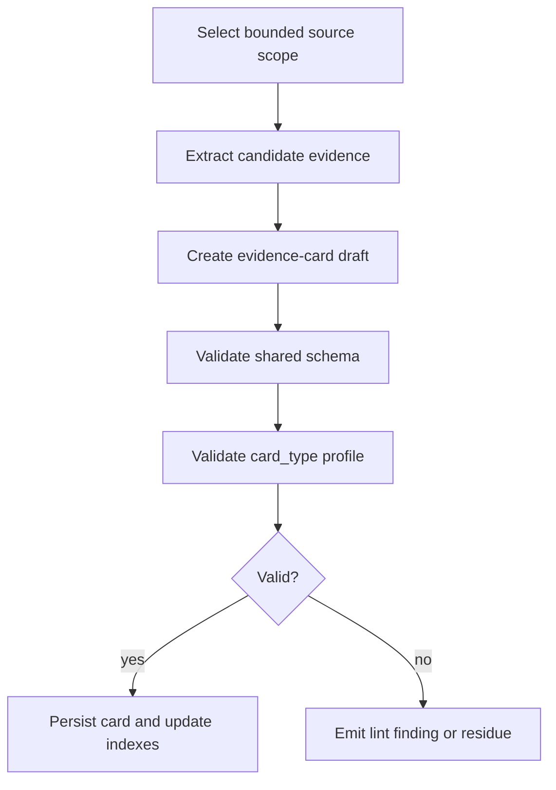
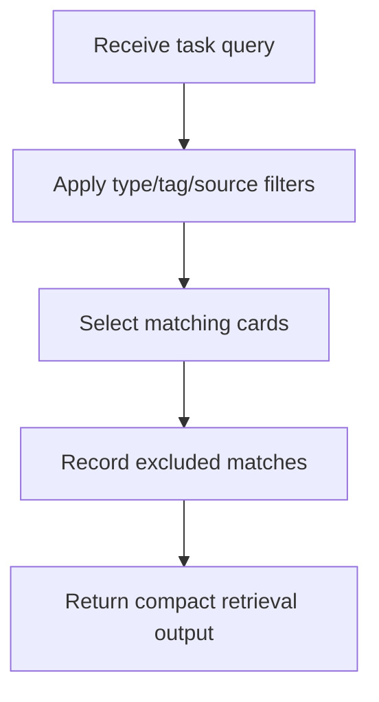

# Flows And Policies: Inventory Evidence-Card

## Flow: SourceToEvidenceCard

Type: Flow

Trigger: explicit ingest, backfill, pilot fixture creation, or refresh from approved evidence.

Orchestrates: CaptureEvidenceCard, ValidateEvidenceCard, update indexes, update log.

Compensation Strategy: reject invalid card and record lint finding or residue.

Idempotency: conditional; stable IDs and source selectors should prevent duplicate cards.

### Steps

### Invariants

| ID | Invariant | Formal Expression |
| --- | --- | --- |
| I1 | Raw sources are read-only. | source mutation forbidden |
| I2 | Every material card claim is source-backed or marked as residue/open question. | claim -> source_ref or residue |
| I3 | Indexes are lookup surfaces, not authority. | index.authority == derived |

## Flow: ComposeRetrieval

Type: Flow

Trigger: lookup, query, context-builder input, invoke input, or repository-harness request.

### Steps

### Output Policy

Retrieval output must include:

- query purpose and filters;
- selected cards with source refs, authority level, selection reason, promotion state, and residue;
- unresolved questions;
- handoff candidates;
- excluded matches with reasons;
- trace notes.

## Flow: BuildHandoffPacket

Type: Flow

Trigger: cards are selected for Ontology Vault, Definitions Governance, Context Builder, Invoke, or Repository Harness.

### Policy

- Handoff packets are read models.
- Packets may recommend downstream review.
- Packets must not claim promotion.
- Ontology packets include claim/relation/contradiction/operational cards when present.
- Definitions packets include concept and claim cards with term evidence.
- Both packet families include non-authority notices and source refs.

## Policy: OwnerStatusValidation

Type: Policy

Applies To: CaptureEvidenceCard and ValidateEvidenceCard.

| Condition | Selected Behavior | Notes |
| --- | --- | --- |
| `promotion_status: captured` with `promotion_owner: none` | valid | Initial capture can have no downstream owner. |
| `promotion_status: candidate` with explicit downstream owner | valid | Candidate handoff target is known. |
| `promotion_status` in promoted/rejected/superseded/blocked with owner none | invalid | Terminal or decision states need an owner. |
| downstream owner exists and governed artifact exists | require `governed_ref` | Do not invent refs from similar text. |

## Policy: PilotBoundedness

The CyberAlchemy pilot may use only the four source files listed in `work-pack/shared/SOURCE-CONTRACTS.md`. It validates shape; it is not production ingest.
