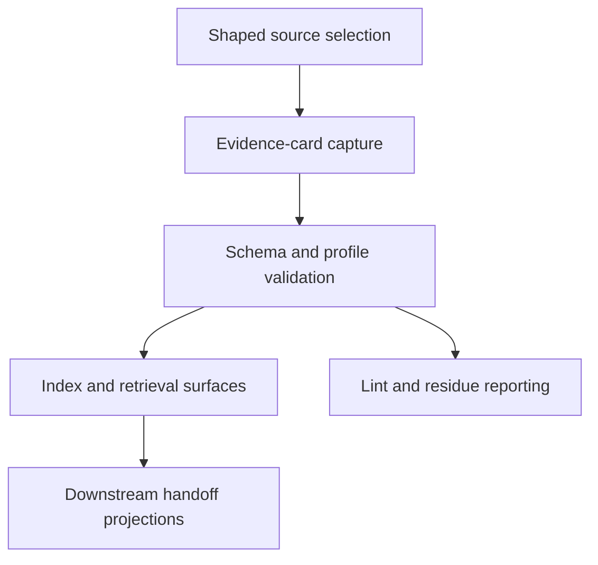

# Inventory Evidence-Card Development Package

## Invoke Result

- Mode: define
- Spell: invoke
- Canonical ID: invoke
- Scope: library
- Phase status: pass
- Mode contract: `../../../spells/invoke/define.md`
- Outputs: `SPEC.md`, `GLOSSARY.md`, `IMPLEMENTATION-LAYERING.md`, `DEFINE-TRANSPORT.md`
- Template selection: Module Formulae bundle plus standalone work-pack companions
- Decisions: refresh the development package as a complete artifact set; remove old collapsed/refinement files
- Unresolved gaps: executable validator language and command integration remain deferred
- Next route: invoke design/plan artifacts in this package, then task-session by SWU

## Mission

Inventory Evidence-Card adds a reusable knowledge-shape layer to the Inventory sigil. It lets Inventory capture source-backed evidence as one canonical `evidence-card` unit, index cards for task-shaped retrieval, lint authority boundaries, and prepare downstream handoff packets without promoting ontology relations or canonical definitions.

## Ownership Boundary

- Owns: evidence-card schema contracts, authoring templates, lint rules, index and retrieval conventions, bounded pilot fixtures, and Inventory-mode documentation updates.
- Does Not Own: Ontology Vault promotion, canonical Definitions Governance terms, CyberAlchemy production ingest, command-runtime integration, or source document mutation.

## Capability Map

## Capabilities

| Capability | Outcome | Key Contracts | Detail |
| --- | --- | --- | --- |
| Evidence-card schema | One canonical record shape for reusable evidence. | `CONCEPT-MODEL.md`, `templates/evidence-card-schema.md` | Required fields, profiles, controlled vocabularies, selectors, trace, and residue. |
| Evidence-card authoring | Fillable template for humans and agents. | `templates/evidence-card.md` | Full and minimal profile guidance. |
| Evidence-card lint | Reviewable validation contract before runtime code. | `templates/evidence-card-lint.md`, `OPERATIONS.md` | Required fields, enum values, owner/status pairs, selector stability, non-authority checks. |
| Index and retrieval | Task-shaped lookup surfaces. | `templates/evidence-card-index.md`, `FLOWS-POLICIES.md` | Selected cards, excluded matches, trace notes, unresolved questions, handoff candidates. |
| Handoff projection | Candidate packets for downstream owners. | `INTERFACES.md`, `ARCHITECTURE.md` | Ontology and Definitions packets preserve source refs and non-authority notices. |
| Development execution | Split, SWU-ready implementation package. | `WORK-PACK.md`, `EXECUTION-PACK.md`, `work-pack/` | One-SWU execution from schema through readiness. |

## Concept Index

| Concept | ID | Type | Source |
| --- | --- | --- | --- |
| EvidenceCard | inventory.EvidenceCard | Record | `CONCEPT-MODEL.md` |
| EvidenceCardProfile | inventory.EvidenceCardProfile | Enumeration | `CONCEPT-MODEL.md` |
| SourceRef | inventory.SourceRef | Value Type | `CONCEPT-MODEL.md` |
| TraceEntry | inventory.TraceEntry | Value Type | `CONCEPT-MODEL.md` |
| Residue | inventory.Residue | Value Type | `CONCEPT-MODEL.md` |
| ValidateEvidenceCard | inventory.ValidateEvidenceCard | Action | `OPERATIONS.md` |
| ComposeRetrieval | inventory.ComposeRetrieval | Flow | `FLOWS-POLICIES.md` |
| BuildHandoffPacket | inventory.BuildHandoffPacket | Flow | `FLOWS-POLICIES.md` |

## Relationship Map

| From | Edge | To | Evidence | Notes |
| --- | --- | --- | --- | --- |
| inventory.EvidenceCard | cites | inventory.SourceRef | `CONCEPT-MODEL.md` | Every material card requires source refs. |
| inventory.ValidateEvidenceCard | enforces | inventory.EvidenceCard | `OPERATIONS.md` | Static lint precedes runtime validator work. |
| inventory.ComposeRetrieval | reads | inventory.EvidenceCard | `FLOWS-POLICIES.md` | Retrieval is task-shaped. |
| inventory.BuildHandoffPacket | projects | inventory.EvidenceCard | `INTERFACES.md` | Projection is not downstream promotion. |

## Supporting Contracts

| Contract Document | Purpose |
| --- | --- |
| `GLOSSARY.md` | Candidate terminology and ownership boundaries. |
| `CONCEPT-MODEL.md` | Structural card records, value types, and enumerations. |
| `OPERATIONS.md` | Actions and read views for validation, capture, lookup, and lint. |
| `FLOWS-POLICIES.md` | Source-to-card, retrieval, handoff, and drift policies. |
| `INTERFACES.md` | Template outputs and downstream packet shapes. |
| `ARCHITECTURE.md` | Six-view design bundle. |
| `TEMPLATE-MANIFEST.md` | Development template inventory and target production paths. |
| `IMPLEMENTATION-PLAN.md` | Delivery slices and task decomposition. |
| `OBSERVABILITY.md` | Signals and review telemetry for future runs. |
| `WORK-PACK.md` | Canonical executable plan. |

## External Dependencies

| Capability | Depends On | Via | Why |
| --- | --- | --- | --- |
| Context Builder | selected evidence and task obligations | lookup output | Downstream context packs need selector-level evidence. |
| Ontology Vault | candidate relation/claim packets | handoff projection | Ontology owns governed meaning and confidence. |
| Definitions Governance | candidate terms | handoff projection | Definitions owns canonical glossary promotion. |
| CyberAlchemy pilot sources | shaped source selection | fixtures | Pilot validates card shape without production ingest. |

## Change History

| Date | Change | Author |
| --- | --- | --- |
| 2026-05-26 | Complete development package refresh with correct invoke output contracts. | Codex |
