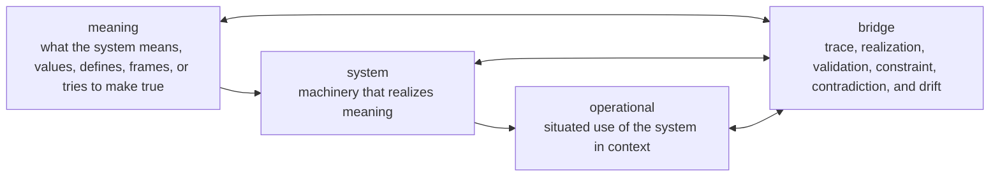

# Branch-Aware Ontology Schema Candidate

Status: exploratory, non-canonical
Date: 2026-05-27
Lifecycle owner: Ontology Vault / Sigil Development
Depends on:

- `BRANCH-AWARE-ONTOLOGY-CANDIDATE.md`
- `BRANCH-NAMING-DISTILL.md`
- `DURABLE-SESSION-CONTEXT.md`

## Purpose

Define a candidate schema for branch-aware ontology entries and relations.

This schema is ontology-owned. It does not mutate Inventory, structured-action-schema, Ontology Vault templates, or any canonical branch conventions. Its job is to make the model concrete enough to validate with Arcanum, CyberAlchemy, DomainSpec, and future-system examples.

## Schema Posture

This is a candidate schema, not a governed schema.

Use it to:

- classify example entries,
- test whether `meaning | system | operational | bridge` works,
- expose missing fields and invalid states,
- prepare a later convention-update or decision-gate packet.

Do not use it to:

- promote ontology truth,
- require Inventory to emit these fields,
- require structured-action-schema to adopt these fields,
- rewrite existing Ontology Vault templates,
- claim `meaning` is canonical before governance review.

## Core Design Choice

The schema uses `meaning` as the candidate first branch label.

Reason:

- `proposition` is too narrow for definitions, methods, types, values, and problem frames.
- `business` is too local or commercial as a global branch label.
- `meaning` works if bounded to the meaning the system exists to preserve, satisfy, interpret, or make actionable.

Candidate discriminator:

```text
meaning | system | operational | bridge
```

Allowed local aliases:

```text
business | domain | intent | proposition | philosophy
```

## Conceptual Model



## Entry Schema

### Minimal YAML Shape

```yaml
id: string
title: string
entry_type: string
status: hypothesis | candidate | reviewed | promoted | deprecated | contradicted
owner: string
updated_at: YYYY-MM-DD

branch_context:
  primary: meaning | system | operational | bridge
  local_alias: business | domain | intent | proposition | philosophy | null
  role_family: meaning | mechanism | context | relation | evidence | governance | other
  local_role: string
  system_subject: string
  operating_context: string | null
  bridge_scope: string | null
  rationale: string

scope:
  applies_to:
    - string
  excludes:
    - string
  validity_scope: string
  expiry_condition: string

content:
  claim: string
  definition: string | null
  purpose: string | null
  examples:
    - string
  non_examples:
    - string

evidence:
  raw_sources:
    - ref: string
      selector: string | null
      role: source | counterevidence | context | prior-decision
  inventory_refs:
    - ref: string
      selector: string | null
      non_authority_notice: true
  validation_refs:
    - ref: string
      result: pass | flag | block | unknown

confidence:
  evidence: low | medium | high | unknown
  commitment: low | medium | high | unknown
  bridge_alignment: low | medium | high | not_applicable | unknown
  scope: low | medium | high | unknown
  rationale: string

edges:
  - type: realized_by | depends_on | constrained_by | observed_by | tested_by | drifts_from | traced_to | operationalizes | contradicted_by | promotes_to | specializes | generalizes_to | supersedes | related_to
    target: string
    target_branch: meaning | system | operational | bridge | unknown
    evidence_refs:
      - string
    status: hypothesis | candidate | reviewed | promoted | deprecated | contradicted
    rationale: string

governance:
  promotion_state: hypothesis | candidate | reviewed | promoted | deprecated | contradicted
  next_gate: none | evidence-review | premise-review | bridge-validation | decision-gate | convention-update | lifecycle-owner-review
  mutation_allowed: false
  promotion_blockers:
    - string
  contradiction_path: string
  circular_authority_check: pass | flag | block | not_applicable
```

### Required Field Rules

All entries require:

- `id`
- `title`
- `status`
- `branch_context.primary`
- `branch_context.system_subject`
- `branch_context.rationale`
- `content.claim`
- `confidence.evidence`
- `confidence.commitment`
- `governance.promotion_state`

Operational entries also require:

- `branch_context.operating_context`
- `scope.validity_scope`
- `scope.expiry_condition`

Bridge entries also require:

- `branch_context.bridge_scope`
- at least one `edges[]` item,
- `confidence.bridge_alignment`,
- evidence from each connected branch, or a blocker naming the evidence gap.

Promoted entries also require:

- at least one raw source or reviewed validation reference,
- no unresolved contradiction unless explicitly accepted by a decision gate,
- `governance.next_gate: none`,
- `governance.circular_authority_check: pass | not_applicable`.

## Branch Context Rules

### Meaning

Use `meaning` when the claim defines what the system means, values, promises, frames, or tries to make true.

Typical local roles:

- `definition`
- `concept`
- `type`
- `method`
- `policy`
- `premise`
- `problem-frame`
- `outcome`
- `value-measure`

Invalid `meaning` classifications:

- a tool merely because the tool is important,
- a runtime event merely because it affects meaning,
- a validation result merely because it supports a claim,
- a bridge relation merely because it mentions intent.

### System

Use `system` when the claim describes machinery that realizes meaning for the system subject.

Typical local roles:

- `component`
- `capability`
- `tool`
- `sigil`
- `spell`
- `schema`
- `template`
- `command-surface`
- `validation-surface`
- `telemetry-surface`
- `runtime-adapter`

Invalid `system` classifications:

- a definition of why the system exists,
- a situated use pattern from one project,
- a relation asserting alignment or drift.

### Operational

Use `operational` when the claim describes situated use of a system in a concrete context.

Typical local roles:

- `application-context`
- `execution-context`
- `route-policy`
- `invocation-pattern`
- `context-solution`
- `operational-lesson`
- `failure-mode`
- `maintenance-proposal`
- `evaluation-signal`
- `customization`
- `self-build-context`

Invalid `operational` classifications:

- a system capability by default,
- any action-shaped record without an operating context,
- a self-application claim that cites itself as authority,
- user workflow knowledge without privacy and scope boundaries.

### Bridge

Use `bridge` when the claim connects branches through traceability, realization, validation, constraint, contradiction, or drift.

Typical local roles:

- `traceability-link`
- `realization-map`
- `operationalization-map`
- `drift-finding`
- `test-coverage-link`
- `observability-link`
- `constraint-mapping`
- `evidence-gap`
- `contradiction`

Invalid `bridge` classifications:

- a simple hyperlink without a relation claim,
- one-sided alignment with no missing-evidence marker,
- test or telemetry evidence treated as meaning authority.

## Relation Schema

Relations can appear inside an entry's `edges[]`, or later become standalone bridge entries if they carry enough meaning, confidence, contradiction, or promotion weight.

### Edge Ownership

| Edge Type | Ontology-owned when | Can remain schema/evidence hint when |
| --- | --- | --- |
| `realized_by` | It asserts governed realization between meaning and system. | It is an unreviewed implementation note. |
| `operationalizes` | It asserts a governed application of meaning/system in context. | It is a route or run observation. |
| `drifts_from` | It preserves expected claim and observed behavior. | It is an unresolved telemetry signal. |
| `tested_by` | It asserts validation coverage. | It only points to a test file. |
| `observed_by` | It asserts measurement relevance. | It only points to a log or metric. |
| `contradicted_by` | It changes confidence or promotion status. | It is a raw counterexample candidate. |
| `promotes_to` | It records a promotion gate result. | It is a proposed next step. |

### Standalone Bridge Entry Trigger

Create a standalone bridge entry when:

- the relation affects promotion,
- the relation is contested,
- the relation spans more than two entries,
- the relation captures drift,
- the relation identifies a reusable evidence gap,
- the relation needs its own confidence or maintenance state.

## Validation Rules

### V1: Branch Value

`branch_context.primary` must be one of:

```text
meaning | system | operational | bridge
```

### V2: Local Alias

`branch_context.local_alias` may be null or one of:

```text
business | domain | intent | proposition | philosophy
```

Local aliases cannot override the primary branch meaning.

### V3: Operational Context

If `primary: operational`, then `operating_context`, `validity_scope`, and `expiry_condition` are required.

### V4: Bridge Evidence

If `primary: bridge`, then the entry must either:

- cite evidence from each connected branch, or
- set `local_role: evidence-gap` and name the missing side.

### V5: Inventory Non-Authority

Inventory references are allowed as evidence pointers, but every `inventory_refs[]` item must preserve `non_authority_notice: true`.

### V6: Structured Action Boundary

No field in this schema requires structured-action-schema adoption.

Action records may later carry branch hints, but Ontology Vault decides ontology branch context.

### V7: Self-Application

If `system_subject` and `operating_context` refer to the same system, then:

- `branch_context.primary` should usually be `operational` or `bridge`,
- `governance.circular_authority_check` must be `pass`, `flag`, or `block`,
- promotion is blocked unless independent evidence or explicit governance review exists.

### V8: Confidence Split

`confidence.evidence` and `confidence.commitment` must both be present. They must not be collapsed into one field.

### V9: Promotion Boundary

`status: promoted` requires:

- `governance.promotion_state: promoted`,
- no open promotion blockers,
- a named owner,
- a reviewed evidence or decision record.

### V10: Meaning Catch-All Guard

Do not classify an entry as `meaning` merely because it has semantic content.

Use `meaning` only when the claim defines or governs what the system means, values, promises, frames, or tries to make true.

## Example Entries

### Meaning Entry

```yaml
id: arcanum.meaning.branch_context_discriminator
title: Branch Context Discriminator
entry_type: MethodPrimitive
status: candidate
owner: Ontology Vault
updated_at: 2026-05-27
branch_context:
  primary: meaning
  local_alias: null
  role_family: meaning
  local_role: method
  system_subject: Arcanum
  operating_context: null
  bridge_scope: null
  rationale: Defines how Arcanum classifies ontology claims by branch.
scope:
  applies_to:
    - branch-aware ontology classification
  excludes:
    - Inventory authority
    - structured-action-schema mutation
  validity_scope: exploratory ontology development
  expiry_condition: governed branch convention replaces candidate model
content:
  claim: Branch context should classify claims by meaning, system, operational, or bridge role in context.
  definition: A discriminator for routing ontology claims to the branch that owns their primary meaning.
  purpose: Prevent misclassification between system components and situated operation.
  examples:
    - Spellcraft as Arcanum capability is system.
    - Spellcraft applied in CyberAlchemy is operational.
  non_examples:
    - A raw Inventory tag promoted as ontology truth.
evidence:
  raw_sources:
    - ref: arcana/inventory/development/ONTOLOGY-BRANCH-MODEL-HANDOFF.md
      selector: null
      role: source
  inventory_refs: []
  validation_refs: []
confidence:
  evidence: medium
  commitment: low
  bridge_alignment: not_applicable
  scope: medium
  rationale: Source handoff supports the discriminator, but governance has not promoted it.
edges: []
governance:
  promotion_state: candidate
  next_gate: decision-gate
  mutation_allowed: false
  promotion_blockers:
    - global branch labels are unresolved
  contradiction_path: Record competing branch labels and route to decision gate.
  circular_authority_check: not_applicable
```

### Operational Entry

```yaml
id: arcanum.operational.self_build_ontology_development
title: Arcanum Self-Build Ontology Development
entry_type: OperationalContext
status: candidate
owner: Ontology Vault
updated_at: 2026-05-27
branch_context:
  primary: operational
  local_alias: null
  role_family: context
  local_role: self-build-context
  system_subject: Arcanum
  operating_context: Arcanum-self-build
  bridge_scope: null
  rationale: Arcanum is being used to develop Arcanum's own ontology model.
scope:
  applies_to:
    - ontology-vault development thread
  excludes:
    - automatic promotion of ontology conventions
  validity_scope: current ontology development package
  expiry_condition: branch-aware ontology convention is accepted or rejected
content:
  claim: Self-build ontology work is operational until promoted through governance.
  definition: null
  purpose: Prevent circular authority while allowing recursive development.
  examples:
    - This schema candidate.
  non_examples:
    - Ontology Vault declaring itself canonical without review.
evidence:
  raw_sources:
    - ref: arcana/ontology-vault/development/DURABLE-SESSION-CONTEXT.md
      selector: null
      role: context
  inventory_refs: []
  validation_refs: []
confidence:
  evidence: medium
  commitment: medium
  bridge_alignment: not_applicable
  scope: high
  rationale: Session boundary explicitly scopes this work as ontology development.
edges: []
governance:
  promotion_state: candidate
  next_gate: bridge-validation
  mutation_allowed: false
  promotion_blockers:
    - self-application examples need validation
  contradiction_path: Record circular-authority failures as bridge drift or governance blockers.
  circular_authority_check: flag
```

### Bridge Entry

```yaml
id: arcanum.bridge.inventory_to_ontology_branch_handoff
title: Inventory To Ontology Branch Handoff
entry_type: BridgeRelation
status: candidate
owner: Ontology Vault
updated_at: 2026-05-27
branch_context:
  primary: bridge
  local_alias: null
  role_family: relation
  local_role: traceability-link
  system_subject: Arcanum
  operating_context: ontology-vault development
  bridge_scope: Inventory evidence capture to Ontology Vault branch governance
  rationale: Connects Inventory's source-backed handoff to Ontology Vault's branch model authority.
scope:
  applies_to:
    - ontology handoffs from Inventory
  excludes:
    - Inventory promotion authority
  validity_scope: branch-aware ontology candidate work
  expiry_condition: governed handoff schema replaces this candidate
content:
  claim: Inventory may propose branch hints, but Ontology Vault decides branch context.
  definition: null
  purpose: Preserve evidence handoff without authority leakage.
  examples:
    - Inventory handoff provides branch_hint.
  non_examples:
    - Inventory branch_hint promoted directly as governed ontology.
evidence:
  raw_sources:
    - ref: arcana/inventory/development/ONTOLOGY-BRANCH-MODEL-HANDOFF.md
      selector: Boundary With Inventory
      role: source
  inventory_refs: []
  validation_refs: []
confidence:
  evidence: high
  commitment: medium
  bridge_alignment: medium
  scope: medium
  rationale: The handoff is explicit, but schema validation has not been run.
edges:
  - type: traced_to
    target: arcana/inventory/development/ONTOLOGY-BRANCH-MODEL-HANDOFF.md
    target_branch: bridge
    evidence_refs:
      - arcana/inventory/development/ONTOLOGY-BRANCH-MODEL-HANDOFF.md
    status: candidate
    rationale: Source handoff establishes boundary between Inventory and Ontology Vault.
governance:
  promotion_state: candidate
  next_gate: bridge-validation
  mutation_allowed: false
  promotion_blockers:
    - candidate schema not validated against example set
  contradiction_path: If Inventory starts owning branch context, record authority drift.
  circular_authority_check: not_applicable
```

## Template Implications

If this candidate survives validation, likely template changes are:

- add `branch-aware-ontology-entry.md`,
- add `branch-aware-bridge-entry.md`,
- revise `business-ontology-map.md` toward either `meaning-ontology-map.md` or a branch-neutral template,
- revise `business-system-bridge.md` toward a multi-branch bridge template,
- add validation examples for meaning/system/operational/bridge classification.

No template is changed by this candidate.

## Open Decisions

| Decision | Candidate stance | Needed route |
| --- | --- | --- |
| Is `meaning` the global first-branch label? | Use in candidate schema. | decision-gate |
| Should existing `business` templates be renamed? | Not yet. | convention-update |
| Should entry schema be YAML-only, Markdown sections, or both? | YAML frontmatter plus Markdown body likely best. | ontology-vault validate |
| Should relations be embedded or standalone? | Both, with standalone trigger rules. | example validation |
| Should JSON Schema be generated later? | Yes, after examples stabilize. | implementation-layering |
| Should structured-action-schema mirror any field? | Not now. | separate handoff |

## Validation Plan

Use this schema against a small example set:

1. Arcanum meaning entry: branch-context discriminator.
2. Arcanum system entry: Invoke or Ontology Vault.
3. Arcanum operational entry: Arcanum-self-build ontology development.
4. Arcanum bridge entry: Inventory-to-Ontology handoff.
5. CyberAlchemy meaning entry: symmetry pursuit or residue reduction.
6. CyberAlchemy system entry: route ledger or harness.
7. DomainSpec bridge entry: domain rule tested by pipeline behavior.

Record failures as schema gaps, not as forced data edits.

## Next Route

Recommended next route:

```text
ontology-vault validate
```

Validate the candidate schema against the example set before mutating `README.md`, `SKILL.md`, templates, Inventory, or structured-action-schema.
