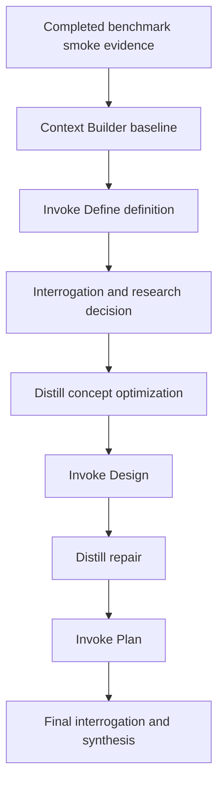

# Benchmark Refine-Distill-Invoke Validation Definition

## Mission

Define a non-mutating validation-authoring target for using `refine`, `distill`, and `invoke` against the completed benchmark smoke-test evidence. The target outcome is an auditable refinement design baseline that proves whether the Arcanum authoring loop can transform existing benchmark evidence into coherent downstream artifacts without changing benchmark implementation files or recomputing scores.

## Ownership Boundary

- Owns: the refinement-run definition, evidence selection, stage-output expectations, non-goals, validation criteria, and downstream route for the current run.
- Does Not Own: benchmark source behavior, fixture contents, smoke-test execution, score generation, canonical Refine/Distill/Invoke contracts, or benchmark work-pack closure state.

## Source Evidence

| Evidence ID | Source | Relevance |
| --- | --- | --- |
| E-001 | `benchmark/development/refinement-runs/20260527T093001Z-benchmark/REFINE-SEED-PROPOSAL.md` | Defines the target, preset, research rule, source request, and validation surface. |
| E-002 | `benchmark/development/refinement-runs/20260527T093001Z-benchmark/context-builder/context-pack.md` | Provides strict context coverage, selected evidence, constraints, known downstream risk, and write scope. |
| E-003 | `benchmark/WORK-PACK.md` | Establishes that the benchmark W0-W3 pilot and TASK-VERIFY closure are complete. |
| E-004 | `benchmark/artifacts/verification-traceability-audit/report.md` | Establishes the completed audit baseline and score-artifact summary without requiring recomputation. |
| E-005 | `benchmark/artifacts/campaign-report-smoke/campaign-report.md` | Establishes completed smoke campaign evidence: 6 runs, 5 pass, 1 fail, 0 infra fail, 0 evidence gaps. |
| E-006 | `.codex/commands/invoke.md` | Defines Invoke's authoring boundary and target artifact provenance requirements. |
| E-007 | `arcana/refine/SKILL.md` and `arcana/refine/REFINEMENT-LOOP.md` | Define the canonical ten-stage Refine loop and local-first research policy. |
| E-008 | `arcana/distill/SKILL.md` | Defines Distill's smallest-coherent-unit optimization boundary. |

## Capability Map

## Capabilities

| Capability | Outcome | Key Contracts | Detail |
| --- | --- | --- | --- |
| Evidence Baseline Selection | Downstream stages use completed benchmark evidence only. | Context pack selected sources, benchmark work-pack, audit report, smoke campaign report. | Prevents rerun or rescore drift. |
| Authoring-Loop Validation | The run checks whether Refine, Invoke, and Distill can create coherent governed artifacts. | Refine loop contract, Invoke mode contracts, Distill quality bar. | Validates Arcanum behavior, not benchmark score quality. |
| Boundary Enforcement | Benchmark source, fixtures, score artifacts, and official raw outputs remain unchanged. | Seed non-goals and context-builder write scope. | Any mutation outside the run folder is a validation failure. |
| Stage Evidence Capture | Each stage emits command-owned artifacts under the current run folder. | Native Refine stage dispatch and Invoke target provenance. | Supports final manifest, evidence index, and result synthesis. |
| Local-First Gap Handling | External research is deferred unless a named evidence gap appears. | `research-if-gap-appears` seed rule and Refine research policy. | Keeps local repository contracts authoritative. |

## Concept Model

| Concept | Type | Key Constraints |
| --- | --- | --- |
| Refinement Target | Record | Target is `benchmark`; scope is the current refinement run only. |
| Completed Evidence Baseline | Record | Uses persisted smoke and audit artifacts; no score recomputation. |
| Authoring Loop | Flow | Preserves the canonical Refine sequence and command-backed stage ownership. |
| Smallest Validation Unit | Value Type | "Can Refine turn completed benchmark smoke evidence into a bounded, non-executed validation design for Arcanum?" |
| Stage Artifact | Record | Must be written under `benchmark/development/refinement-runs/20260527T093001Z-benchmark/`. |
| Boundary Violation | Event | Any mutation to benchmark source, tests, fixtures, score artifacts, or official raw outputs. |

## Acceptance Criteria

| Criterion | Evidence |
| --- | --- |
| Define artifacts exist in the current run folder. | `benchmark/development/refinement-runs/20260527T093001Z-benchmark/invoke-define/` |
| Stage summary preserves Invoke define native output contract. | `benchmark/development/refinement-runs/20260527T093001Z-benchmark/stages/02-invoke-define.md` |
| Template selection records eligibility and rationale. | `transport-report.md#Template Selection Evidence` |
| Glossary terms use deterministic link statuses. | `glossary.md#Formal Terms` |
| Downstream plan/full/validate layering need is not hidden. | `implementation-layering-seed.md` |
| No benchmark source, fixture, test, score, or official raw-output artifact is modified by this stage. | `git diff --name-only` path review. |

## Constraints And Non-Goals

- Do not mutate `benchmark/src/`, `benchmark/test/`, `benchmark/fixtures/`, score artifacts, official raw outputs, or benchmark work-pack completion status.
- Do not rerun smoke commands or recompute benchmark scores.
- Do not promote Refine, Distill, or Invoke as benchmark lifecycle owners.
- Do not use external research unless a named evidence gap appears and the user confirms the need.
- Do not edit canonical command, spell, sigil, or skill contracts from this define stage.

## Decisions

| Decision | Selected Option | Rationale |
| --- | --- | --- |
| Define target | `benchmark` refinement run | Explicit in the seed proposal and context-builder pack. |
| Output depth | `standard` | Explicit preset; enough detail for downstream design without producing an execution work-pack. |
| Evidence strategy | Use completed local benchmark artifacts | Matches no-rerun/no-rescore constraint and context-builder strict coverage. |
| Template family | `invoke.generic` plus local companion artifacts | The target is a refinement validation definition, not a module, spell, sigil, UX plan, or implementation plan. |
| Research posture | Local-first; defer external research | No named evidence gap exists. |
| Next owner | `refine` | This is a refinement target definition inside a Refine run; Invoke authors the definition only. |

## Unresolved Gaps

| Gap ID | Description | Severity | Next Action |
| --- | --- | --- | --- |
| G-001 | Downstream stages still need to prove interrogation, distill, design, repair, plan, and final synthesis quality. | medium | Continue the Refine loop using this define output as input. |
| G-002 | Prior run evidence showed a block at Invoke Define; this stage resolves the immediate definition artifact but does not prove later stage behavior. | low | Preserve the risk in final run synthesis. |

## Gate Result

- Status: pass
- Reason: Core goal, scope, evidence baseline, constraints, template eligibility, glossary baseline, layering seed, and transport report are present; no blocker ambiguity remains for define mode.
