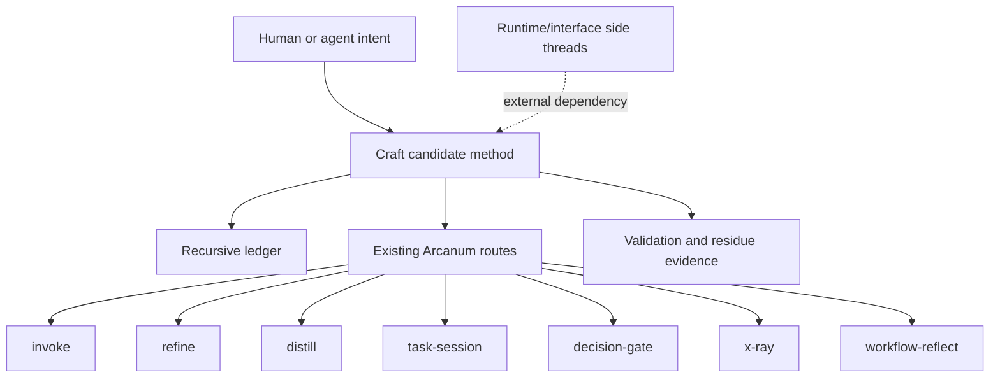
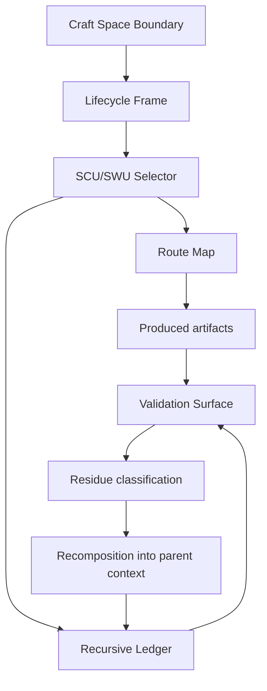
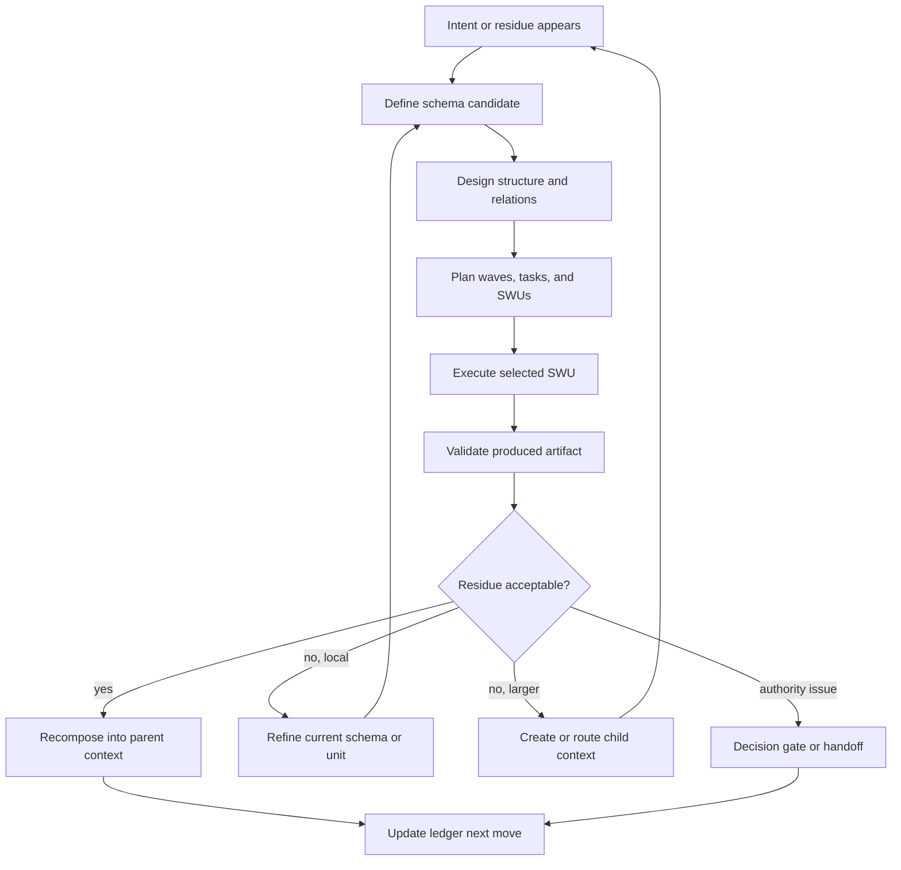
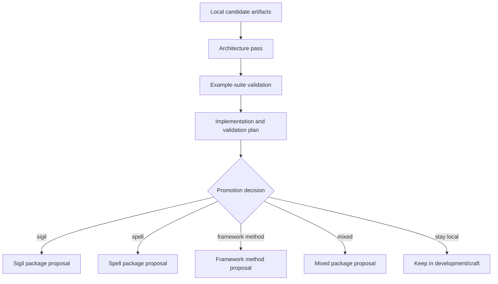

# Craft Method Architecture

## Invoke Result

| Field | Value |
| --- | --- |
| Mode | design |
| Spell | invoke |
| Target | `development/craft/CRAFT-ARCHITECTURE.md` |
| Phase status | pass |
| Mode contract | `spells/invoke/design.md` |
| Template/profile selection | Invoke architecture template with module-formulae architecture bundle profile |
| Source register | `CRAFT-ARCHITECTURE-INPUTS.md` |
| Glossary consistency | pass; see `CRAFT-ARCHITECTURE-GLOSSARY-CONSISTENCY.md` |
| Design transport | recorded; see `CRAFT-ARCHITECTURE-DESIGN-TRANSPORT.md` |
| Work-pack | n/a |
| Next route | `invoke plan development/craft/CRAFT-ARCHITECTURE.md` |

## Architecture Intent

Craft is a candidate method architecture for making with LLM-centered execution. Its job is to keep intention, schema, artifact, validation evidence, residue, and recomposition visible while work moves through nested contexts.

This architecture makes Craft operational without promoting it into canonical Arcanum authority. Craft may route to existing capabilities, define local artifacts, and specify validation requirements; it must not silently replace existing sigils, spells, runtime adapters, registries, or command surfaces.

## Source Contracts

| Contract ID | Source | Required | Architectural Use |
| --- | --- | --- | --- |
| SC-001 | `CRAFT-INITIAL-DEFINITION.md` | yes | Conceptual source for Craft lifecycle, SCU, SWU, residue, validation, and recomposition. |
| SC-002 | `CRAFT-GLOSSARY.md` | yes | Candidate vocabulary and status boundary for method, ledger, condition, route, and deferred automation terms. |
| SC-003 | `CRAFT-ARCHITECTURE-INPUTS.md` | yes | Acceptance gate, non-goals, side-thread boundaries, deferred implementation concerns, and architecture-owned inputs. |
| SC-004 | `LEDGER.md` | yes | Validated fixture proving recursive contexts, artifacts, relations, typed items, and next moves can be represented. |
| SC-005 | `LEDGER-VALIDATION.md` | yes | Evidence that blocker lifecycle, lane representation, generated-index deferral, and MVP validation pass. |
| SC-006 | `CRAFT-LEDGER-TYPE-SYSTEM.md` | yes | Condition type, operational lane, role hint, blocker refiner, and waiver behavior. |
| SC-007 | `CRAFT-GAP-CLOSURE-WORK-PACK.md` | yes | Closure evidence for pre-architecture gap wave and current next route. |
| SC-008 | `CRAFT-REFINE-RUNTIME-STRATEGY.md` | no | Side-thread runtime strategy. Reference only; do not treat as Craft-local acceptance blocker. |
| SC-009 | `ARCANUM-SKILL-RUNTIME-HANDOFF.md` | no | Side-thread runtime interface handoff. Reference only; do not claim solved. |

## View 1: Context View

Craft sits in `development/craft/` as a local candidate method package. It is used by a human or agent who wants to turn ambiguous intent into stable artifacts while preserving evidence about why each unit exists, how it was validated, and how it recomposes into a parent context.

The ownership boundary is local and candidate. Craft owns the method view over recursive making. Existing Arcanum capabilities own their own execution contracts. Runtime/interface work owns command, adapter, observation envelope, and skill invocation behavior.

## View 2: High-Level Structure View

Craft has seven architectural parts:

| Part | Responsibility | Current Status |
| --- | --- | --- |
| Craft Space Boundary | Names the bounded making space, source contracts, scope, and authority limits. | candidate |
| Lifecycle Frame | Provides the method progression from intent through definition, design, planning, execution, validation, reflection, and recomposition. | candidate |
| SCU/SWU Selector | Finds the smallest coherent unit that can be translated, validated, and recomposed without losing meaning. | candidate |
| Recursive Ledger | Records nested contexts, artifacts, relations, typed conditions, gates, enablers, decisions, and next moves. | validated-by-mvp |
| Route Map | Chooses existing Arcanum routes when work belongs to define, refine, distill, task execution, decision gating, explanation, or reflection. | architecture-defined |
| Validation Surface | Defines what evidence is needed for pass, flag, block, waiver, promotion, and future automation. | architecture-defined |
| Residue and Recomposition Loop | Captures mismatch after validation and feeds it back into the parent context or next route. | candidate |

## View 3: Low-Level Components View

| Component | Responsibility | Collaborates With | Boundary Rule |
| --- | --- | --- | --- |
| Intent Intake | Captures the user goal, target context, source files, and current uncertainty. | Craft Space Boundary, Route Map | It does not execute work directly. |
| Source Contract Register | Lists the artifacts that authorize the current design or plan. | Validation Surface, Design Transport | Missing required source contracts block design or plan. |
| Vocabulary Guard | Keeps architecture terms aligned with the local glossary. | Glossary consistency report | Candidate terms remain local until promoted. |
| Context Ledger Model | Represents projects inside projects and cross-context relations. | Recursive Ledger, Validation Surface | Work-packs are ledger artifacts, not the ledger root. |
| Condition Model | Represents blockers, gates, enablers, types, lanes, role hints, and waivers. | Ledger Model, Route Map | Raw blockers require refinement before resolution unless waived. |
| Route Classifier | Selects the next existing capability or side thread. | Existing Arcanum routes | It records route choice; it does not steal route authority. |
| Evidence Collector | Names validation, review, test, fixture, or decision evidence. | Validation Surface, Promotion Path | Evidence must be attached before pass or promotion claims. |
| Residue Classifier | Identifies mismatch, ambiguity, missing structure, drift, or unclosed responsibility after validation. | Recomposition Loop | Residue is either closed locally, routed, deferred, or promoted to a new context. |
| Recomposition Check | Confirms the lower unit still fits its parent context. | Recursive Ledger, Parent Context | A completed unit is not done for Craft until its parent relation is clear. |

## View 4: Workflow Process View

Craft uses a recurring lifecycle. The lifecycle is not a command sequence by itself; it is an architectural frame for selecting the correct route and artifact at each stage.

Workflow closure requires more than producing a file. A Craft unit is closed when its artifact exists, validation evidence is recorded, residue is classified, and the recomposition path back to the parent context is explicit.

## View 5: Decision Flow View

| Decision Point | Condition | Route or Outcome |
| --- | --- | --- |
| Is intent too vague to design? | Objective, artifact, or boundary is unclear. | Route to `invoke define`, `scope-interview`, or `definitions-governance`. |
| Is the unit too broad? | Too many responsibilities, weak validation boundary, or unclear recomposition. | Route to `distill` or split into a smaller SCU. |
| Is the blocker raw? | Blocker lacks type, lane, evidence, closure condition, or owner. | Route to blocker refinement; resolution is blocked until refined or waived. |
| Is the design brittle? | Relationships, authority, failure behavior, or validation are unclear. | Route to `refine`, `decision-gate`, or an architecture design pass. |
| Is the work executable? | Inputs, outputs, done criteria, validation, and recomposition path are present. | Route to `task-session` or an implementation work-pack. |
| Is validation enough? | Evidence supports pass/flag/block at current layer. | Pass, flag for plan, block, or create residue-led follow-up. |
| Is promotion being considered? | Local validation suggests broader reuse. | Route to explicit promotion decision; do not promote automatically. |
| Is runtime or command behavior required? | Adapter, observation envelope, skill invocation, or command surface must change. | Route to runtime/interface side thread. |

## View 6: Dependency Interface View

| Interface | Craft Calls It When | Interface Data | Craft Must Not |
| --- | --- | --- | --- |
| `invoke define` | Raw intent needs objective, artifact, scope, vocabulary, or unknowns. | Target path, source context, output artifact expectation. | Treat define output as automatic canonical authority. |
| `invoke design` | Approved definition needs architecture, relations, validation shape, and handoff notes. | Source contracts, glossary, boundary, risks, required views. | Create execution tasks inside design mode. |
| `invoke plan` | Design is ready to become waves, tasks, SWUs, gates, and validation obligations. | Architecture bundle, unresolved gaps, route constraints. | Execute the work-pack during planning. |
| `refine` | A vague or brittle concern needs deeper discovery before execution. | Refinement target, source artifacts, intended closure. | Replace refine lifecycle or runtime strategy. |
| `distill` | A concept or unit is too broad and needs a smaller coherent core. | Broad model, target context, recomposition need. | Lose parent-context relation. |
| `decision-gate` | Progress depends on choosing among consequential options. | Options, criteria, evidence, owner, downstream effect. | Hide unresolved authority as implementation work. |
| `task-session` | One bounded work-pack task or SWU is ready for execution. | Task ID, acceptance criteria, validation surface, constraints. | Run multi-task waves without explicit route. |
| `x-ray` | A visual explanation or guided understanding artifact is needed. | Target artifact, audience, explanation boundary. | Treat explanation as proof of implementation. |
| `workflow-reflect` | A promoted or running capability needs observability-backed improvement. | Telemetry, invocation evidence, known issues. | Invent development work when maintenance reflection is enough. |
| Runtime/interface side threads | Command, adapter, observation envelope, or skill invocation behavior must change. | Handoff artifact, runtime boundary, desired observation capture. | Claim runtime integration is complete from Craft architecture. |

## Route Integration Contract

Craft is an orchestrating method, not a replacement for the capabilities it routes to.

| Route Family | Owns | Craft Owns |
| --- | --- | --- |
| Define routes | Turning ambiguous intent into scoped candidate definitions. | Deciding that a definition is needed and recording the source contract. |
| Design routes | Architecture, relationships, validation shape, risks, and interface rules. | Ensuring the design recomposes into Craft's parent context and ledger. |
| Plan routes | Waves, tasks, SWUs, gates, blockers, and validation criteria. | Requiring every planned unit to have recomposition and evidence obligations. |
| Execution routes | Producing or mutating artifacts. | Selecting the next responsible move and recording outcome evidence. |
| Validation routes | Tests, schema checks, manual reviews, fixtures, or validator-backed gates. | Deciding which evidence is sufficient at the current Craft layer. |
| Reflection routes | Observability-backed improvement and residue analysis. | Feeding residue into the next schema, context, route, or closure decision. |
| Runtime/interface routes | Command, adapter, observation envelope, and skill invocation mechanics. | Referencing runtime as an external dependency or future seam only. |

## Validation Example-Suite Shape

Before Craft can be promoted or automated, it needs examples that prove method behavior across small but representative cases.

| Example ID | Required Example | Proves |
| --- | --- | --- |
| EX-001 | SCU selection from a broad intent. | Craft can shrink a problem without losing recomposition meaning. |
| EX-002 | SWU plan from an approved design. | Craft can convert structure into executable units with evidence obligations. |
| EX-003 | Residue classification after validation. | Craft can distinguish local fix, new context, decision gate, and deferral. |
| EX-004 | Recomposition after a completed child unit. | Craft can reconnect work to its parent context without hidden glue. |
| EX-005 | Raw blocker refinement before resolution. | Blocker lifecycle rules hold across typed, lane-owned conditions. |
| EX-006 | Cross-context blocker or enabler. | Recursive ledger can represent relations that cut across branches. |
| EX-007 | Route boundary example. | Craft calls existing Arcanum routes without claiming their authority. |
| EX-008 | Runtime side-thread boundary example. | Runtime/interface gaps remain visible but non-blocking to Craft architecture. |
| EX-009 | Promotion decision example. | Local validation can lead to explicit promotion review without automatic promotion. |
| EX-010 | Type plus lane to role-hint review. | Role hints can be reviewed manually before any delegation automation exists. |

## Promotion Decision Path

Craft remains local and candidate until an explicit promotion route decides otherwise.

Minimum promotion evidence:

1. Architecture bundle passes its source-contract and six-view gate.
2. Example suite proves SCU, SWU, residue, recomposition, blocker lifecycle, route boundary, and promotion behavior.
3. At least one complete plan/execution/validation loop shows Craft producing a useful artifact without collapsing route authority.
4. Glossary terms have conflict review against any target registry or ontology.
5. Runtime/interface requirements are either implemented by their owner thread or explicitly excluded from the promotion scope.

## Deferred Automation Evidence

Priority scoring, generated ledger indexes, and role delegation automation are not part of this architecture acceptance gate.

| Automation Area | Required Evidence Before Work Starts |
| --- | --- |
| Priority scoring | Multiple validated ledgers with different blocker, enabler, readiness, confidence, and impact profiles. |
| Generated ledger index | Repeated query needs, known index consumers, generated-state policy, and validation rules. |
| Role delegation automation | Example coverage across business, tech, QA, validator, auditor, governance, planner, operations, integrator, and blocker_refiner lanes. |
| Runtime execution integration | Completed runtime/interface owner artifacts and observation-envelope contract. |

## Dependency And Interface Rules

| Rule ID | Rule | Applies To | Enforcement |
| --- | --- | --- | --- |
| R-001 | Every design or plan must cite required source contracts. | Architecture and planning artifacts | Source contract table. |
| R-002 | Every unit must have a recomposition path before execution. | SCU/SWU planning | Work-pack validation and ledger next move. |
| R-003 | Raw blockers cannot be resolved directly. | Blocker lifecycle | Blocker refinement gate or waiver evidence. |
| R-004 | Work-packs are artifacts owned by contexts, not the ledger root. | Recursive ledger | Ledger validation review. |
| R-005 | Candidate glossary terms stay local until promotion. | Vocabulary | Glossary consistency and promotion review. |
| R-006 | Runtime/interface changes are side-threaded. | Command, adapter, skill, registry, observation surfaces | Handoff to runtime/interface owner route. |
| R-007 | Deferred automation must be evidence-gated. | Scoring, indexes, role delegation | Example-suite and decision-gate prerequisites. |

## Decision Log

| Decision ID | Decision | Options Considered | Reason |
| --- | --- | --- | --- |
| D-001 | Treat Craft as a candidate orchestrating method, not a canonical authority. | Promote now, stay local, or candidate with promotion path. | Current evidence supports architecture readiness, not canonical promotion. |
| D-002 | Keep existing Arcanum routes authoritative over their own lifecycle. | Replace routes, wrap routes, or call routes by boundary. | Route authority must stay legible and avoid hidden runtime mutation. |
| D-003 | Require blocker refinement before resolution, with waiver as explicit exception. | Allow direct resolution, require refinement, or disallow waiver. | MVP validation proved refinement and waiver representation. |
| D-004 | Define validation examples before implementing more automation. | Implement scoring/indexes now or gate automation on examples. | Automation would be premature without several validated states. |
| D-005 | Side-thread runtime/interface gaps. | Block Craft architecture, solve runtime here, or reference externally. | Runtime work has separate owner artifacts and should not block method design. |

## Risks And Gaps

| Risk ID | Risk | Status | Mitigation |
| --- | --- | --- | --- |
| RK-001 | Craft becomes an overloaded umbrella that hides route ownership. | active risk | Keep route integration table and source-contract requirements in every follow-on plan. |
| RK-002 | Validation examples remain prose-only. | planning gap | Next plan should create a small example-suite work-pack before promotion. |
| RK-003 | Role hints are mistaken for delegation authority. | active risk | Preserve manual review until type plus lane examples cover enough operational lanes. |
| RK-004 | Runtime/interface side-thread is accidentally treated as solved. | active risk | Keep runtime boundary explicit in architecture, transport report, and later plans. |
| RK-005 | Recomposition is assumed after task completion. | active risk | Require recomposition evidence in work-pack done criteria. |

## Implementation Layering Seed

The next `invoke plan` pass should preserve this layer order:

| Layer | Purpose | Candidate Work |
| --- | --- | --- |
| L0 | Freeze architecture contract. | Sync architecture bundle, glossary consistency, and transport report. |
| L1 | Build validation example suite. | Create minimal examples for SCU, SWU, residue, recomposition, route boundary, blocker refinement, and promotion decision. |
| L2 | Plan recursive-ledger hardening. | Add validation rules or fixtures only after examples reveal stable requirements. |
| L3 | Evaluate automation readiness. | Decide whether scoring, generated index, or role mapping has enough evidence to start. |
| L4 | Promotion review. | Decide whether Craft stays local or becomes a sigil, spell, framework method, or mixed package. |

## Downstream Planning Notes

- The immediate planning target is an example-suite and architecture-hardening work-pack, not runtime implementation.
- The plan must preserve side-thread boundaries for `CRAFT-REFINE-RUNTIME-STRATEGY.md` and `ARCANUM-SKILL-RUNTIME-HANDOFF.md`.
- Every task should name source contracts, expected artifact, validation evidence, and recomposition target.
- Any task that touches scoring, generated indexes, role delegation automation, runtime adapters, commands, registries, sigils, spells, or skill surfaces should be blocked unless an explicit owner route is opened.

## Design Transport Notes

This design should be carried forward as the source architecture for the next Craft planning pass. The transport is append-only in meaning: follow-on artifacts may refine details, but they should not silently remove source contracts, route boundaries, side-thread boundaries, or deferred automation gates.

## Gate Result

| Field | Value |
| --- | --- |
| Status | pass |
| Reason | The architecture answers the six acceptance questions from `CRAFT-ARCHITECTURE-INPUTS.md`, includes the required six design views, preserves candidate authority boundaries, names route integration rules, defines validation example-suite shape, records promotion evidence requirements, and keeps runtime/interface work side-threaded. |
| Blocking gaps | none |
| Non-blocking follow-ups | Example suite, implementation plan, promotion review, deferred automation evidence, runtime/interface side-thread completion. |
