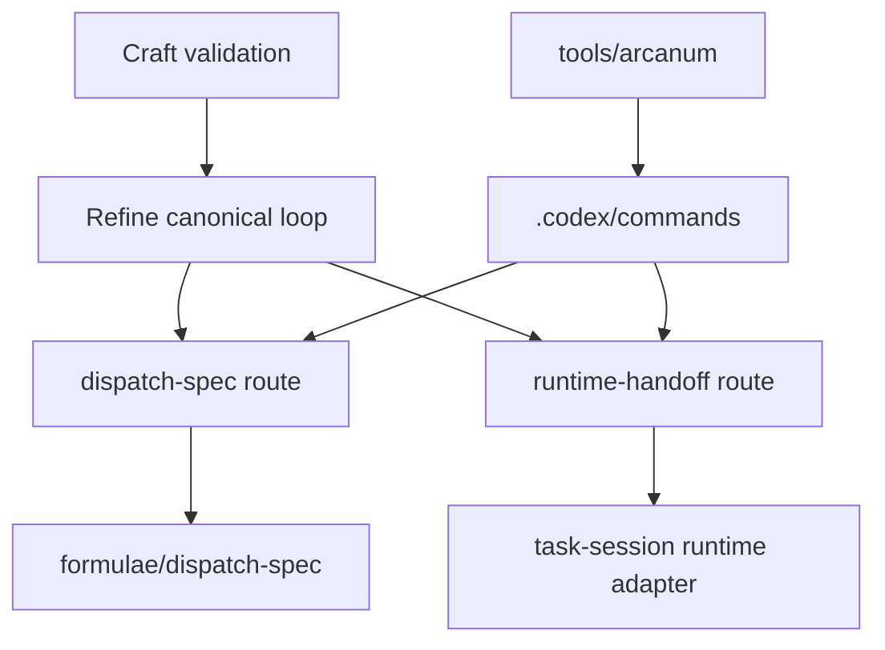
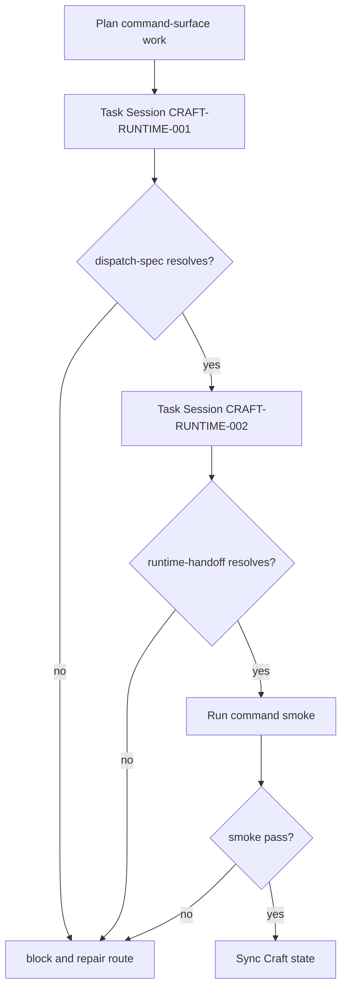

# Craft Runtime Command Surface Design

## Invoke Result

| Field | Value |
| --- | --- |
| Mode | design |
| Target | `development/craft/CRAFT-RUNTIME-DESIGN.md` |
| Phase status | pass |
| Mode contract | `spells/invoke/design.md` |
| Glossary consistency | pass; see `CRAFT-RUNTIME-GLOSSARY-CONSISTENCY.md` |
| Design transport | recorded; see `CRAFT-RUNTIME-DESIGN-TRANSPORT.md` |
| Work-pack | n/a |
| Next route | plan |

## Architecture Intent

Design the smallest command-surface bridge that lets Craft validation rerun Refine without failing on missing command routes.

The design does not implement command files. It defines the owner boundaries, route shape, validation checks, and next planning handoff.

## Source Contracts

| Contract ID | Source | Required | Use |
| --- | --- | --- | --- |
| SC-RUN-001 | `CRAFT-RUNTIME-DEFINE.md` | yes | Defines objective, scope, and deliverables. |
| SC-RUN-002 | `CRAFT-RUNTIME-GLOSSARY.md` | yes | Local runtime terms. |
| SC-RUN-003 | `CRAFT-REFINE-RUNTIME-STRATEGY.md` | yes | Orchestrator/stage-worker topology. |
| SC-RUN-004 | `ARCANUM-SKILL-RUNTIME-HANDOFF.md` | yes | Observation and cross-runtime skill invocation requirements. |
| SC-RUN-005 | `refinement-runs/20260529T164919Z-validate-craft/RESULT.md` | yes | Current blocker evidence. |
| SC-RUN-006 | `formulae/dispatch-spec/SKILL.md` | yes | Dispatch-spec ownership source. |
| SC-RUN-007 | `arcana/task-session/runtime-adapters/runtime-handoff.md` | yes | Runtime handoff adapter source. |
| SC-RUN-008 | `tools/arcanum` | yes | Command resolution mechanism. |

## View 1: Context View

The command surface is the only immediate blocker. Existing capability sources are present, but the bare command names needed by Refine are not exposed.

## View 2: High-Level Structure View

| Part | Responsibility |
| --- | --- |
| Route Alias Layer | Adds or exposes bare command routes without changing capability ownership. |
| Capability Source Layer | Keeps dispatch-spec and runtime-handoff source contracts in their existing locations. |
| Validation Layer | Proves command resolution and dispatch validation. |
| Task Session Layer | Executes scoped changes after this Invoke plan creates a work-pack. |

## View 3: Runtime Flow View

| Component | Responsibility | Boundary |
| --- | --- | --- |
| `dispatch-spec` command file | Resolve through `tools/arcanum --resolve dispatch-spec` and point to dispatch-spec validation behavior. | Does not promote dispatch-spec or run arbitrary lifecycle work. |
| `runtime-handoff` command file | Resolve through `tools/arcanum --resolve runtime-handoff` and point to runtime handoff validation/adapter behavior. | Does not implement every runtime adapter. |
| Command smoke script or check | Verify both routes resolve and expected source files exist. | Does not run full Refine loop. |
| Craft package sync | Records blocker cleared after task-session evidence. | Does not claim Craft promotion. |

## View 4: Responsibility View

## View 5: Data And State View

| Decision | Options | Selected Planning Bias |
| --- | --- | --- |
| How to expose `dispatch-spec`? | bare alias to existing formulae source, arcanum-sigil alias, or tools/arcanum internal alias | Prefer bare `.codex/commands/dispatch-spec.md` alias if source review confirms it is enough. |
| How to expose `runtime-handoff`? | command alias, task-session adapter route, or new sigil | Prefer command alias to existing runtime-handoff adapter/contract, with later hardening if insufficient. |
| How much to validate? | resolve only, smoke command, full Refine rerun | Start with resolve plus dispatch validation smoke; full Refine rerun is a later validation task. |

## View 6: Validation And Risk View

| Dependency | Interface | Required For |
| --- | --- | --- |
| `tools/arcanum` | `--resolve`, `--list`, optional `--exec --adapter dry-run` | Command availability checks. |
| `.codex/commands` | Markdown command files | Bare route exposure. |
| `formulae/dispatch-spec/scripts/validate-dispatch.py` | Python validation script | Dispatch validation smoke. |
| `arcana/task-session/runtime-adapters/runtime-handoff.md` | Adapter contract | Runtime-handoff source behavior. |
| `CRAFT-VALIDATION.md` | Review surface | Recomposition and non-promotion checks. |

## Risks

| Risk | Mitigation |
| --- | --- |
| Alias hides true lifecycle ownership. | Command files must cite source owner and non-promotion boundary. |
| Runtime-handoff route is broader than a simple alias. | First task must inspect existing adapter contract before writing. |
| Full Refine rerun is attempted too early. | Work-pack separates smoke validation from later Refine validation. |

## Gate Result

`pass`

The design is ready for Invoke plan.
