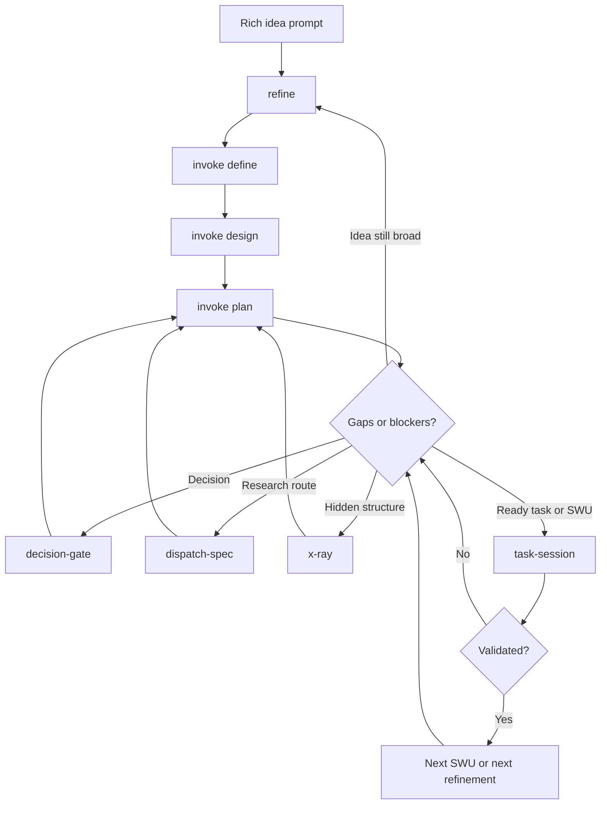

# Arcanum Development Usage Guide

Status: guide artifact.
Audience: designers, product builders, researchers, and engineers using Arcanum to turn an ambitious idea into an MVP and then keep improving it.

## What This Guide Is

This guide explains the whole Arcanum development loop:

1. Start with the richest prompt you can write.
2. Run `refine` to turn the idea into a governed refinement route.
3. Let the refinement result shape or call `invoke`.
4. Use `invoke define`, `invoke design`, and `invoke plan` to create definition, design, architecture views, implementation layering, and a work-pack.
5. Resolve gaps and blockers with the right Arcanum capability.
6. Run `task-session` for one bounded MVP task or SWU.
7. Repeat the loop whenever a blocker, gap, or new ambition appears.

The main mindset is simple: do not rush from idea to implementation. Use Arcanum to make the idea inspectable, argued, evidenced, planned, and then executed in small verified steps.

## The Short Version

```text
rich idea prompt
  -> refine
  -> invoke define/design/plan
  -> blockers and gaps
  -> decision-gate | refine | dispatch-spec | x-ray
  -> task-session for one ready task/SWU
  -> validate evidence
  -> repeat from the next gap or next task
```

## First Prompt

Start with the idea as fully as you can. The first prompt is not supposed to be polished. It is supposed to be rich.

Use this shape:

```text
[$refine] I want to develop this idea:

<Describe the idea in as much detail as possible. Include what it is, who it is for, what it should help them do, why it matters, and what makes it exciting.>

Context:
- Product or domain:
- Target users:
- User pain or opportunity:
- What exists already:
- What feels missing:
- What inspired the idea:
- What must be true for it to be valuable:
- What should not happen:
- Technical or business constraints:
- Design constraints:
- Evidence, references, examples, links, screenshots, or prior artifacts:
- Questions I am unsure about:
- Decisions I do not want the agent to guess:
- What MVP would prove:
- What a really ambitious version could become:

Please refine this into a development route. I want definition, design, plan, gaps, blockers, and the next executable task.
```

### Example First Prompt

```text
[$refine] I want to build a tool that helps designers validate finished frontend interfaces with evidence, not just taste.

The tool should inspect a page with Playwright, capture screenshots, traces, ARIA snapshots, accessibility output, layout measurements, and structured findings. But it should not pretend to prove subjective quality. It should separate hard browser failures from UX risk flags, screenshot review prompts, and human-study residues.

The audience is product designers and frontend engineers working together. Designers should be able to contribute fixtures, review prompts, domain heuristics, and evidence cards. Engineers should be able to implement repeatable checks. Researchers should know when human evidence is still needed.

The MVP should prove one full flow: a fixture corpus with known-good and known-bad pages, a Playwright runner, a findings report, and screenshots that designers can inspect.

I am unsure about:
- which rules should block,
- how to avoid fake UX scoring,
- how to make designers comfortable contributing,
- where human-study evidence belongs,
- what the first fixture set should include.

Please refine this into a development route with definition, design, plan, blockers, and next task-session-ready SWUs.
```

## What Refine Does

Use `refine` when the idea is still broad, ambitious, or under-shaped.

`refine` is the front door. It should:

- build a compact evidence baseline,
- create an initial seed proposal,
- route the work through the canonical refinement loop,
- use `invoke` stages when the idea needs definition, design, and planning,
- use critique and repair stages before treating a plan as ready,
- identify gaps, blockers, unresolved decisions, and research needs,
- recommend the next lifecycle owner.

The core `refine` loop is:

| Stage | Purpose |
| --- | --- |
| Context Builder | Select the relevant evidence and constraints. |
| Invoke Define | Create the definition baseline. |
| Interrogation | Critique whether the definition is strong enough. |
| Research Decision | Decide whether bounded research is needed. |
| Distill | Find the smallest coherent unit and reject weaker alternatives. |
| Invoke Design | Create design and architecture views. |
| Interrogation | Review the design from multiple angles. |
| Distill Repair | Repair weak or over-broad parts. |
| Invoke Plan | Produce implementation layering, plan, and work-pack. |
| Final Synthesis | Return the refined result and next route. |

If the runtime cannot execute every stage automatically, the result should say so honestly. A proposal-only result is still useful as a route, but it is not implementation evidence.

## What Invoke Adds

Use `invoke` when you need durable artifacts.

`invoke` turns intent into authored development artifacts:

| Invoke Mode | What It Produces | Why It Matters |
| --- | --- | --- |
| `define` | Definition, glossary, scope, target artifact baseline. | Gives the idea a stable name, purpose, boundary, and vocabulary. |
| `design` | Design/architecture views, trade-offs, glossary consistency. | Shows how the thing should work from several angles. |
| `plan` | Implementation layering, implementation plan, work-pack, SWUs. | Turns the design into executable steps with validation expectations. |
| `refresh` | Proposal-only updates from new evidence. | Keeps artifacts current without silently mutating them. |
| `handoff` | New session/thread handoff. | Splits work without losing context or owner boundaries. |

For new work, the usual authoring chain is:

```text
invoke define
  -> invoke design
  -> invoke plan
  -> task-session
```

For a new sigil:

```text
invoke define/design/plan
  -> sigil-development
  -> task-session for implementation tasks
  -> experiment-harness before promotion
```

For a new spell:

```text
invoke define/design/plan
  -> spellcraft
  -> task-session for implementation tasks
  -> experiment-harness before promotion
```

## What Happens After Plan

A good plan will reveal gaps. That is a feature.

Common plan outputs:

- implementation layers,
- work-pack tasks,
- SWUs,
- validation strategy,
- unresolved decisions,
- research gaps,
- evidence gaps,
- architecture questions,
- fixture needs,
- blockers.

Do not smooth those over. Route them.

## Gap And Blocker Router

Use this table when the plan reveals a problem.

| Situation | Use | Why |
| --- | --- | --- |
| A consequential choice has multiple viable options. | `decision-gate` | It resolves the choice with options, trade-offs, selected decision, and durable record. |
| The idea, design, or plan still feels fuzzy or too broad. | `refine` | It runs another refinement pass around the gap. |
| You need multiple research streams or a repeatable route over capabilities. | `dispatch-spec` | It validates a route with steps, gates, handoffs, observability, and subagent strategy. |
| You do not understand an architecture, process, artifact, or dependency structure. | `x-ray` | It explains the hidden structure through lanes, flows, dependencies, lifecycle, and questions. |
| You have one ready task or SWU with clear evidence expectations. | `task-session` | It executes one bounded unit with context, gates, validation, and synchronized evidence. |
| A source claim, market reference, or academic reference needs research. | `dispatch-spec` plus research route | It keeps research lanes explicit and prevents unsupported claims from becoming implementation assumptions. |
| A blocker is really a missing human decision. | `decision-gate` | Arcanum should not guess consequential choices. |
| A blocker is missing context or contradictory evidence. | `context-builder` through `task-session` or `refine` | The work should stop until the controlling evidence is clear. |

## How To Use Decision Gate

Use `decision-gate` before consequential mutation when the agent should not choose.

Good decision-gate prompt:

```text
[$decision-gate] Resolve the blocker for <target>.

Context:
- Current plan:
- Consequential choice:
- Options already visible:
- What this decision affects:
- What should not proceed until this is decided:

Please prepare the options, trade-offs, recommendation if safe, and persist the decision record.
```

Decision examples:

- Choose first MVP surface: CLI, HTML, browser extension, or hosted app.
- Choose evidence strictness: exploratory, review, release, or compliance.
- Choose implementation order: fixture first, validator first, or prototype first.
- Choose domain focus: dashboard, checkout, authoring, or onboarding.
- Choose whether a refresh should apply changes or remain proposal-only.

If `decision-gate` returns `BLOCK`, stop. Do not proceed until the decision is answered or explicitly overridden.

## How To Use Dispatch Spec For Research Streams

Use `dispatch-spec` when you need a route, not just a question.

Good dispatch-spec prompt:

```text
[$dispatch-spec] Create a research route for <topic>.

We need research streams for:
- standards or source-of-truth references,
- market or practitioner references,
- technical implementation references,
- risks and contraindications,
- validation or fixture design.

The route should produce:
- source ledger,
- claim map,
- validator or design implications,
- blocker list,
- next work-pack or task-session handoff.
```

Use it when:

- research has multiple lanes,
- different specialists or subagents might be useful,
- claims need source URLs and freshness rules,
- output should become a reusable route,
- research evidence must not auto-promote to canonical knowledge.

## How To Use X-Ray

Use `x-ray` when the problem is hard to see.

Good x-ray prompt:

```text
[$x-ray] Explain <target> for <audience>.

Focus on:
- what it is,
- parts and responsibilities,
- flows,
- dependencies,
- lifecycle,
- assumptions,
- risks,
- open questions,
- how this helps us decide the next route.
```

Use x-ray for:

- architecture,
- feature workflows,
- design systems,
- validation loops,
- lifecycle states,
- confusing plans,
- dense artifacts,
- processes that need visual explanation.

## When To Run Task Session

Run `task-session` only when one task or SWU is ready enough to execute.

Ready means:

- the task is bounded,
- inputs and source links are known,
- write scope is clear,
- blockers are resolved or recorded as assumptions,
- validation surface exists,
- completion evidence is defined.

Good task-session prompt:

```text
[$task-session] Execute <work-pack path> --task <TASK-ID>
```

or:

```text
[$task-session] Execute <work-pack path> --swu <SWU-ID>
```

Task Session should:

- build a context pack,
- evaluate gates,
- run decision-gate if a blocker-level choice appears,
- mutate only the declared scope,
- validate done criteria,
- synchronize task evidence,
- report follow-up gaps.

## The MVP Loop

MVP work is not one big execution. It is a loop.



## How To Think About Each Capability

| Capability | Mental Model |
| --- | --- |
| `refine` | Shape the idea until the next route is obvious. |
| `invoke` | Author the durable definition, design, and plan artifacts. |
| `decision-gate` | Stop guessing and make the consequential choice explicit. |
| `dispatch-spec` | Turn multi-step or multi-lane work into a validated route. |
| `x-ray` | Make hidden structure understandable. |
| `task-session` | Execute exactly one bounded task with evidence. |
| `experiment-harness` | Prove reusable sigil or spell behavior with examples and reports. |
| `signal-observer` and `workflow-reflect` | Learn from completed runs and improve the workflow later. |

## A Complete Example Flow

1. Write the richest idea prompt.
2. Run `refine`.
3. Review the refine result.
4. If the result says the idea needs artifacts, run or accept `invoke define/design/plan`.
5. Inspect the plan.
6. For each blocker:
   - use `decision-gate` for human choices,
   - use `dispatch-spec` for multi-stream research,
   - use `x-ray` for understanding,
   - use `refine` again if the idea needs reshaping.
7. Once a work-pack has a ready SWU, run `task-session`.
8. Validate the result.
9. If validation reveals a gap, route it using the same blocker router.
10. Repeat until the MVP proves the core value.

## What Good Looks Like

Good Arcanum development produces:

- a definition that names the thing clearly,
- a design with multiple views and trade-offs,
- a plan with layers and SWUs,
- decisions that are recorded,
- research that has routes and source evidence,
- x-rays for confusing structures,
- task sessions with validation receipts,
- residues that are not forgotten,
- next steps that are bounded and auditable.

## What To Avoid

Avoid:

- jumping straight from an idea to implementation,
- using `task-session` before the task is bounded,
- hiding blocker decisions inside implementation,
- treating proposal-only refreshes as approval to mutate,
- using research findings as canonical truth without review,
- letting a broad idea become a giant untestable work-pack,
- claiming MVP completion without validation evidence,
- restarting the whole process when only one blocker needs routing.

## First Prompt Checklist

Before running `refine`, include as many of these as possible:

- What is the idea?
- Who is it for?
- What should users become able to do?
- What is the emotional or practical promise?
- What existing tools, workflows, or artifacts inspired it?
- What would make it obviously valuable?
- What would make it dangerous, misleading, or useless?
- What must be decided by a human?
- What should not be inferred?
- What evidence already exists?
- What references should be considered?
- What does MVP success look like?
- What would the ambitious version become?

## Guide Architecture Result

- Spell: `guide-architecture`
- Target: whole Arcanum development workflow
- Status: pass
- Context: local contracts for `guide-architecture`, `refine`, `invoke`, `decision-gate`, `dispatch-spec`, `x-ray`, and `task-session`
- Translate: skipped
- Explanation sections: 17
- Active evidence prompt: Try the first prompt template on one real idea and check whether the resulting plan has a ready SWU or a clear blocker route.
- Guide receipt: this file
- User-ledger proposal: none
- Residue:
  - Resolved into a companion HTML guide: `development/user-guide/arcanum-development-loop.html`.
  - Resolved into a Whisper idea-to-MVP fixture: `development/user-guide/fixtures/whisper-idea-to-mvp/`.
- Next route: use this guide to start with `refine`, then route gaps through the blocker router.
