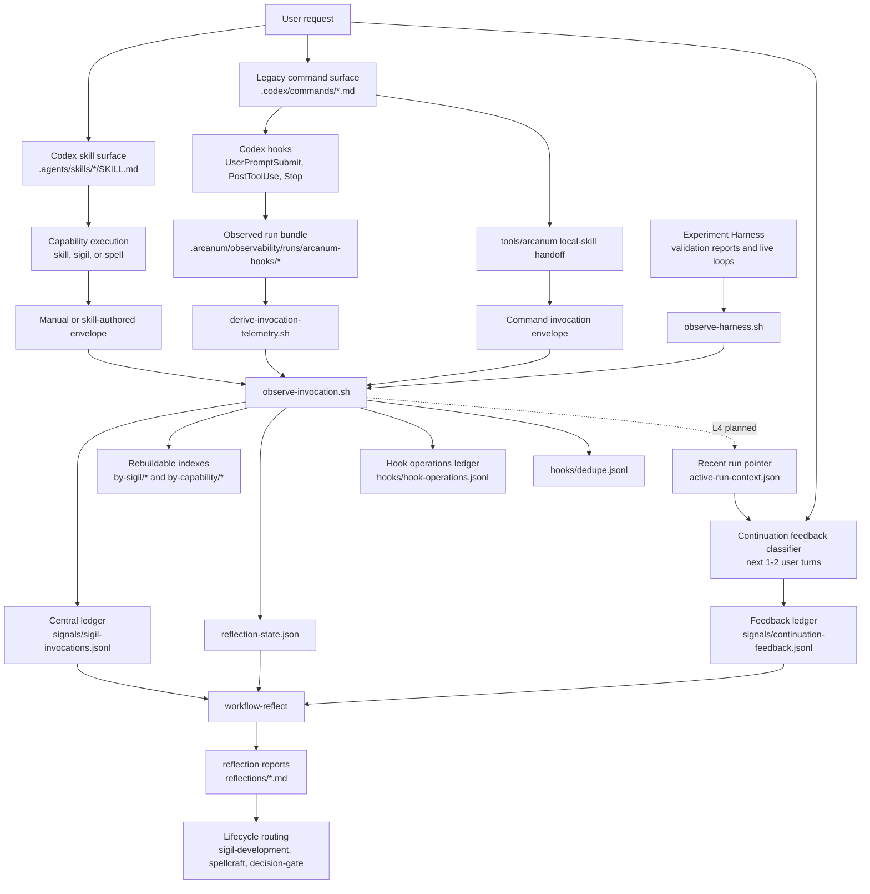

# Observability Architecture Overview

## Purpose

This overview maps the current Arcanum observability system across framework docs, repository state, Codex hooks, skills, command adapters, and the experiment harness.

It uses the Distill lens: find the smallest coherent concept unit, prove how it recomposes into the full system, and name scattered or stale surfaces that make the architecture harder to navigate.

## Current Architecture In One Sentence

Arcanum observability is a repository-local telemetry and reflection loop: a capability run produces evidence, derivation enriches a privacy-safe invocation envelope, the observer appends one canonical invocation event, later continuation feedback can link follow-up corrections to that run, and repeated or severe signals route to reflection.

## Smallest Coherent Unit

The base smallest coherent unit is the **Observed Invocation Envelope Pipeline**.

Responsibility:

- receive evidence from one capability run,
- build or validate one privacy-safe invocation envelope,
- append exactly one canonical telemetry event,
- update rebuildable indexes and reflection counters,
- return closeout fields that the user or wrapper can trust.

It is small enough to implement and verify, but large enough to preserve the meaning of observability. If reduced further into only "write JSONL" or only "run hooks", it loses the behavior that makes the system useful.

For the skill-aware update, the smallest coherent lifecycle is the **Observed Run Feedback Cycle**:

- close the run with derived telemetry,
- append immutable invocation evidence,
- preserve a recent-run pointer,
- attach later correction or clarification events as linked continuation feedback.

This keeps same-turn evidence separate from later user feedback without expanding observability into full conversation memory.

## Component Chart



## Source Inventory

| Layer | Current files | Role |
| --- | --- | --- |
| Concept and package contract | `framework/observability/README.md`, `REPOSITORY-PACKAGE.md`, `SIGIL-OBSERVABILITY-HOOK.md`, `OBSERVED-RUNS.md` | Defines schema, storage, hook flow, run bundles, privacy, and reflection integration. |
| Deterministic observer scripts | `framework/observability/scripts/observe-invocation.sh`, planned `derive-invocation-telemetry.sh`, `record-hook-operation.sh`, `rebuild-observability-indexes.sh`, `compact-observability-store.sh` | Derive run telemetry, validate envelopes, append canonical events, track hook operations, dedupe emissions, rebuild or compact derived state. |
| Observed run scripts | `start-observed-run.sh`, `checkpoint-observed-run.sh`, `finish-observed-run.sh`, legacy `observe-run-with-codex.sh` | Make long runs recoverable through run bundles and checkpoints. |
| Codex hook bridge | `.codex/hooks.json`, `.codex/hooks/arcanum-*.sh` | Opens envelopes for slash-command invocations, records tool evidence, closes and observes on Stop. |
| Deterministic command wrapper | `tools/arcanum` | Resolves command surfaces, writes local-skill handoffs by default, can run explicit legacy adapters, builds command envelopes, calls observer and reflection scripts. |
| Skill discovery surface | `.agents/skills/*` | Current Codex skill discovery location. Symlinks point to canonical Arcanum capability folders. |
| Capability observers | `arcana/signal-observer/SKILL.md`, `arcana/workflow-reflect/SKILL.md`, `formulae/observability-setup/SKILL.md` | Agent-level contracts for observing, reflecting, and installing/verifying the package. |
| Experiment producer | `.agents/skills/experiment-harness` and `arcana/experiment-harness/scripts/observe-harness.sh` | Produces validation reports and converts them into observer-compatible telemetry. |
| Runtime state | `.arcanum/observability/` | Local source of truth for telemetry, indexes, hook operations, dedupe, run bundles, counters, and reflection reports. |

## Runtime Data Model

Default runtime package:

```text
.arcanum/observability/
  config.json
  reflection-state.json
  signals/
    sigil-invocations.jsonl
    continuation-feedback.jsonl
  by-sigil/
  by-capability/
  hooks/
    hook-operations.jsonl
    failures.jsonl
    dedupe.jsonl
  runs/
  active-run-context.json   # planned for continuation feedback attribution
  reflections/
```

Canonical event path:

```text
framework/observability/scripts/observe-invocation.sh
  --envelope <path>
  --observability-dir .arcanum/observability
```

The central invocation ledger is the source of truth for completed capability runs. `by-sigil/` and `by-capability/` are rebuildable reference indexes. `continuation-feedback.jsonl` is a linked feedback ledger for later user corrections and clarifications; it must not rewrite old invocation facts. Hook operation rows are infrastructure telemetry and must not be observed as capability events.

## Execution Paths

### 1. Legacy Slash Command Path

1. User runs a command-like request such as `/invoke`.
2. `.codex/hooks/arcanum-user-prompt-submit.sh` checks whether the first token maps to `.codex/commands/<name>.md`.
3. If it does, the hook opens a pending envelope under `.arcanum/observability/runs/arcanum-hooks/<run-id>/`.
4. `.codex/hooks/arcanum-post-tool-use.sh` appends tool events.
5. `.codex/hooks/arcanum-stop.sh` writes closeout evidence and calls `derive-invocation-telemetry.sh`.
6. `derive-invocation-telemetry.sh` writes the enriched envelope and extraction report.
7. The Stop hook calls `observe-invocation.sh`.
8. The observer appends the ledger row, writes indexes, updates counters, refreshes the recent-run pointer, and returns `OBSERVATION`, `LEDGER`, `REFLECTION_TRIGGER`, `RECOMMENDATION`, and `DEDUPE_KEY`.

Strength: deterministic closeout for `.codex/commands`.

Weakness: it does not currently recognize `$skill-name` skill invocations unless they also map to `.codex/commands`.

### 2. `tools/arcanum` Local-Skill Handoff Path

1. `tools/arcanum` resolves an alias through `.codex/commands`.
2. It builds a prompt around the command adapter.
3. It writes a local-skill handoff and receipt contract, or runs an explicit legacy adapter when selected.
4. It builds an invocation envelope and calls `observe-invocation.sh`.
5. It optionally calls `reflect-invocation-signals.sh`.

Strength: deterministic command runner outside native slash UX.

Weakness: command-oriented; it is not yet a first-class skill runner for `.agents/skills`.

### 3. Experiment Harness Path

1. Experiment Harness runs prompts, loops, fixtures, validations, and reports.
2. `report-harness.sh` writes run reports.
3. `observe-harness.sh` reads the latest or selected report.
4. It constructs an experiment-harness envelope.
5. It calls the generic observer.

Strength: validation evidence becomes runtime telemetry.

Weakness: it is a producer of observability, not the general invocation path.

### 4. Direct Skill Path

1. Codex discovers a skill under `.agents/skills/<skill-name>/SKILL.md`.
2. User invokes `$skill-name` or Codex selects it implicitly.
3. The skill guides agent behavior.

Current gap: there is no deterministic hook bridge that opens, derives, closes, and observes an envelope for explicit `$skill-name` the same way the command hook does for `/command-name`. Implicit skill selection still depends on future platform metadata or a wrapper.

### 5. Continuation Feedback Path

1. After the planned L4 feedback layer exists, an observed run closes and updates `.arcanum/observability/active-run-context.json`.
2. The next one or two user prompts are checked for correction, clarification, continuation pressure, route miss, route switch, or fresh work.
3. High-confidence follow-up signals are written as linked feedback events in `signals/continuation-feedback.jsonl`.
4. Necronomicon may later mirror those events into active-interaction or gap-ledger memory, but observability does not require Necronomicon to record the feedback.

Strength: captures useful quality evidence that appears after the skill is no longer running.

Weakness: attribution must stay conservative to avoid treating every follow-up as a defect in the previous run.

## Current Runtime Evidence

The local package currently reports:

- storage model: `central-ledger-reference-indexes`,
- source of truth: `signals/sigil-invocations.jsonl`,
- thresholds: 5 meaningful executions, 10 generated outputs, 3 related workflow gaps, 1 severe workflow gap,
- reflection counters: 21 meaningful executions, 39 generated outputs, 2 related workflow gaps, 0 severe workflow gaps.

Observed capabilities in the central ledger:

| Capability | Count |
| --- | ---: |
| `invoke` | 12 |
| `experiment-harness` | 5 |
| `interrogation` | 1 |
| `structured-interview-kits` | 1 |

Capability kind coverage:

| Kind | Count |
| --- | ---: |
| `spell` | 12 |
| `sigil` | 3 |
| unknown / legacy-shaped | 4 |

The unknown rows are a migration signal: legacy envelopes still exist or earlier rows lack normalized `capability.kind`.

## Distill Deconstruction

### Broadest Layer: Repository Learning System

Arcanum wants capabilities to improve from evidence rather than memory. This includes usage traces, validation reports, live loop results, reflection reports, and lifecycle routing.

### Middle Layer: Observability Package

The package owns portable storage and deterministic scripts. It should not decide what a sigil means or mutate capabilities. It records evidence and routes reflection.

### Selected Unit: Observed Run Feedback Cycle

This is the smallest coherent unit for the skill-aware update because it closes one run honestly and can still learn from nearby user feedback without pretending that later feedback was available at closeout.

Closure proof:

- input: one run envelope or enough run evidence to build one,
- process: derive, validate, normalize, dedupe, append, index, count, report, then optionally attribute later feedback,
- output: one canonical invocation event plus optional linked continuation feedback events,
- owner: framework observability package,
- validation: JSON parsing, required fields, dedupe key, central ledger append, index append, counter update, feedback-link confidence.

Recomposition proof:

- Command hooks use it for legacy slash commands.
- `tools/arcanum` uses it for command-wrapper execution.
- Experiment Harness uses it to turn reports into telemetry.
- Skill-aware hooks use it to derive and observe explicit `$skill-name` runs.
- Continuation feedback uses the recent-run pointer to attach later corrections without mutating old rows.
- `workflow-reflect` consumes its ledger and counters.
- Lifecycle sigils consume reflection reports to revise capabilities.

## Scattered Or Conflicting Surfaces

| Surface | Current tension | Effect |
| --- | --- | --- |
| `.agents/skills` vs `.codex/commands` | Codex skills are now exposed through `.agents/skills`, but deterministic hooks still watch `.codex/commands`. | `$skill-name` usage can bypass observability unless manually observed. |
| `tools/arcanum` | Still describes itself as the repository-local command surface over `.codex/commands`. | Useful compatibility wrapper, but conceptually stale for skill-first Codex usage. |
| Closeout derivation vs append authority | The Stop hook has evidence, while `observe-invocation.sh` should stay append-focused. | Without a derivation component, telemetry proves a run happened but not whether the output contract held. |
| Later user feedback vs invocation facts | User corrections may arrive one or two prompts later. | If stored by mutating the old row, telemetry lies about when evidence appeared; if ignored, workflow gaps stay invisible. |
| `observability-setup` default | Skill process says default storage is `hybrid`; repository package says recommended default is `central-ledger-reference-indexes`. | New installs may encode the wrong mental model unless repaired. |
| Observed Invocation Loop docs | Correctly call out command hooks and `.codex/commands`, but do not yet describe `.agents/skills` as the primary discovery surface. | Architecture docs lag behind the current skill migration. |
| Command adapter snapshots | Generated `.codex/commands/*.md` embed canonical snapshots. | They can drift from canonical skills and create duplicate authority. |
| Unknown capability kind rows | Some ledger rows lack normalized `capability.kind`. | Reflection grouping is weaker and migration status is harder to audit. |
| Hook operations vs capability telemetry | Both live under observability and both are JSONL. | Clear docs exist, but humans can still confuse operational rows with behavior signals. |

## Optimized Coherent Model

Use these boundaries:

1. `.agents/skills/` is the **Codex skill discovery surface**.
2. Canonical capability folders under `arcana/`, `formulae/`, `transmutations/`, and `spells/` are the **source of truth**.
3. `.codex/commands/` and `tools/arcanum` are **legacy compatibility and deterministic wrapper surfaces**.
4. `framework/observability/scripts/observe-invocation.sh` is the **single append authority** for capability telemetry.
5. `derive-invocation-telemetry.sh` is the **semantic extraction boundary** before append.
6. `.arcanum/observability/signals/sigil-invocations.jsonl` is the **central invocation event source of truth**.
7. `.arcanum/observability/signals/continuation-feedback.jsonl` is the **linked delayed-feedback ledger**.
8. `by-sigil/` and `by-capability/` are **derived indexes**.
9. `workflow-reflect` is the **evidence-backed maintenance route**, not an observer.
10. `experiment-harness` is a **validation evidence producer**, not the general invocation wrapper.

## Recommended Architecture Moves

### Move 1: Add A Skill-Aware Observation Bridge

Teach the hook/wrapper layer to recognize `$skill-name` from `.agents/skills/<name>/SKILL.md`, not only `/command-name` from `.codex/commands/<name>.md`.

Minimum implementation:

- `UserPromptSubmit` detects first token matching `$<skill-name>`,
- reads frontmatter from `.agents/skills/<skill-name>/SKILL.md`,
- opens an envelope with `capability.kind = "skill"` unless Arcanum metadata says `sigil` or `spell`,
- preserves the same Stop-hook closeout path,
- calls `derive-invocation-telemetry.sh` before `observe-invocation.sh`,
- preserves `skill` and `skill_detection` fields in the normalized ledger row.

### Move 2: Reposition `tools/arcanum`

Keep `tools/arcanum` as compatibility, but add skill-aware commands:

```text
tools/arcanum --list-skills
tools/arcanum --resolve-skill experiment-harness
tools/arcanum --print-skill-prompt experiment-harness <request>
```

Do not make it the canonical skill runtime. Let Codex skills remain native; use the wrapper when deterministic observation or CLI execution is required.

### Move 3: Repair Storage Default Drift

Update `formulae/observability-setup/SKILL.md` so its default storage model matches `REPOSITORY-PACKAGE.md`:

```text
central-ledger-reference-indexes
```

This is a low-risk documentation and setup-contract repair.

### Move 4: Refresh Observed Invocation Loop For Skills

Update `spells/observed-invocation-loop/README.md` to say:

- primary Codex discovery surface: `.agents/skills`,
- command adapters: compatibility/deterministic wrapper surface,
- hooks should observe both `$skill-name` and `/command-name` patterns.

### Move 5: Normalize Existing Ledger Rows

Add or run a migration check that reports rows missing:

- `capability.id`,
- `capability.kind`,
- `capability.tier`,
- `dedupe_key`.

Do not rewrite the central ledger automatically without a migration plan; produce a report first.

### Move 6: Add Continuation Feedback Attribution

Capture the quality signals that appear after closeout without rewriting invocation facts.

Minimum implementation:

- update `.arcanum/observability/active-run-context.json` after observed runs,
- classify the next one or two user prompts as correction, clarification, continuation, route miss, route switch, or fresh work,
- append high-confidence linked events to `signals/continuation-feedback.jsonl`,
- defer Necronomicon mirroring until the feedback ledger proves useful.

## Tension Ledger

Resolved:

- The base closeout unit is the observed invocation envelope pipeline.
- The skill-aware architectural unit is the observed run feedback cycle.
- Skill-aware observability needs a derive step before append.
- Later corrections belong in linked continuation feedback, not in retroactive invocation mutation.
- Experiment Harness is a producer of validation telemetry, not the general observability runtime.
- Hook operation rows and capability telemetry have separate ledgers.

Unresolved:

- Native Codex skill invocations are not deterministically observed unless routed through command compatibility or manual closeout.
- Implicit skill invocation cannot be reliably observed without platform metadata or wrapper execution.
- Continuation feedback needs conservative attribution rules to avoid false links.
- Command snapshots can drift from canonical skills.
- Setup defaults differ between `observability-setup` and the repository package.
- Existing telemetry contains legacy or unknown-kind rows.

## Premortem

Likely failure:

Arcanum migrates to `.agents/skills`, but observability remains attached only to `.codex/commands`, or it observes skill runs only at closeout and misses the user's next-turn correction. Users believe skills are improving from evidence while the most useful failure signal never enters the ledger.

Guardrail:

Make skill detection explicit in hooks and wrappers, derive telemetry before append, and add continuation feedback attribution after the base path works. Add validation checks that every skill listed in `.agents/skills` either has an observation route or is explicitly marked unobserved.

## Navigation Guide

Start here:

1. Read this file for the architecture map.
2. Read `REPOSITORY-PACKAGE.md` for storage contract.
3. Read `SIGIL-OBSERVABILITY-HOOK.md` for envelope and hook semantics.
4. Read `scripts/observe-invocation.sh` for the actual append authority.
5. Read `spells/observed-invocation-loop/README.md` for the managed invocation spell.
6. Read `arcana/experiment-harness/SKILL.md` only when the source is validation evidence from experiment reports.

Next route:

- `implementation-layering` for sequencing the six architecture moves above.
- `task-session` for implementing the skill-aware hook bridge, derivation, and observer preservation.
- deferred `task-session` for continuation feedback attribution once closeout derivation is proven.
- `workflow-reflect` for evidence-backed changes after more skill-native telemetry exists.

## Distill Result

- Target context: repository-wide Arcanum observability, including framework docs, runtime hooks, skills, experiment harness, and local telemetry.
- Objective and output artifact: create a clear architecture overview; this file.
- Mode and budget: Standard, inferred.
- Proposal tracks: one role-simulated track.
- Recursive rounds: two conceptual passes.
- Verdict: flag.
- Current smallest coherent unit: Observed Run Feedback Cycle.
- Optimization point: this unit aligns hooks, derivation, wrapper/manual envelopes, experiment reports, ledger append, indexes, counters, continuation feedback, and reflection without absorbing full Necronomicon memory.
- Deferred complexity: automatic ledger rewrite, full command deletion, full Necronomicon integration, and native Codex platform integration.
- Frame-expiry note: if Codex exposes first-class post-skill events, the hook bridge should move from prompt-token detection to platform event metadata.
- Next route: implementation-layering, then task-session.
