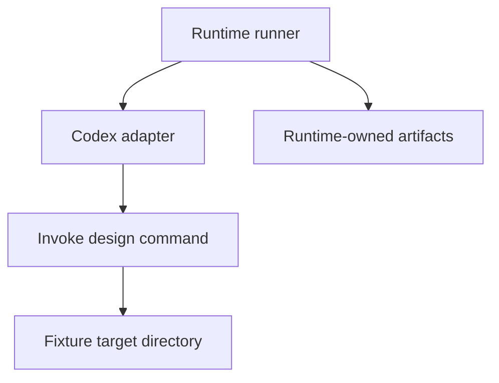
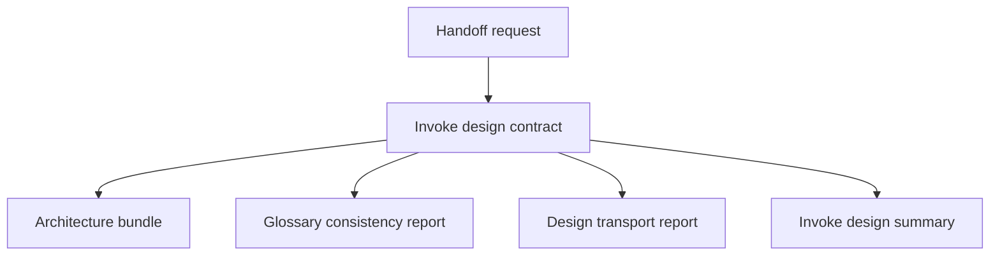
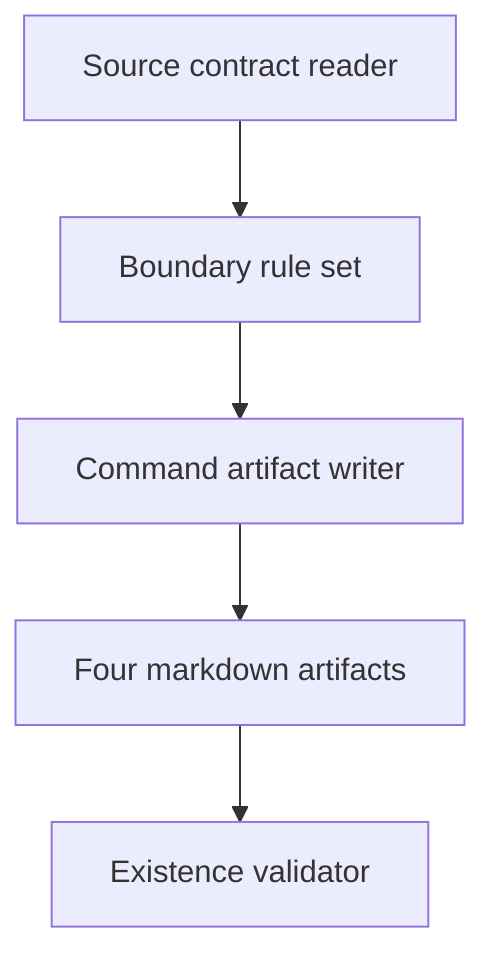
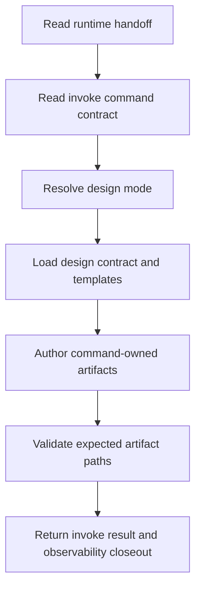
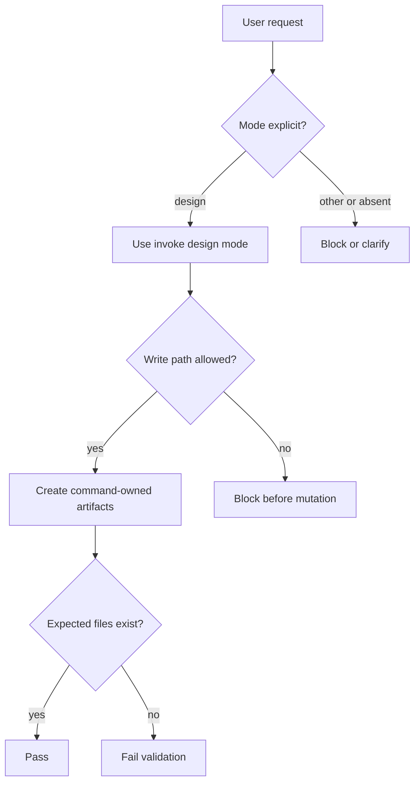
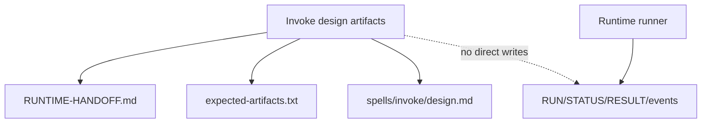

# Architecture Bundle: Runtime Artifact Reproduction

## Design Intent

Runtime artifact reproduction is a tiny fixture capability that proves a runtime-backed invoke command can create command-owned design artifacts in addition to runtime-owned result files. The design keeps the capability file-based, deterministic, and bounded to the declared fixture target directory.

## Inputs

- framework/runtime/development/fixtures/invoke-design-artifacts/RUNTIME-HANDOFF.md
- framework/runtime/development/fixtures/invoke-design-artifacts/expected-artifacts.txt
- .codex/commands/invoke.md
- spells/invoke/design.md

## Required View Set

### 1. Context View

The runtime runner owns status, event, result, and compatibility-copy outputs. The invoke command owns only the design artifacts under `framework/runtime/development/fixtures/invoke-design-artifacts/target/development/`.

### 2. High-Level Structure View

The fixture has no service runtime, registry entry, or persistent state. Its structure is the authored artifact set plus the existing validation fixture that checks file existence.

### 3. Low-Level Components View

| Component | Responsibility | Boundary |
| --- | --- | --- |
| Source contract reader | Interpret the handoff fixture and expected artifact list. | Read-only access to fixture source files. |
| Boundary rule set | Preserve runtime-owned versus command-owned artifact ownership. | No direct writes to runtime result/status/event files. |
| Command artifact writer | Create the expected design artifact files. | Writes only under the declared target development directory. |
| Existence validator | Confirm the expected command-owned files exist. | Uses shell checks; does not mutate artifacts. |

### 4. Workflow Process View

Failure behavior is intentionally simple: if any expected command-owned artifact cannot be created inside the target directory, the fixture should fail validation and route back to the runtime/invoke integration surface.

### 5. Decision Flow View

| Decision ID | Decision | Options Considered | Reason |
| --- | --- | --- | --- |
| D-001 | Use design mode. | define, design, plan, full, validate | The request explicitly asks to design and names design-stage artifacts. |
| D-002 | Treat the handoff as discovery-mode design approval. | block for missing define outputs, proceed with discovery-mode fixture design | The fixture request is deliberately small and supplies source contracts through the handoff and expected artifact list. |
| D-003 | Keep validation at file-existence level. | content schema validation, existence checks | The fixture objective is reproduction of command-owned artifacts, not semantic promotion of a full capability. |

### 6. Dependency Interface View

| Interface | Producer | Consumer | Contract |
| --- | --- | --- | --- |
| Handoff fixture | Runtime fixture source | Invoke design run | Declares objective, write scope, expected artifacts, and validation checks. |
| Command-owned artifact set | Invoke design run | Runtime fixture validation | Must include exactly the requested markdown files under the target development directory. |
| Runtime-owned artifacts | Runtime runner | Runtime validation and compatibility surface | Must not be written directly by the invoke design run. |

## Assumptions

- The runtime runner will copy or write requested output and runtime result artifacts outside this command-owned design work.
- File existence is sufficient evidence for this fixture because the fixture objective is artifact reproduction.
- The target directory is intentionally local to `framework/runtime/development/fixtures/invoke-design-artifacts/target/development/`.

## Open Risks

| Risk ID | Risk | Impact | Mitigation |
| --- | --- | --- | --- |
| R-ARCH-1 | Future validation may require content assertions beyond file existence. | medium | Keep section headers and invoke result fields stable enough for later grep-based checks. |
| R-ARCH-2 | Runtime and command artifact ownership could drift. | medium | Preserve explicit "no direct runtime writes" language in INVOKE-DESIGN.md and DESIGN-TRANSPORT.md. |

## Unresolved Decisions

| Decision | Options | Current Status |
| --- | --- | --- |
| Whether to add semantic content validation for the four artifacts. | file existence only, required headings, full schema | deferred |

## Planning Notes

- Direct implementation constraints: only command-owned fixture artifacts should be authored by invoke design.
- Boundary rules: runtime `RESULT.md`, `RUN.json`, `STATUS.json`, `events.jsonl`, adapter profile files, and requested output copying are runner-owned.
- Testability implications: validation can remain a short shell check over the four expected paths.

## Handoff Targets

- Deferred follow-up if runtime validation later needs richer content checks.
- No implementation-plan or work-pack artifact is emitted by this design run.
