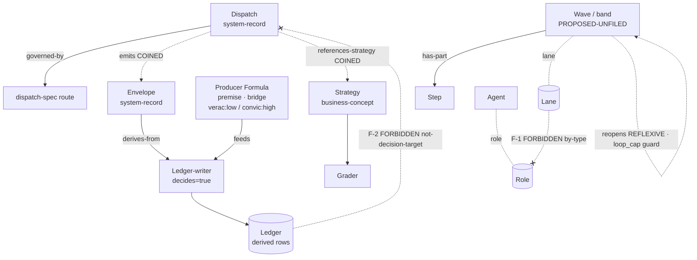

# Ontology View — typed nodes + typed edges beneath the dispatch-composition attack

## 1. Governance posture

This view formalizes the dispatch-composition attack as **typed nodes + typed edges**, and makes the forbidden relationships *unconstructible* rather than merely warned-against in prose. It decides no shape (→ `system-view.md`) and no verdict (→ `engineer-view.md`); it only types what those siblings name, and points every typed verdict back at a `D`-row. The artifact rides `node_type: discovery` for edge legality and carries `governance_status: project-local-overlay`.

### Constitution + edge-catalog resolution (recorded for reproducibility)

| Resolution | Result |
|---|---|
| Project-under-analysis repo | `c:/Users/victo/Arcanum` (`.git` HEAD `3179739`) |
| In-tree `ontology-conventions.md` | **NONE** — `find c:/Users/victo/Arcanum -name ontology-conventions.md` → 0 hits; Arcanum has no `vault/`. Per the SKILL's resolution rule (highest VERSION+PATH **within the project's own repo**, never cross-repo) this is a **declared resolution gap**. |
| Fallback applied (task-directed) | Sibling **domainspec** repo `c:/Users/victo/domainspec` (`.git` HEAD `c5d0066`, working tree clean for the three resolved files). Cross-repo by necessity, not by silent nearest-path. |
| Constitution used | `c:/Users/victo/domainspec/vault/ontology-conventions.md` **@ version 2.3.0** (frontmatter `version: 2.3.0`; clean). Node taxonomy §`node_type` (16-value enum) + Appendix B; confidence semantics §`veracidade`/`convicção`; by-type anchor in Appendix C category-boundary prose. |
| Edge-catalog used | `c:/Users/victo/domainspec/.claude/skills/custom/edge-catalog.md` (legality matrix) + author-picker `.claude/skills/custom/edges.md`; full per-edge cardinality + source/target `node_type` matrix in the constitution's **Appendix C** (lines 554–644 @ v2.3.0). Legality matrix is NOT the count source. |
| D-row inventory | `./engineer-view.md` §4 (D1–D7). |

> **Honest caveat (rides R-04 from engineer-view).** The constitution is resolved in the *sibling* repo because Arcanum carries no constitution of its own. This is the same cross-repo-evidence posture the engineer-view flagged: the typing below is sound against domainspec v2.3.0, but Arcanum has not adopted that constitution in-tree. If Arcanum later vends its own `ontology-conventions.md`, this view is STALE and must re-resolve. No edge is coined to escape this gap.

### Counted edge total (live, Bash-derived each run — never a literal)

**Predicate (recorded):** count catalog rows matching `^\| \`` (a backtick-prefixed forward edge) in `vault/ontology-conventions.md` between the H3 `### Epistemic edges` and the H3 `### Edges deprecated by this catalog`, summed across the three live subsections (`epistemic` / `provenance` / `reference`). Deprecated table and authoring-rules prose excluded. Zero rows would mean a mis-resolved version → re-derive; non-zero here, so the predicate holds.

| Source | Value |
|---|---|
| **Live-table total** (this run's count) | **25** forward edges (15 epistemic + 9 provenance + 1 reference) |
| Appendix-C header prose (line 556) | "**22 forward edges**" |
| Section-8 prose (line 322) | "**21 forward edges** (40 names total)" |

**Three-way mismatch (25 live / 22 header / 21 prose) is SURFACED, NOT reconciled** — flagged as blocker **OQ-ONT-1**. The header and prose are not the live-table truth; the resolver counts rows, and the rows disagree with both stated figures. (This is the v2.3.0/v2.4.0-shape mismatch the SKILL's worked-example saga warns about — the worked example never counted; this run did.)

---

## 2–3. Dispatch-folder artifacts

**Skip predicate applied:** `single + N=1 + explorer` — the default single-author path. No multi-agent machinery dispatched; no `agents/` folder materialized under `research/dispatch-composition-attack/<view_slug>/`. The skip drops the dispatch, **not** the skeptic/citation-strike FUNCTION: the author ran it inline before §7 — every node schema and every precedent opened on disk and was checked to actually support the claim. Result: **zero struck citations, zero downgrades** (every on-disk path below was confirmed present-or-absent as typed). `exit_reason: success`.

---

## 4. Node types

Kind axis (project-declared, not a canonical enum): **`system-record`** (a runtime/operational artifact) vs **`business-concept`** (a governance/domain abstraction) vs **`bridge`** (couples the two). Branch ∈ {business, system, bridge, mixed}. Confidence (`veracidade`/`convicção`) is recorded **only on belief-bearing nodes** (axiom/premise/audit per constitution §applicability); every node below is `node_type: discovery` or `conceptual` and therefore carries **no** confidence — except the one premise-typed node (the producer Formula's stateless contract), which does.

> **Instance vs. canonical-source note (discovery §7 reconcile, v0.2.0).** Where a node's on-disk instance cites `.claude/skills/dispatch-spec/SKILL.md`, that path is the **generated** copy; the **canonical** typed-source — and the edit target for any change to that node's schema — is `formulae/dispatch-spec/{dispatch.schema.json, SKILL.md, scripts/validate-dispatch.py}`. Likewise the hook scripts' canonical home is `framework/observability/scripts/arcanum-hook-*.sh` (the `.codex/hooks/*` are generated), and the absent Claude hook surface is a `tools/bootstrap_arcanum.sh` generator gap, not a config file. Instances below are left at their verified locations; engineer-view's decision rows (D3/D5/D6) carry the canonical edit targets.

<!-- node row columns = name | node_type | kind | branch | schema | flags/instances (confidence only on belief-bearing) | precedent -->

| Name | node_type | kind | branch | Schema | Flags / on-disk instances | Precedent |
|---|---|---|---|---|---|---|
| **Dispatch** | discovery | system-record | system | `{dispatch_id, intent, mode, steps[], gates}` | decides=false; the unit that emits a started/closed pair. instances: `.claude/skills/dispatch-spec/SKILL.md:72` (Rule 1 required keys) — **verified** | engineer-view C3 (verified); discovery §Core Concepts |
| **Wave / band** | discovery | system-record | system | `{wave_id, lane, intent}` wrapping `steps[]` | decides=false; **PROPOSED-UNFILED on disk** — `grep waves\|wave_id .claude/skills/dispatch-spec/SKILL.md` → **0** (verified absent). scope: route-spec (Phase 2a) | engineer-view D5/C3 (verified absent); discovery §Core Concepts (Wave band) |
| **Layer / step** | discovery | system-record | system | `{step_id, technique, parallel?, join_policy?}` | decides=false; the level the Wave groups; instances: dispatch-spec Rules 3–7 (`:74`+) — **verified present** | engineer-view C3 (verified) |
| **Agent** (worker) | discovery | system-record | system | `{agent_id, role_id, spawn_status, join_status, close_status, residue, reroute}` | decides=false; lifecycle-receipt subject. instances: dispatch-spec Rules 21–25 (`:92-96`, `:133`) — **verified** | engineer-view C3 (verified) |
| **Ledger** (central) | discovery | system-record | system | append-only `*.jsonl`; one row per envelope | decides=false; sole writing authority is `observe-invocation.sh`. instances: ledger path `signals/sigil-invocations.jsonl` (`observe-invocation.sh:64`) — **verified** | engineer-view C2 (verified); discovery §1 (sole-writer boundary) |
| **Envelope / record** | discovery | system-record | system | `{timestamp, sigil, tier, mode, request, execution{status,…}, observer{…}}` + producer-added `{goal, angle, anti_bias, exit_reason}` | decides=false; `execution.status ∈ {completed,partial,blocked,failed}` (template `:12`); authored extensions **absent from base template** — verified `invocation-envelope.json:1-33` | engineer-view C1 (verified on disk) |
| **Ledger-writer** | discovery | system-record | system | shell entrypoint: `--target-run-id`, `--dedupe-key`, appends + dedupes | decides=true (it is the gate that admits/dedupes a row); `dedupe_key = "$target_run_id:signal-observer:$observer_version"` (`:151`); self-creates dir (`mkdir -p`, `:58`) — **verified** | engineer-view C2/M2/M3 (verified) |
| **Producer Formula** | **premise** | bridge | bridge | stateless · schema-validate-or-reject · idempotent → calls the writer | **belief-bearing** → `veracidade: low`, `convicção: high` (a **Strategic Bet**: designed-not-built, but the team is building around producer-not-port). **ABSENT on disk** — no script calls `observe-invocation.sh --envelope` with authored fields (verified). instances: none | engineer-view D1/OQ-A (verified absent); discovery §Core Concepts (Producer-not-replacement) |
| **Strategy** (typed object) | discovery | business-concept | bridge | `strategy_ref → (role-set, grader)` def at `formulae/dispatch-spec/strategies/<name>.yml` | decides=false; **PROPOSED-UNFILED** — `strategy_ref` grep → **0**; target dir **does not exist** (verified). scope: route-spec | engineer-view D6/C3 (verified absent); discovery §Core Concepts (Strategy as typed object) |
| **Grader** | conceptual | business-concept | business | `{role-set, convergence/verdict criteria}` (referenced by Strategy) | decides=false; named only inside the `(role-set, grader)` recipe; no on-disk instance in this tree (the `research` strategy anchors to domainspec's `research-constitution.md`, cross-repo). instances: none in-tree | engineer-view D6 (verified); discovery §Core Concepts |
| **Lane** | conceptual | business-concept | business | a property **of a Wave** (`wave.lane`) | decides=false; an axis of the Wave band, NOT of an Agent. **Forbidden-coupling input** (see §5 F-1). instances: bound to Wave schema above (PROPOSED-UNFILED) | engineer-view C3 (verified); discovery §3 |
| **Role** | discovery | system-record | system | a property **of an Agent** (`agent.role_id` → `subagent_strategy.roles`) | decides=false; an axis of the Agent, NOT of a Wave. **Forbidden-coupling input** (see §5 F-1). instances: dispatch-spec `:133` `role_id` matches `subagent_strategy.roles` — **verified** | engineer-view C3 (verified) |
| **Verdict-vocabulary** | conceptual | business-concept | business | closed enum `{pass, flag, block}` carried on Waves | decides=false; the §6 model verdict set. instances: discovery §4 (Phase 2a verdict vocab); not yet on disk in dispatch-spec | engineer-view D5 context; discovery §4 |
| **Connection / edge** | conceptual | business-concept | bridge | a typed `consumes`/`reviews`/`reopens` relation between steps | decides=false; **fenced into Phase 2b** (needs the typed-DAG; cross-repo). The `reopens` member is the reflexive class (see §5 F-4). instances: none — fenced | engineer-view D7/M5 (verified fenced); discovery §2 (2a/2b partition) |
| **the producer Formula** | (see *Producer Formula* above) | — | — | — | single node; listed once | — |

**Both-endpoint-capable nodes surfaced as §5 reflexive input:** **Step** and **Wave/Step Connection** can both source and target a same-typed edge (`reopens`: a Connection from a later step back to an earlier one; a Wave-to-Wave `continues`-style relation) — fed to F-4. **Agent** can target an `Agent`-typed relation (a worker rerouting to a peer) — flagged but out of scope here (L3 receipts are deferred, engineer-view R-07).

---

## 5. Edge types

Catalog edges are reproduced **verbatim** from Appendix C @ v2.3.0 (cardinality may be tightened, never loosened). Coined edges are flagged **PROPOSED-UNFILED** with a blocker OQ — no external amendment path is invented.

<!-- edge row columns = name | from → to | direction, cardinality | rule | forward/inverse | precedent -->

| Edge | from → to | Direction, cardinality | Rule | Forward / inverse | Precedent |
|---|---|---|---|---|---|
| `derives-from` | ontology-view → discovery.md | directed, N:1 (tightened from N:M) | "this view draws its entire node/edge seed from the discovery; reconciled @ v0.2.0 (newer = STALE)" | inverse `derives` | catalog @ v2.3.0, reused verbatim (Appendix C epistemic) |
| `cites` | ontology-view → engineer-view.md | directed, N:M | "every typed verdict points at a D-row in engineer-view" | inverse `cited-by` | catalog @ v2.3.0, verbatim (Appendix C reference) |
| `cites` | ontology-view → system-view.md | directed, N:M | "shape is pointed up to system-view; not re-typed here" | inverse `cited-by` | catalog @ v2.3.0, verbatim |
| `derives-from` | Envelope → Ledger-writer (concept-level) | directed, N:1 | "a record is produced FOR the writer that owns the ledger; the writer is fed, never replaced" | inverse `derives` | catalog @ v2.3.0; engineer-view C2 (verified) |
| `part-of` | Step → Wave | directed, N:1 | "a step is a structural component of the band that groups it" | inverse `has-part` | catalog @ v2.3.0 (Appendix C, `conceptual,spec` source) — **tightened note:** Step/Wave are `system-record` kind, not constitutional `conceptual`/`spec`; reused at the project-overlay layer, flagged **reuse-at-overlay** |
| `governed-by` | Dispatch → dispatch-spec route schema | directed, N:1 | "a dispatch's shape is bound by the route spec's rules" | inverse `governs` | catalog @ v2.3.0, verbatim |
| **`emits`** | Dispatch → Envelope | directed, 1:N | "a dispatch emits a started+closed envelope pair into the ledger" | inverse **`emitted-by`** | **COINED — PROPOSED-UNFILED.** No catalog edge expresses runtime emission (the closest, `creates`, is **session-only** per Appendix C provenance category). Blocker **OQ-ONT-2.** |
| **`references-strategy`** | Dispatch → Strategy | directed, N:1 | "a route points at a reusable (role-set, grader) recipe instead of re-spelling roles" | inverse **`strategy-referenced-by`** | **COINED — PROPOSED-UNFILED.** `strategy_ref` is a schema FK with no catalog analogue. Blocker **OQ-ONT-3.** |
| **`consumes`** | Step → Step (Connection) | directed, N:M | "a later step reads an earlier step's output" | inverse `consumed-by` | catalog name exists @ v2.3.0 but is **session-source-only** (provenance category). Between two `step` nodes it is **reuse-pending-version-bump / fenced** — the typed-DAG (Phase 2b) is where step-to-step `consumes` would become legal; cross-repo. NOT coined. |
| **`reviews`** | Wave → Wave (Connection) | directed, N:M | "a review wave evaluates a prior wave's output" | inverse **`reviewed-by`** | **fenced (Phase 2b)** — needs the typed-DAG; cross-repo (Vlad). Not coined here, not constructed here. engineer-view D7/M5 (verified fenced). |
| **`reopens`** | Wave/Step → earlier Wave/Step (Connection) | directed, N:M — **reflexive/cyclic class** | "a wave can send work back to an earlier wave" — the back-edge | inverse **`reopened-by`** | **fenced (Phase 2b) + reflexive guard required** (see F-4). engineer-view D7/M5 (verified fenced). |

### Forbidden edges & guards (the differentiator)

Discipline: **by-type unconstructibility FIRST, named fail-closed guard SECOND — EXCEPT the reflexive class, where the predicate guard is PRIMARY.** The by-type argument is anchored in the constitution's own **Appendix C category-boundary prose @ v2.3.0, line 558**: *"A session cannot originate an epistemic edge — doing so would make the session an epistemic actor, which it is not… Formalized nodes cannot originate provenance edges"* — and authoring rule 5 (line 642): *"Respect the category boundary."* That doctrine is what makes a wrong endpoint-pair *admit no catalog edge*, not merely fail a lint.

**LIVE rule:** an enforcement body must be reachable AND evaluating the predicate, verified on disk. **Nothing in this attack is built** (`.claude/settings.json` absent; producer absent; `waves`/`strategy_ref`/strategies-dir absent — all verified). Therefore **every guard below is PLANNED, stated honestly.** The by-type *argument* is authoring/review-time and holds now; the runtime *guard* is PLANNED.

| # | Archetype | Forbidden pair | By-type unconstructibility (PRIMARY for 1–3) | Named guard (PRIMARY for 4) | Status |
|---|---|---|---|---|---|
| **F-1** | Orthogonal-axis coupling | `Lane (Wave property) ⟷ Role (Agent property)` coupled as **peers** | Lane is an axis **of Wave** (`system-record`); Role is an axis **of Agent** (`system-record`). They are properties of two *different* nodes — there is **no node whose schema carries both as sibling fields**, and no catalog edge admits a `Lane→Role` peer edge (neither is a node_type; both are sub-properties). The category-error is the mode-conflation the model warns against (system-view §10, "lane"≠"role"). Constructing it would require coining a property-to-property edge — refused. | `guard:no-lane-role-peer` — a validator rejecting any route field that places `lane` and `role` as siblings on one object. | **PLANNED** (no validator on disk; dispatch-spec has neither field yet — verified) |
| **F-2** | Derived/cache node as decision target | `decision-edge → Ledger row` (a derived ledger row as a decision target) | A Ledger row is the **derived output** of the writer (`decides=false`); a decision edge's target must be a decision-bearing node. The only `decides=true` node is the **Ledger-writer** (the gate), never a *row*. No catalog edge targets an emitted row as a verdict subject; the row carries `execution.status`, it does not *decide* it. | `guard:ledger-row-not-decision-target` — fail-closed: a row is read-only provenance; no rule may key a verdict off a single derived row. | **PLANNED** (no such rule on disk) |
| **F-3** | Tier escalation without a gate | `Step → reflection escalation` flipping a tier with no gate (the false-positive reflection storm) | Not a pure by-type case — the endpoints (Step, reflection_trigger) are legal; the danger is *escalation without a gate*. Requires a **named runtime guard**, not a type refusal. | `guard:completion-before-reflect` — reflection (`reflection_trigger`) must not fire `severe-gap` off a stuck `partial`; the guard requires a verified `completed` transition (the D3/OQ-B completion-signal) before any threshold counts. Threshold lives at `config.json:11` (`related_workflow_gaps: 3`) — **verified present**, but the gating predicate is **absent**. | **PLANNED** (engineer-view M1: enforcement ABSENT — verified) |
| **F-4** | **Reflexive / self-loop (predicate guard PRIMARY)** | `reopens` back-edge: a Wave/Step edging back to itself or cycling without bound | By-type **cannot apply** — endpoints are identical, legal `step`/`wave` nodes. So the predicate guard is primary. | `guard:loop_cap` — a `reopens` edge is admitted only if `loop_cap` is not exhausted AND `target.position < source.position` (no self-loop: `source ≠ target`; no unbounded cycle). The `loop_cap` **default is itself a Vlad-reserved cross-repo decision** (engineer-view D7; discovery OQ-1) — so the predicate body does not yet exist in this tree. | **PLANNED** (predicate has no on-disk body; `loop_cap` default unresolved — blocker, see OQ-ONT-4) |

---

## 7. Open questions + Residue ledger

### Open questions (recommendation + owner; blockers flagged)

- **OQ-ONT-1 — Edge-count three-way mismatch (BLOCKER).** Live-table 25 vs Appendix-C header 22 vs Section-8 prose 21 in the resolved constitution. *Recommendation:* do not reconcile in this view; the constitution owner must align header/prose to the live table (the v2.3.0→v2.4.0 catalog drift). *Owner:* domainspec constitution maintainer. **Blocker** for any promotion that asserts a canonical edge count.
- **OQ-ONT-2 — `emits` is COINED (BLOCKER).** Runtime emission (Dispatch→Envelope) has no catalog edge; `creates` is session-only. *Recommendation:* file an edge-amendment discovery in domainspec proposing a runtime-emission edge, OR keep emission purely schema-level (a producer call, not a graph edge). Promotion HALTED until filed. *Owner:* domainspec edge-catalog maintainer.
- **OQ-ONT-3 — `references-strategy` is COINED (BLOCKER).** `strategy_ref` FK has no catalog analogue. *Recommendation:* treat as a schema FK (not a vault graph edge) — it lives inside dispatch-spec, not in a `## Connections` block — and withdraw the coin if so; else file an amendment. *Owner:* dispatch-spec maintainer.
- **OQ-ONT-4 — `loop_cap` predicate body absent (BLOCKER, unowned-in-tree).** The reflexive guard for `reopens` has no on-disk predicate and its default is Vlad-reserved (cross-repo). *Recommendation:* do not construct any `reopens` edge until the typed-DAG ratifies and `loop_cap` defaults; ships in Phase 2b only. *Owner:* cross-repo decision-maker (Vlad). Mirrors engineer-view OQ-D.
- **OQ-ONT-5 — Cross-repo constitution adoption (rides R-04).** Arcanum types itself against a constitution it does not vend in-tree. *Recommendation:* either vendor `ontology-conventions.md` into Arcanum or record the cross-repo dependency as a standing overlay condition. *Owner:* Arcanum maintainer.

### Residue ledger

| # | State | Surviving residue | Citation |
|---|---|---|---|
| R-08 | open | "Arcanum has no in-tree constitution; node/edge typing rests on the sibling domainspec v2.3.0 — the same cross-repo-evidence caveat the engineer-view's R-04 carries" | engineer-view R-04 (`findings.md:57`); this view §1 resolution gap |
| R-09 | open | "constitution edge count disagrees with itself (25/22/21) — surfaced, never reconciled; the resolver counts rows, the prose is stale" | this view §1 (Bash predicate, live count) |
| R-10 | open | "two coined edges (`emits`, `references-strategy`) have no amendment route in this tree — PROPOSED-UNFILED, promotion HALTED; `references-strategy` may dissolve into a schema FK rather than a graph edge" | this view §5; engineer-view D6 |
| R-11 | open | "every forbidden-edge guard is PLANNED, never LIVE — nothing in the attack is built (no settings.json, no producer, no waves/strategy_ref); the by-type arguments hold at authoring time, the runtime guards do not yet exist" | engineer-view M1–M5 (enforcement ABSENT, verified); this view §5 |
| R-12 | open | "the `reopens` reflexive guard (`loop_cap`) has no predicate body and its default is Vlad-reserved — the reflexive class is the one place by-type cannot help, and the predicate is exactly the missing piece" | engineer-view D7/OQ-D; this view F-4 |
| R-13 | closed | "Lane (Wave) and Role (Agent) are orthogonal-axis properties of two different nodes — typed so no peer edge admits the pair; the mode-conflation the model warns against is made unconstructible by-type" | this view F-1; system-view §10 |
| R-14 | closed | "producer-not-port preserved at type level: the Producer Formula is a `bridge` premise feeding the Ledger-writer, never a second writer node" | engineer-view R-06; discovery §Core Concepts |
| R-15 | open | "node instances cite GENERATED copies (`.claude/skills/dispatch-spec/*`, `.codex/hooks/*`); the canonical typed-sources are `formulae/dispatch-spec/*` and `framework/observability/scripts/arcanum-hook-*.sh`. The absent Claude hook surface is a `tools/bootstrap_arcanum.sh` generator gap (M6), not a missing config — a typed node could be added for the generator if the surface is formalized" | discovery §7 (canonical edit map); engineer-view M6 |

Open residue (R-08…R-12, R-15) preserved, never demoted. Closed residue (R-13, R-14) records adjudicated typings.

---

## 8. Schema graph + Cross-reference map + overlay status

### Curated schema graph (subset — the load-bearing typed core)

### Cross-reference map (nothing decided twice)

- **Verdicts pointed at engineer-view (no re-deciding):** Producer Formula→**D1**; scaffold not re-typed→D2; Envelope completion field→**D3**; Strategy/skill-coupling→D4; Wave→**D5**; Strategy/`strategy_ref`→**D6**; Connection/`reviews`/`reopens` fence→**D7**. F-3 completion guard rides D3; F-4 `loop_cap` rides D7.
- **Shape pointed up:** all narrative/layering/fence → `system-view.md`. Not re-narrated.
- **Terms owned here:** every node/edge type above is this view's lane; the siblings *use* them, this view *types* them.

### Overlay status

`governance_status: project-local-overlay` — out of promotion. Two coined edges PROPOSED-UNFILED (promotion HALTED, no external amendment path invented); the constitution is resolved cross-repo because Arcanum vends none in-tree (R-08). The artifact rides `node_type: discovery`. **Step-8 `domainspec-emit-signals` epilogue SKIPPED — not in the domainspec repo** (this is the Arcanum tree). `exit_reason: success`.

### Connections

| Edge | Target | Note |
|---|---|---|
| `derives-from` | `./discovery.md` | seed corpus and sole mutation trigger; reconciled against version 0.2.0 (newer = STALE) |
| `cites` | `./system-view.md` | owns the shape; terms here type what it names |
| `cites` | `./engineer-view.md` | owns the verdicts D1–D7 each typed verdict points at |
| `cites` | `./findings.md` | evidence for the preserved tensions |
| `cites` | `./research.md` | raw four-agent evidence bundle |
| `cites` | `c:/Users/victo/domainspec/vault/ontology-conventions.md` | resolved constitution @ v2.3.0 (cross-repo; forward-only by target — not an Arcanum vault node) |

---

*Run note — nodes typed: 14 · edges typed: 11 (2 coined-flagged: `emits`, `references-strategy`; PROPOSED-UNFILED, promotion HALTED) · forbidden-guard status: endpoint-type PLANNED (F-1/F-2 by-type arguments hold at authoring time, runtime guards unbuilt) | reflexive PLANNED (F-4 `loop_cap` predicate body absent, default Vlad-reserved).*
