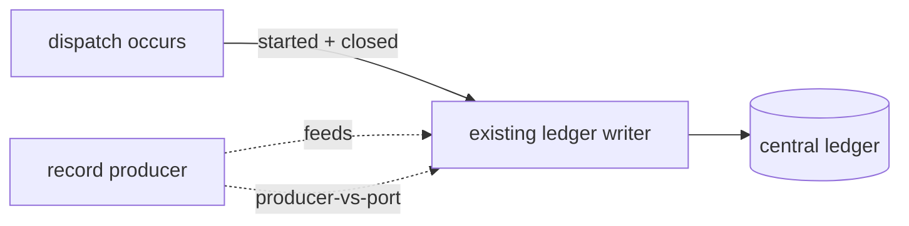
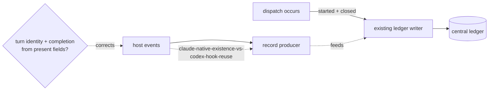
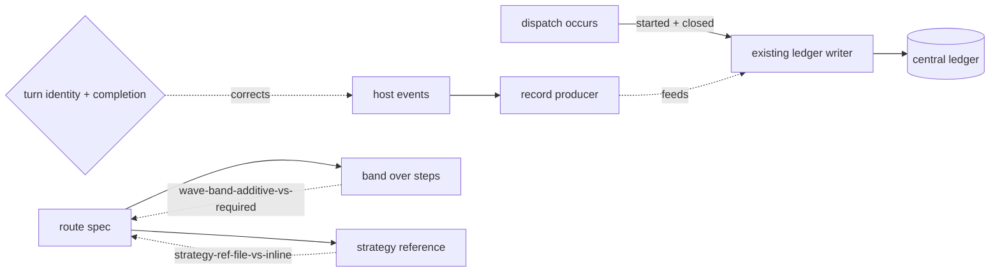
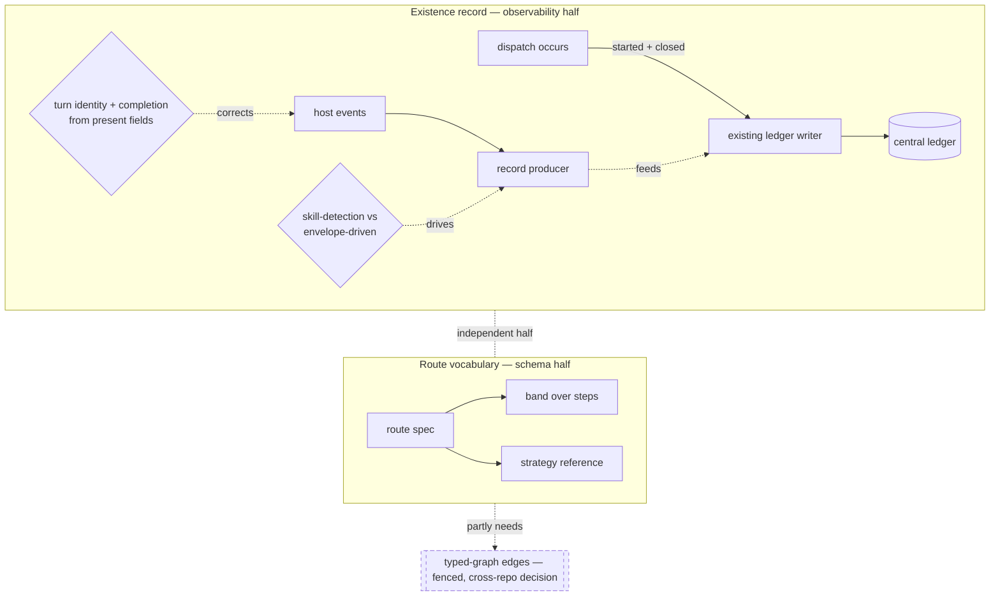

# System View — the dispatch-composition attack at stakeholder altitude

## 1. Objective

Make a subagent dispatch *visible and governable* under Claude Code, and give the dispatch route a vocabulary for grouping the work it spawns — without making any call that belongs to another repository. Concretely: a dispatch should land a matched started/closed pair in the one central ledger, and the route specification (`dispatch-spec`) should gain a way to name a band of work above the individual step and to point at a reusable team-and-grader recipe (`derives-from -> discovery.md`).

This view names where the plan could defensibly go another way. It decides nothing.

### Executive gloss

*Problem → choice → why the choice is live. Each bullet is anchored to the seed. These are informal translations, not definitions; terms belong to ontology-view.*

- **What this does.** It wires observability so a dispatch *emits* governance records, and extends the route spec with two structures it lacks — a grouping band and a typed strategy handle (`discovery.md:13-17`).
- **Why now.** The central ledger holds one bootstrap record and zero cross-run rows; until a dispatch actually emits, the "must emit" gate is documentation, not governance (`discovery.md:23`).
- **The work splits in two independent halves.** Observability wiring and route-spec schema touch different surfaces and neither blocks the other (`findings.md:11`; `research.md:97`).
- **Biggest open decision (not ours).** A typed-graph reshaping of the route depends on a cross-repository ratification — fenced off here, recommended to wait (`discovery.md:78`; "what this view does not cover" below).
- **"Fits now" is not "works now."** The wiring exists as an integration plan that has never been exercised; reusing the existing hook scripts is necessary but, on its own, not sufficient (`findings.md:100`; `research.md:99`).
- **The cheapest shippable slice is observability-only.** One dispatch emitting a traceable record closes the long-standing gap of ungoverned multi-agent folders (`findings.md:30`; `discovery.md:23`).
- **Start here:** read the Surface, then the layered shape; the stance table collects every place the plan picks a side that could be argued.
- **Given-and-fixed vs. not-yet-in-the-picture:** the existing ledger writer is treated as the sole authority and is fed, never replaced (given); the typed-graph edges are deliberately out of the current picture (`discovery.md:34`, `:35`).

---

## 2. Surface — what this is, plainly

Today a multi-agent dispatch under Claude Code leaves almost no governed trace: the events that *would* record it are wired for a different host and read fields that Claude does not send, so nothing useful lands. The attack plan closes that gap from two sides at once. On one side, it makes a dispatch *emit* a record into the existing central ledger by feeding the writer that already owns the ledger. On the other, it teaches the route specification to describe work in *bands* and to *reference a reusable strategy* rather than re-spelling roles every time.

The stakes are concrete: the seed counts a large set of multi-agent folders that stay ungoverned until the first real emission lands (`discovery.md:23`). The seed is equally blunt that the plan is not built — it has never been exercised end to end (`findings.md:100`).

The **producer-vs-port** stance — feed the existing ledger writer with a new producer versus port a second writer from the sibling repository, a real tension, not a settled answer — named here, decided nowhere (`stance:producer-vs-port -> engineer-view#[PROVISIONAL — row not yet authored]`).

### Alternative framings we considered

| Framing | Why we set it aside |
|---|---|
| Open at the route-spec schema (bands and strategy first) | It frames the work as a vocabulary change and buries the live failure that no record emits today; the emission gap is what makes the plan urgent. |
| Open at the cross-repository typed-graph decision | That decision is fenced off as not-ours; leading with it would frame a stakeholder choice around a question this team cannot answer. |

---

## 3. Layer — the existence record: making a dispatch leave a governed trace

A dispatch should leave a matched pair behind it: a record when it starts and a record when it closes, both landing in the one central ledger that already exists. The plan reaches that by *producing* a conformant record and handing it to the established writer, rather than standing up a competing writer. The concrete stake: the ledger today holds a single bootstrap record and no cross-run rows, so the very first matched pair is the difference between "governed" and "documented" (`discovery.md:23`; `findings.md:24`).

The **producer-vs-port** stance carries this layer (named at the Surface). A second, sharper choice lives one level down: whether the scaffold the writer counts against is materialized by the canonical setup capability or by a bare hand-made directory — the difference shows up only when the reflection counters are read.

The **observability-setup-vs-minimal-scaffold** stance — materialize the signal scaffold through the canonical setup capability versus a bare make-and-touch, a real tension, not a settled answer — named here, decided nowhere (`stance:observability-setup-vs-minimal-scaffold -> engineer-view#[PROVISIONAL — row not yet authored]`). The seed itself frames this as correctness-for-counters rather than a hard blocker, because the writer self-creates its directory (`discovery.md:57`) — which is exactly why it is a live judgment call and not a forced move.

### Alternative framings we considered

| Framing | Why we set it aside |
|---|---|
| Treat scaffolding as a precondition that simply "must exist first" | The writer self-creates its directory, so calling the scaffold a hard precondition overstates a dependency the seed explicitly softens. |
| Fold the producer into the ledger writer itself | That collapses the two-surfaces shape this view is built on and hides the producer-vs-port tension by pre-answering it. |

---

## 4. Layer — the host-fit problem: Claude is not the host the trace was built for

The events that should fire the trace were authored for a different host. Two of the fields they depend on to identify a turn and to mark completion are simply not present in what Claude sends — so reused as-is, every turn collapses onto one identity and every dispatch is recorded as unfinished (`discovery.md:27-28`; `findings.md:67-68`). The plan's correction is to derive a turn identity from a field Claude *does* send (a session identifier plus a turn counter) and to read completion from a field actually present in Claude's stop event. The stake is total: without these corrections the first layer produces zero usable records (`discovery.md:44`; `findings.md:71`).

A second-order stake rides here, and it changes *where the work goes* rather than *what it is*: the host wiring is **generated**, not hand-placed — so the correction belongs at the step that emits the host surface, not in a one-off configuration a regeneration would silently overwrite. A stakeholder weighing this should expect the fix to touch a generator, and should distrust any one-off file as a durable answer. (Which concrete files are canonical versus generated is a mechanics question — engineer-view's lane, not named here.)

The **claude-native-existence-vs-codex-hook-reuse** stance — author a Claude-native turn identity and completion signal versus reuse the existing host-coupled event scripts as-is, a real tension, not a settled answer — named here, decided nowhere (`stance:claude-native-existence-vs-codex-hook-reuse -> engineer-view#[PROVISIONAL — row not yet authored]`). The seed records the optimist and skeptic both as right about different things — the target shape is sound, *and* a settings copy alone is necessary-but-not-sufficient (`findings.md:71`) — which is precisely the un-collapsed tension this view must preserve.

A related judgment rides alongside it: whether the producer should *depend on detecting the skill* that was invoked at all, given that the prompt-reading event sees only part of the installed skill set, or instead be driven purely from the dispatch's own record (`discovery.md:30`, `:81`).

The **skill-detection-coupled-vs-envelope-driven** stance — drive the producer from prompt-side skill detection versus drive it from the dispatch record itself, a real tension, not a settled answer — named here, decided nowhere (`stance:skill-detection-coupled-vs-envelope-driven -> engineer-view#[PROVISIONAL — row not yet authored]`).

### Alternative framings we considered

| Framing | Why we set it aside |
|---|---|
| "Just register the host events and they will work" | The seed shows two of the depended-on fields are absent under this host, so registration alone records nothing usable — naming it as solved would assert a side. |
| Defer the host-fit corrections to a later increment | The seed makes the corrections part of the *minimal* shippable increment, not an enhancement; deferring them would change which increment is even shippable. |

---

## 5. Layer — the route vocabulary: bands above steps, and a strategy you can name once

The second half teaches the route specification two structures it lacks. First, a *band* that groups the individual steps a dispatch already validates — giving a functional level above the step, attached as an additive grouping so the existing step-level checks keep working (`discovery.md:45`, `:66`). Second, a *strategy reference*: instead of re-spelling the team-and-grader roles inside every dispatch, a route can point at a reusable strategy definition (`discovery.md:46`, `:67`). The stake is reuse and legibility — a route author names the recipe once rather than re-authoring roles per dispatch, and absent either structure, nothing in the current spec breaks (`findings.md:37`).

The **wave-band-additive-vs-required** stance — attach the band as an optional grouping that leaves existing routes valid versus make it a structural requirement of every route, a real tension, not a settled answer — named here, decided nowhere (`stance:wave-band-additive-vs-required -> engineer-view#[PROVISIONAL — row not yet authored]`).

The **strategy-ref-file-vs-inline** stance — express a strategy as a referenced, colocated, reusable definition versus inline the roles per dispatch, a real tension, not a settled answer — named here, decided nowhere (`stance:strategy-ref-file-vs-inline -> engineer-view#[PROVISIONAL — row not yet authored]`).

### Alternative framings we considered

| Framing | Why we set it aside |
|---|---|
| Treat band-and-strategy as one indivisible "schema upgrade" | The seed shows the two structures move independently — a sibling draft adopted one family of change without the other — so bundling them hides a real seam. |
| Frame the band as the carrier of review-and-reopen governance now | That governance partly depends on the fenced-off typed-graph half; asserting it here would import an out-of-scope decision into an in-scope layer. |

---

## 6. Full picture — the assembled shape

Both halves assembled: the existence record (left) feeds the one ledger through a producer corrected for the host; the route vocabulary (right) gains a band and a strategy reference. A dashed fence marks the part deliberately left out of the picture.

The two halves are independent — neither blocks the other (`findings.md:11`). The fence is the load-bearing scope line of the whole plan.

---

## 7. Given-vs-optimized — what is fixed-and-obeyed vs. tuned

This is the *control* axis — what the plan treats as fixed and obeys, versus what it tunes — and it is orthogonal to whether a thing is built yet.

**Given (fixed-and-obeyed):**
- The existing ledger writer is the sole writing authority — fed, never replaced (`discovery.md:34`).
- The base rule, premise, and the typed-graph open question are not touched here — anything that would reopen them is fenced (`discovery.md:35`).
- The wave/agent receipt levels are out of scope for this increment — they await a later receipt structure (`discovery.md:36`).
- The sibling repository's own ledger and hooks are unchanged (`discovery.md:37`).

**Optimized (tuned by an authoring choice):**
- How the host-fit identity and completion are derived (the **claude-native** stance).
- Whether the scaffold is canonical or minimal (the **observability-setup** stance).
- Whether the band is optional or required, and whether the strategy is referenced or inline (the **wave-band** and **strategy-ref** stances).
- Whether the producer reads skill detection or the record itself (the **skill-detection** stance).

The **ship-2a-structure-only-vs-wait-for-vlad** stance — ship the additive route-vocabulary half now, naming out loud that it is structure-only until the fenced half clears, versus hold it until the cross-repository decision lands, a real tension, not a settled answer — named here, decided nowhere (`stance:ship-2a-structure-only-vs-wait-for-vlad -> engineer-view#[PROVISIONAL — row not yet authored]`). The seed preserves both voices: the half is genuinely decouplable and shippable, *and* it under-delivers the review-loop story until the fenced half lands (`findings.md:80`).

### Alternative framings we considered

| Framing | Why we set it aside |
|---|---|
| Model everything as a tunable knob | The ledger writer, the untouched base rules, and the receipt levels are fixed-and-obeyed boundaries; treating them as knobs would erase the scope line the plan rests on. |
| Define "given" as "already built today" | The control axis is fixed-vs-tuned, not built-vs-unbuilt — the existing writer is given *and* exists, the receipt levels are given-as-out-of-scope yet unbuilt; conflating the two would hide existence stances. |

---

## 8. Process-order annotations

Only sequence the assembly diagram cannot carry:

- **Host-fit before first usable record.** Within the existence half there is a hard ordering the boxes do not show: the turn-identity and completion corrections must hold *before* any record is usable — the seed names "fits now ≠ works now" exactly here (`findings.md:100`). A reader checking the plan checks the corrections first, not the producer wiring.
- **The two halves carry no ordering between them.** The diagram's dashed peer-line is not a sequence edge — the seed is explicit that neither half blocks the other (`research.md:97`).
- **The fence gates only the route half's deeper governance, and only later.** The route-vocabulary half ships independently of the fenced decision; only its review-and-reopen governance waits on it (`findings.md:80`).

---

## 9. Stance-to-verdict table

| Stance | Tension named here | Owning row + target doc |
|---|---|---|
| `producer-vs-port` | Feed the existing ledger writer via a new producer vs. port a second writer from the sibling repo | engineer-view#[PROVISIONAL — row not yet authored] |
| `observability-setup-vs-minimal-scaffold` | Canonical setup capability vs. bare make-and-touch for the signal scaffold | engineer-view#[PROVISIONAL — row not yet authored] |
| `claude-native-existence-vs-codex-hook-reuse` | Author a host-native turn identity + completion signal vs. reuse host-coupled event scripts as-is | engineer-view#[PROVISIONAL — row not yet authored] |
| `skill-detection-coupled-vs-envelope-driven` | Drive the producer from prompt-side skill detection vs. from the dispatch record | engineer-view#[PROVISIONAL — row not yet authored] |
| `wave-band-additive-vs-required` | Band attached as optional grouping vs. required structure of every route | engineer-view#[PROVISIONAL — row not yet authored] |
| `strategy-ref-file-vs-inline` | Strategy as a referenced reusable definition vs. inline roles per dispatch | engineer-view#[PROVISIONAL — row not yet authored] |
| `ship-2a-structure-only-vs-wait-for-vlad` | Ship the additive half now as structure-only vs. hold for the fenced cross-repo decision | engineer-view#[PROVISIONAL — row not yet authored] |

Every pointer is provisional because the engineer-view does not yet exist. Each carries the blocker open question below.

---

## 10. What this view does not cover

- **Verdicts, schemas, mechanics — engineer-view's lane.** Field names, ordered states, cardinalities, closed enumerations, the dedupe-key form, the exact payload field chosen for completion, the build/done status of any piece — none appear here. Every stance above resolves to exactly one engineer-view row, owned there.
- **Where in the repo each change lands — engineer-view's lane.** Which file is the canonical source versus a generated copy, and the fact that the missing Claude hook surface is a generator gap, are mechanics: they live in engineer-view's decision rows and its M6 mechanic (and the discovery's canonical edit map), never as paths in this shape view.
- **Terms — ontology-view's lane.** "Dispatch", "wave/band", "ledger", "envelope/record", "strategy", "grader", "lane", "verdict vocabulary" are used here, defined there.
- **Settled out of scope (not a live stance here).** The typed-graph reshaping of the route — typed inter-step edges, non-linear fan-in, nested meta-dispatch — is *settled as out-of-scope* by the seed's own partition criterion: it is fenced into the gated half because it needs the typed graph or reopens the base rule, and the seed records the recommendation to not start it until the cross-repository gate clears (settling decision: `discovery.md:47`, `:78`). It is named here so a reader cannot mistake the fence for a hidden tension — but the decision to fence it is the seed's, not this view's.
- **The cross-repository ratification itself.** Whether to ratify the sibling draft, collapse to a single canonical spec, discharge the premise, or set the cycle-cap default — all four are explicitly not-ours and recorded as reserved (settling decision: `discovery.md:78`; `findings.md:51-56`).

**Open questions** (each carries a recommendation + owner; blocker flagged):

- **BLOCKER OQ-A — engineer-view rows do not exist.** Every stance pointer is provisional until the engineer-view decision inventory is authored. *Recommendation:* author engineer-view next, harvesting all seven stance slugs as its row seeds. *Owner:* engineer-view author.
- **OQ-B — completion signal under this host.** Which stop-event field reliably signals completion, replacing the absent one. *Recommendation:* inspect a live stop payload; treat as the gating proof for the existence half being "done" (`discovery.md:79`). *Owner:* observability implementer.
- **OQ-C — host-native turn identity stability.** Whether session-identifier-plus-counter is stable and monotonic across a session. *Recommendation:* confirm empirically over a two-turn session before building on it (`discovery.md:80`). *Owner:* observability implementer.
- **OQ-D — cross-repo verification.** The sibling-repo claims were relayed, not re-verified in this tree. *Recommendation:* confirm against the live sibling tree before any ratification (`discovery.md:82`; `findings.md:57`). *Owner:* cross-repo decision-maker.

Nothing here is decided twice: shape lives in this view, verdicts in engineer-view, terms in ontology-view.

---

## 11. Maturity / known limitations

This view is seeded from an exploratory discovery (`status: exploratory`, version 0.2.0) and inherits its maturity. The practical consequences a reader should hold:

- **The plan is unexercised.** The observability half is an integration plan that has never run end to end; the seed is explicit that "fits now" is not "works now" (`findings.md:100`). Treat the existence half as designed-not-demonstrated.
- **A material slice rests on relayed cross-repo evidence.** The claims underpinning the fenced half were read in a sibling repository and not re-verified in this tree (`findings.md:57`). Any reasoning that leans on the fenced half carries that caveat.
- **All stance pointers are provisional.** No engineer-view exists, so none of the seven tensions yet resolves to a verifiable owning row; this view's links are forward references until that inventory is authored.
- **Reconcile, not regenerate.** This view derives from the discovery and is its downstream artifact; a higher discovery version makes this view STALE and is fixed only by re-running against the delta, never hand-patched.

---

## 12. Connections

| Edge | Target | Note |
|---|---|---|
| `derives-from` | `./discovery.md` | seed corpus and sole mutation trigger; reconciled against version 0.2.0 (newer = STALE) |
| `complements` | `./engineer-view.md` | owns verdicts, schemas, mechanics, AND the canonical-vs-generated edit locations; harvests all seven stance slugs |
| `uses-terms-of` | `./ontology-view.md` | owns every term used here (not yet authored) |
| `cites` | `./findings.md` | the synthesis the discovery stands on; evidence for the preserved tensions |
| `cites` | `./research.md` | the raw four-agent evidence bundle |
