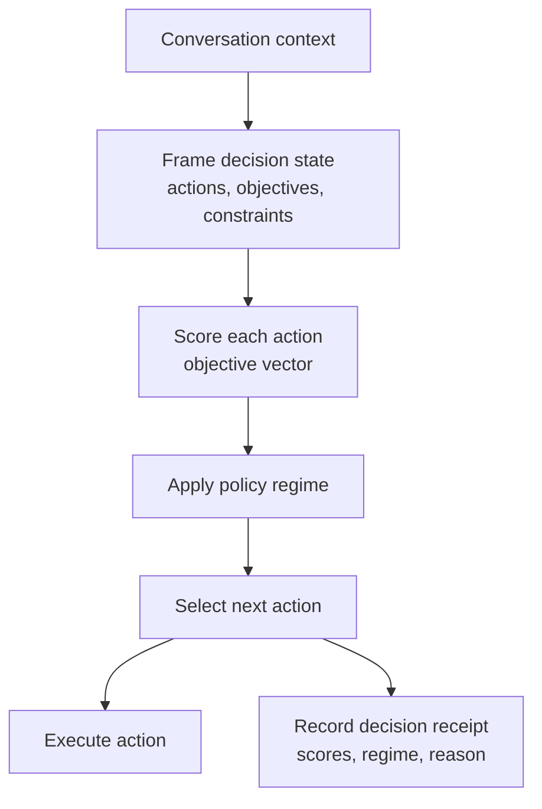

<!--
node_type: orientation
status: design-stage (model + test harness exist; no live evidence yet)
topic: what MOGT is — from scratch, for someone outside the domain
last_updated: 2026-06-10
-->

# MOGT — Multi-Objective Game Theory for Agentic Conversation Decisions

> Orientation document. Plain language, lots of context, lean. Every factual claim
> points to the file it came from. Where something is **designed but not built or
> not yet tested**, it is marked ⚠️.
>
> This README is the from-scratch explainer. For the formal symbols and the runtime
> algorithm see [module-formulae/formal-runtime-definition.md](module-formulae/formal-runtime-definition.md);
> for canonical term definitions see [definitions/DEFINITIONS.md](definitions/DEFINITIONS.md).

## Objective

Explain, for someone outside the domain, what this project asks, what MOGT actually
does inside an agent, what is **given** (the system obeys) versus **optimized** (the
system improves), and — most important — what is **proven** versus only **designed**.

The honest headline first: the decision model and a synthetic-fixture test harness
exist, but **no live experiment has been run, so nothing about MOGT is proven yet.**
All four project claims are rated *insufficient evidence* and all four experiments are
*not started*. Source: [results/MOGT-EVIDENCE-STATUS.md](results/MOGT-EVIDENCE-STATUS.md),
[experiments/EXPERIMENTS.md](experiments/EXPERIMENTS.md).

---

## 1. The question, concretely

**The problem.** An agentic system constantly has to pick its next conversation move:
answer now, ask a clarifying question, call a tool, consult another agent, escalate to a
human, defer, refuse, or stop. Each move trades off several things at once — answer
**quality**, **cost**, **latency**, **safety**, and **escalation risk**. Most systems make
that choice with an *implicit heuristic* ("answer if you can, clarify if unsure, escalate if
risky") that nobody can inspect afterward. Source:
[PROJECT-OVERVIEW.md](PROJECT-OVERVIEW.md), [definitions/DEFINITIONS.md](definitions/DEFINITIONS.md) (MOGT-D1, MOGT-D4).

**The bet.** Maybe making those objectives *explicit* — scoring each candidate action on
every objective and selecting with a named policy — produces decisions that are easier to
trace, higher quality under competing goals, and calmer when agents disagree, **without**
costing too much overhead. That is the whole research question. Source:
[PROJECT-OVERVIEW.md](PROJECT-OVERVIEW.md) §Research Problem.

**The decision this research informs.** Whether it is worth adding an explicit
multi-objective / game-theoretic decision layer to an agent orchestrator, or whether the
implicit heuristic is good enough. Source: [PROJECT-OVERVIEW.md](PROJECT-OVERVIEW.md)
§Stakeholders.

**What it is *not*.** Not a proof of optimality for all multi-agent systems, not a
production market mechanism, not a replacement for human governance. Source:
[PROJECT-OVERVIEW.md](PROJECT-OVERVIEW.md) §Non-goals.

---

## 2. What MOGT actually is (the one idea)

MOGT is a **decision layer inserted right before an agent acts**. It does not replace the
language model — it wraps one decision point around it. Given the current conversation, it
frames the choice, scores each available action across the objectives, applies a chosen
*policy regime*, executes the winner, and records why. Source:
[module-formulae/formal-runtime-definition.md](module-formulae/formal-runtime-definition.md).

*MOGT sits between understanding the conversation and taking the next action — it is the "which move, and why?" step.*

The four questions MOGT answers at each turn: *What actions are available? What objectives
matter now? Which action is best under the chosen policy? Why was it selected?* Source:
[module-formulae/formal-runtime-definition.md](module-formulae/formal-runtime-definition.md) §Runtime Placement.

---

## 3. Core concepts (the vocabulary)

**Decision state.** Everything the choice depends on at turn *t*: the context, the
candidate actions, the active objectives, and the constraints. (Formally
`s_t = (c_t, A_t, O_t, K_t)`.) Source: [definitions/DEFINITIONS.md](definitions/DEFINITIONS.md) (MOGT-D2).

**Objective vector.** Each candidate action is scored on five objectives, every score
normalized to `0..1` where **higher is always better** (so "low cost" becomes a high
`cost` score). Source: [definitions/DEFINITIONS.md](definitions/DEFINITIONS.md) (MOGT-D3),
[module-formulae/formal-runtime-definition.md](module-formulae/formal-runtime-definition.md) §Objective Vector.

| Objective | Higher score means |
|---|---|
| quality | better answer |
| cost | cheaper |
| latency | faster |
| safety | safer |
| escalation_risk | less need to escalate |

**Candidate actions.** The finite menu at this turn — answer, ask a clarifying question,
call a tool, consult an agent, escalate, defer, refuse, stop. MOGT only reasons over actions
that are *actually available*. Source: [definitions/DEFINITIONS.md](definitions/DEFINITIONS.md) (MOGT-D4).

**The four policy regimes — the thing being compared.** A *policy regime* is the rule used
to pick the winning action. The experiments compare regimes, not prompts. Source:
[definitions/DEFINITIONS.md](definitions/DEFINITIONS.md) (MOGT-D9),
[module-formulae/formal-runtime-definition.md](module-formulae/formal-runtime-definition.md) §Policy Regimes.

| Regime | How it chooses | When it earns its cost |
|---|---|---|
| **heuristic** | the existing implicit rule (the baseline to beat) | always available; the control group |
| **weighted_sum** | one weighted score per action, pick the max | simple; but a single number can hide the tradeoff |
| **pareto_guided** | drop actions beaten on *every* objective, tie-break the rest | stops the system picking a strictly-worse action |
| **bargaining_guided** | bounded negotiation between disagreeing roles | only when roles genuinely conflict (it is the most expensive) |

**Pareto frontier.** The actions that are *not* strictly worse than some other available
action on every objective — frontier membership means "not obviously dominated." Source:
[definitions/DEFINITIONS.md](definitions/DEFINITIONS.md) (MOGT-D5).

**Overhead envelope.** The admissible bound on tokens, latency, and review burden a policy
may consume. An elegant policy that is too slow or expensive is not useful. Source:
[definitions/DEFINITIONS.md](definitions/DEFINITIONS.md) (MOGT-D8).

**Decision receipt.** The concrete record one decision emits — feasible/blocked actions,
scores, selected action, principal tradeoff, policy trace, runtime status, overhead. In an
experiment it becomes a data row; in production it is an audit log. Source:
[module-formulae/runtime-decision-receipt.md](module-formulae/runtime-decision-receipt.md);
schema at [experiments/schema/mogt-runtime-decision-receipt.schema.json](experiments/schema/mogt-runtime-decision-receipt.schema.json).

---

## 4. How one decision is made (worked example)

A user asks for a recommendation, but the request is underspecified — guessing could be
poor or unsafe. Three actions are available, scored (higher is better):

| Action | quality | cost | latency | safety | escalation_risk |
|---|---:|---:|---:|---:|---:|
| `answer_now` | 0.62 | 0.95 | 0.95 | 0.55 | 0.60 |
| `ask_clarifying_question` | 0.86 | 0.75 | 0.70 | 0.90 | 0.82 |
| `escalate_or_defer` | 0.70 | 0.35 | 0.30 | 0.98 | 0.95 |

Under the **weighted_sum** regime (weights: quality 0.35, safety 0.25, cost 0.15, latency
0.15, escalation_risk 0.10), `ask_clarifying_question` wins (score 0.815) — it buys much
better quality and safety for slightly more cost and latency. Under **pareto_guided**,
`answer_now` is not invalid (it is cheaper/faster) but the clarifying question sits on the
practical frontier. The receipt records the selected action, the regime, and the
principal tradeoff. Source:
[module-formulae/formal-runtime-definition.md](module-formulae/formal-runtime-definition.md) §Worked Runtime Example.

*Same actions, same scores — the regime is the knob, and it can change the winner. That is exactly what the experiments measure.*

---

## 5. What is GIVEN vs what is OPTIMIZED

The easiest confusion to fall into. Three layers:

| Layer | Example | Given or optimized? |
|---|---|---|
| **The task** | "pick the next conversation action" | **Given, fixed.** The decision point never changes shape. |
| **Hard constraints** | safety gates, token/latency budget, missing-info blocks | **Given. Binary — obey, fail-closed.** If no action passes the constraints, MOGT must return a blocked/escalation action, never pretend a normal action is fine. Source: formal-runtime-definition.md §Feasible Set. |
| **Objectives** | the five-dimension vector and its weights | **Given dimensions; the response is optimized.** The policy maximizes *this decision's* fit to the objectives. |
| **The policy regime** | heuristic vs weighted vs Pareto vs bargaining | **The variable under study.** This is what the four experiments compare. |
| **Execution parameters** | weights, Pareto tie-breaker, bargaining activation, objective estimator | ⚠️ **Open design questions — not settled.** See §6 and formal-runtime-definition.md §Open Design Questions. |

---

## 6. What is proven vs what is only designed (read this before citing anything)

This is the most important section. MOGT is at the **design + dry-run** stage. The
distinction the project enforces: synthetic fixtures prove the *machinery runs*, never that
*MOGT works*. Source:
[module-formulae/flows-policies.md](module-formulae/flows-policies.md) (EvidenceStatusBoundaryPolicy),
[results/MOGT-EVIDENCE-STATUS.md](results/MOGT-EVIDENCE-STATUS.md).

| Thing | State |
|---|---|
| Canonical definitions (MOGT-D/M) | ✅ authored — [definitions/DEFINITIONS.md](definitions/DEFINITIONS.md) |
| Formal + runtime decision model | ✅ authored — [module-formulae/](module-formulae/) |
| Test harness: run schema, validator, Pareto calculator, result-summary generator | ✅ built, **synthetic-fixture only** — [tools/](tools/), [development/WORK-PACK.md](development/WORK-PACK.md) |
| Runtime receipt contract + JSON Schema + objective estimator contract | ✅ authored — [module-formulae/](module-formulae/), [experiments/schema/](experiments/schema/) |
| The four claims (C1–C4) | ⚠️ **all rated *insufficient evidence*** — [results/MOGT-EVIDENCE-STATUS.md](results/MOGT-EVIDENCE-STATUS.md) |
| The four experiments (E1–E4) | ⚠️ **all *not started*** — [experiments/EXPERIMENTS.md](experiments/EXPERIMENTS.md) |
| Any live run data | ⚠️ **none exists** |
| Objective estimator implementation; production runtime adapter | ⚠️ **designed/contracted, not built** — [module-formulae/objective-estimator-contract.md](module-formulae/objective-estimator-contract.md) |

Completeness today: structural ~100%, **empirical 0%**, publication ~10%. Source:
[PROJECT-OVERVIEW.md](PROJECT-OVERVIEW.md) (and the lane status there).

---

## 7. The four claims and the four experiments

Each experiment exists to test one claim. All are still open. Source:
[claims/CLAIMS.md](claims/CLAIMS.md), [experiments/EXPERIMENTS.md](experiments/EXPERIMENTS.md),
[results/MOGT-EVIDENCE-STATUS.md](results/MOGT-EVIDENCE-STATUS.md).

| Claim | Plain reading | Experiment | Status |
|---|---|---|---|
| **MOGT-C1** | Explicit objective vectors make decisions easier to trace and review than implicit heuristics. | E1 — Tradeoff Traceability Baseline | ⚠️ not started |
| **MOGT-C2** | Pareto/dominance-aware selection improves decision quality under competing goals. | E2 — Pareto Arbitration Quality | ⚠️ not started |
| **MOGT-C3** | Game-theoretic negotiation reduces oscillation, deadlock, and unresolved disagreement. | E3 — Negotiation Stability Under Conflict | ⚠️ not started |
| **MOGT-C4** | The benefits stay inside an acceptable overhead envelope. | E4 — Overhead Feasibility Envelope | ⚠️ not started |

First-wave order: E1 → E2 → E4 → E3. Source: [experiments/EXPERIMENTS.md](experiments/EXPERIMENTS.md).

---

## 8. Where this sits, and how to help

**Two-repository design.** This is Repo 2 (`mogt-agentic-conversation`), connected to Repo 1
(`mars`). It owns only MOGT-specific claims, experiments, data, results, and paper artifacts;
upstream framework contracts are consumed from MARS, and cross-repo coupling is allowed only
through declared entries in [deps/DEPENDENCIES.yaml](deps/DEPENDENCIES.yaml) and published MARS
exports. Source: [PROJECT.yaml](PROJECT.yaml).

**High-value contribution lanes:**

1. Sharpen experiment protocols and measurable criteria in `experiments/*/protocol.md`.
2. Expand source quality and inventory provenance coverage.
3. Build benchmark conversation corpora and blinded review rubrics for E1–E4.
4. Review result interpretation and validity-threat documentation **once live runs are published** (today there are none).

---

## Connections

- Formal model + runtime algorithm: [module-formulae/formal-runtime-definition.md](module-formulae/formal-runtime-definition.md)
- Canonical definitions: [definitions/DEFINITIONS.md](definitions/DEFINITIONS.md) · index: [definitions/DEFINITIONS-INDEX.md](definitions/DEFINITIONS-INDEX.md)
- Module model (concepts, operations, flows, receipt, estimator): [module-formulae/](module-formulae/)
- Claims + hypotheses: [claims/CLAIMS.md](claims/CLAIMS.md), [claims/HYPOTHESES.md](claims/HYPOTHESES.md)
- Experiments + evidence status: [experiments/EXPERIMENTS.md](experiments/EXPERIMENTS.md), [results/MOGT-EVIDENCE-STATUS.md](results/MOGT-EVIDENCE-STATUS.md)
- Project scoping: [PROJECT-OVERVIEW.md](PROJECT-OVERVIEW.md) · manifest: [PROJECT.yaml](PROJECT.yaml)
- Artifact index: [registry/ARTIFACT-INDEX.md](registry/ARTIFACT-INDEX.md) · research graph: [registry/RESEARCH-GRAPH.md](registry/RESEARCH-GRAPH.md)
