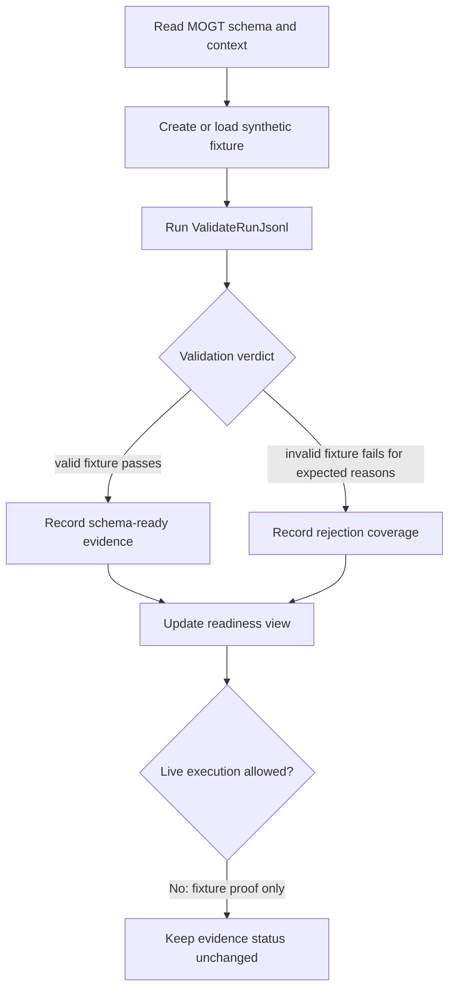
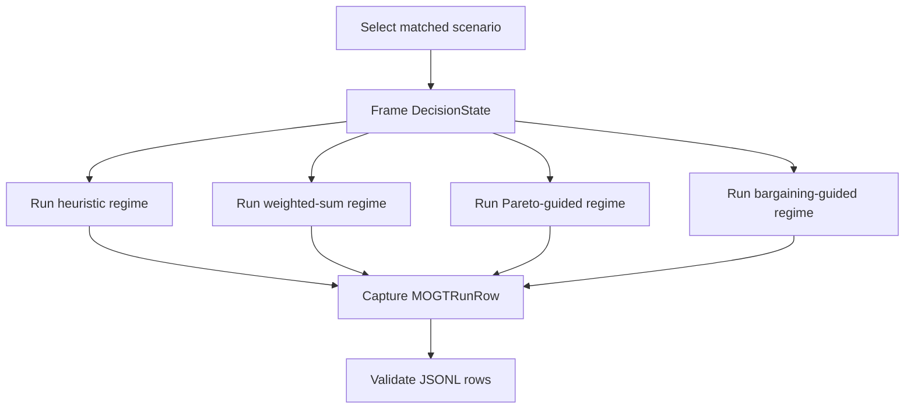
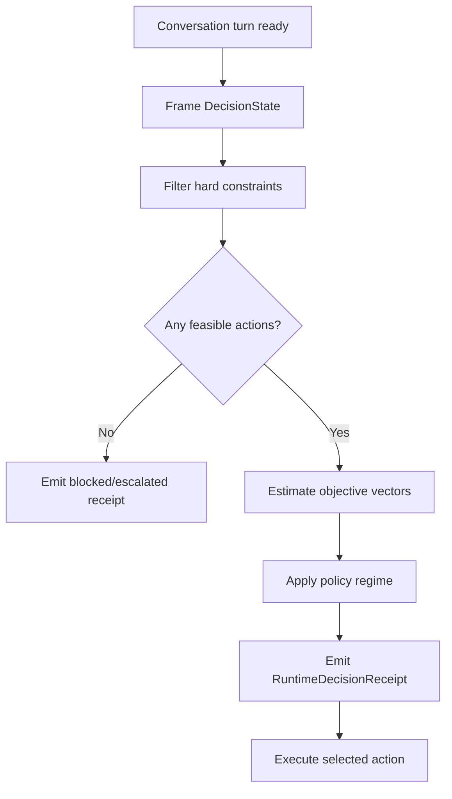

# Flows And Policies: MOGT Agentic Conversation

Define multi-step workflows and policy/rule decisions for MOGT evidence
modeling.

## Flow: FixtureValidationFlow

Type: Flow

Trigger: `SWU-MOGT-HARNESS-001` or a later evidence-harness task needs to prove
schema/data mechanics before live experiment execution.

Orchestrates: `CaptureRunRow`, `ValidateRunJsonl`, `EvidenceReadinessView`.

Compensation Strategy: none for validation; fix schema/fixture/validator and
rerun.

Idempotency: yes, for the same fixture file and validator version.

### Steps



### Step Table

| Step | Description | Actor | Action | On Success | On Failure | Compensation |
| --- | --- | --- | --- | --- | --- | --- |
| 1 | Read schema/context | task-session | inspect files | fixture construction | BLOCK on missing contract | none |
| 2 | Build passing fixture | operator/tool | `CaptureRunRow` | validate passing fixture | repair fixture | edit fixture |
| 3 | Build failing fixture | operator/tool | `CaptureRunRow` | validate rejection | repair invalid case | edit fixture |
| 4 | Run validator | operator/tool | `ValidateRunJsonl` | record command output | fail task if behavior wrong | repair validator |
| 5 | Update readiness | operator | `EvidenceReadinessView` | mark schema proof complete | preserve blocker | none |

### Invariants

| ID | Invariant | Formal Expression |
| --- | --- | --- |
| I1 | Fixture proof does not authorize live experiment execution. | `fixture_ready != live_run_approved` |
| I2 | Missing `policy_regime` is a blocker. | `not row.policy_regime -> validation_failed` |
| I3 | Missing `objective_vector` is a blocker. | `not row.objective_vector -> validation_failed` |
| I4 | Invalid fixture must fail. | `invalid_fixture -> validator_exit_code != 0` |

---

## Flow: PolicyRegimeComparisonFlow

Type: Flow

Trigger: `SWU-MOGT-HARNESS-002` or later fixture design defines matched
scenarios for policy-regime comparison.

Orchestrates: `SelectPolicyAction`, `CaptureRunRow`, `ValidateRunJsonl`.

Compensation Strategy: mark scenario incomplete and do not include it in
readiness evidence.

Idempotency: conditional; policy-regime outputs are idempotent only for fixed
scenario, prompt, model, temperature, and policy parameters.

### Steps



### Step Table

| Step | Description | Actor | Action | On Success | On Failure | Compensation |
| --- | --- | --- | --- | --- | --- | --- |
| 1 | Define scenario | operator | frame decision state | policy evaluation | scenario blocked | remove from fixture set |
| 2 | Apply regimes | policy evaluator | `SelectPolicyAction` | row capture | regime flagged | record deviation |
| 3 | Capture rows | research runner | `CaptureRunRow` | validation | row invalid | repair row source |
| 4 | Validate rows | validator | `ValidateRunJsonl` | fixture readiness | fail readiness | rerun after repair |

### Invariants

| ID | Invariant | Formal Expression |
| --- | --- | --- |
| I1 | Matched comparison requires same scenario across regimes. | `same(scenario_id) across compared rows` |
| I2 | Regime comparison requires explicit regime labels. | `forall row: policy_regime in PolicyRegime` |
| I3 | Pareto claims require frontier/dominance fields. | `experiment_id == E2 -> frontier_membership && dominated_selection` |

---

## Policy: EvidenceStatusBoundaryPolicy

Type: Policy

Applies To: `EvidenceReadinessView`, result summaries, paper updates.

Trigger Conditions: any task proposes to update claim status, paper result
sections, or publication readiness.

### Decision Table

| Condition | Selected Behavior | Notes |
| --- | --- | --- |
| Evidence is `synthetic_fixture` | Preserve insufficient evidence status. | Fixture proves mechanics only. |
| Evidence is `dry_run` | Allow readiness notes, block claim upgrade. | Dry-run can unblock live-run planning. |
| Evidence is `live_experiment` and validation passes | Allow analysis task to propose claim update. | Claim status still requires analysis/adjudication. |
| Result summary missing | Block paper evidence claims. | Narrative must not outrun analysis. |
| Protocol deviations unresolved | Flag or block claim update. | Severity depends on methodology profile. |

### Formula

```text
claim_update_allowed =
  evidence_class == live_experiment
  and validated_data == true
  and result_summary_exists == true
  and approved_analysis_task == true
```

### Parameters

| Parameter | Type | Default | Description |
| --- | --- | --- | --- |
| `validated_data` | `boolean` | `false` | Whether run data passed schema/integrity validation. |
| `result_summary_exists` | `boolean` | `false` | Whether result summary exists for the run. |
| `approved_analysis_task` | `boolean` | `false` | Whether a bounded analysis/adjudication task approved the update. |

---

## Policy: PolicyRegimeSelectionPolicy

Type: Policy

Applies To: `SelectPolicyAction`.

Trigger Conditions: a decision state has candidate actions and the evaluator
must select one action.

### Decision Table

| Condition | Selected Behavior | Notes |
| --- | --- | --- |
| `policy_regime == heuristic` | Select according to baseline heuristic rule. | Baseline must be documented in fixture. |
| `policy_regime == weighted_sum` | Compute weighted objective score and select max score. | Weights must be explicit. |
| `policy_regime == pareto_guided` | Filter dominated actions, then select from frontier by documented tie-breaker. | Requires frontier/dominance fields for E2. |
| `policy_regime == bargaining_guided` | Run bounded negotiation/equilibrium-inspired selection. | Requires cycle/escalation tracking for E3. |

### Formula

```text
pareto_frontier(A) = { a in A | not exists b in A: b strictly dominates a }
dominated_selection = selected_action not in pareto_frontier(A)
```

### Parameters

| Parameter | Type | Default | Description |
| --- | --- | --- | --- |
| `weights` | `ScoreMap` | none | Required for weighted-sum regime. |
| `frontier_tie_breaker` | `string` | `quality_then_safety` | Tie-breaker after Pareto filtering. |
| `max_negotiation_cycles` | `integer` | `3` | Bound for bargaining-guided regime. |

---

## Rule Catalog

| Rule ID | Rule | Enforced By | Evidence |
| --- | --- | --- | --- |
| MOGT-R1 | Every row must declare `policy_regime`. | `ValidateRunJsonl` | invalid fixture rejection |
| MOGT-R2 | Every row must declare `objective_vector`. | `ValidateRunJsonl` | invalid fixture rejection |
| MOGT-R3 | Scores must be normalized between 0 and 1. | `ValidateRunJsonl` | invalid fixture rejection |
| MOGT-R4 | Selected action must exist in candidate set. | `ValidateRunJsonl` | invalid fixture rejection |
| MOGT-R5 | Synthetic fixtures cannot update claim evidence. | `EvidenceStatusBoundaryPolicy` | `TASK-MOGT-HARNESS-001-RESULT.md` |
| MOGT-R6 | E2 rows require frontier and dominance fields. | schema + validator | `mogt-run.schema.json` |

---

## Flow: RuntimeDecisionFlow

Type: Flow

Trigger: an agentic conversation runtime asks MOGT to choose the next action.

Orchestrates: `MOGTDecide`, `SelectPolicyAction`, `RuntimeDecisionReceipt`.

Compensation Strategy: emit blocked/escalated receipt when no feasible action
or valid objective estimates exist.

Idempotency: conditional; idempotent only for the same context snapshot,
candidate actions, objective estimates, constraints, regime, and parameters.

### Steps



### Step Table

| Step | Description | Actor | Action | On Success | On Failure | Compensation |
| --- | --- | --- | --- | --- | --- | --- |
| 1 | Frame current turn | orchestrator | `MOGTDecide` | feasible-set filtering | missing state | blocked receipt |
| 2 | Apply hard constraints | orchestrator | constraint filter | objective scoring | no feasible actions | escalation receipt |
| 3 | Estimate objectives | scorer/orchestrator | objective estimator | policy selection | missing estimates | fallback or block |
| 4 | Select action | policy evaluator | `SelectPolicyAction` | receipt emission | invalid policy trace | fallback receipt |
| 5 | Execute selected action | agent runtime | external action execution | conversation continues | execution failure | record deviation |

### Invariants

| ID | Invariant | Formal Expression |
| --- | --- | --- |
| I1 | Runtime decision emits a receipt before execution. | `MOGTDecide -> RuntimeDecisionReceipt -> execute` |
| I2 | Hard constraints precede optimization. | `filter(K_t) before pi(...)` |
| I3 | Receipt can become an experiment row. | `RuntimeDecisionReceipt -> MOGTRunRow` |
| I4 | Bargaining is optional, not the base mechanism. | `bargaining_guided only when activation_policy == true` |
