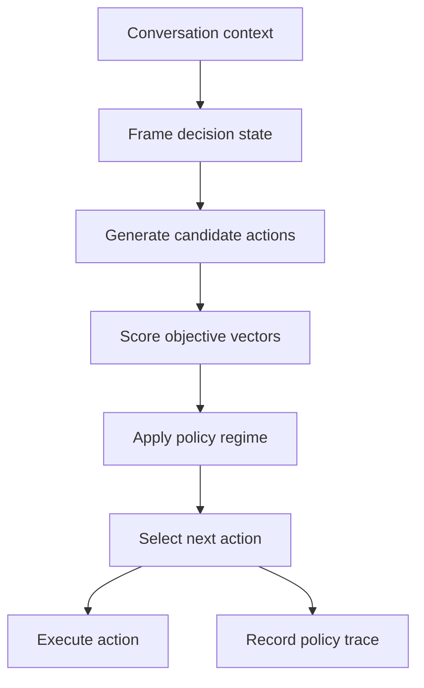

# MOGT Formal And Runtime Definition

## Purpose

This document defines how MOGT actually works inside an agentic conversation
system. It is not an experiment plan and it is not evidence that MOGT works. It
is the operational model that experiments are meant to test.

Short version:

> MOGT is a decision layer inserted before an agent chooses the next
> conversation action. It turns the current conversation state into candidate
> actions, scores each action across multiple objectives, applies a policy
> regime such as heuristic, weighted-sum, Pareto-guided, or bargaining-guided,
> then executes the selected action and records why.

## Runtime Placement

MOGT sits between conversation understanding and action execution.



MOGT does not replace the language model. It wraps one decision point around
the model or orchestrator:

1. What actions are available?
2. What objectives matter now?
3. Which action is best under the selected multi-objective policy?
4. Why was that action selected?

## Formal Runtime Object

A MOGT decision episode at turn `t` is:

```text
E_t = (s_t, R_t, A_t, O_t, K_t, V_t, U_t, pi, tau)
```

Where:

| Symbol | Meaning | Runtime interpretation |
| --- | --- | --- |
| `s_t` | decision state | current conversation context, candidate actions, objectives, constraints |
| `R_t` | roles | agents, reviewers, tools, or stakeholder perspectives active in the decision |
| `A_t` | candidate actions | finite set of next actions the system may take |
| `O_t` | objectives | quality, cost, latency, safety, escalation risk, or scoped subset |
| `K_t` | constraints | hard rules, policy limits, safety gates, budget caps |
| `V_t` | objective-vector function | maps each action to normalized objective scores |
| `U_t` | role utility/preference function | optional role-specific view over objective vectors |
| `pi` | policy regime | decision rule used to select an action |
| `tau` | trace | recorded rationale, scores, regime, and deviations |

The runtime output is:

```text
(a_t*, tau_t) = pi(s_t, R_t, A_t, O_t, K_t, V_t, U_t)
```

Where `a_t*` is the selected action and `tau_t` is the policy trace.

## Decision State

At turn `t`:

```text
s_t = (c_t, A_t, O_t, K_t)
```

Where:

- `c_t` is the conversation context available at the turn.
- `A_t` is the finite candidate action set.
- `O_t` is the active objective set.
- `K_t` is the active constraint set.

The candidate action set might include:

- answer now;
- ask a clarifying question;
- call a tool;
- consult another agent;
- escalate to a human;
- defer;
- refuse;
- stop.

MOGT only reasons over actions that are actually available. It is not a vague
preference system over imaginary options.

## Objective Vector

For each candidate action `a in A_t`, compute:

```text
v(a, s_t) = (
  quality(a),
  cost_preference(a),
  latency_preference(a),
  safety(a),
  escalation_preference(a)
)
```

Each component is normalized to `0..1`, with higher always better.

Important normalization rule:

- Lower raw cost becomes higher `cost_preference`.
- Lower raw latency becomes higher `latency_preference`.
- Lower unacceptable escalation risk becomes higher `escalation_preference`.

This avoids a common mistake where some objectives are minimized and others are
maximized. Runtime MOGT compares one consistent vector shape.

## Feasible Set

Hard constraints filter candidate actions before selection:

```text
F_t = { a in A_t | K_t(a, s_t) == pass }
```

If `F_t` is empty, MOGT must return a blocked/escalation action instead of
pretending a normal action is available.

Examples of hard constraints:

- safety policy blocks an answer;
- token budget blocks a multi-agent debate;
- latency budget blocks a long negotiation;
- missing information requires clarification before tool use.

## Policy Regimes

### Heuristic Regime

The heuristic regime is the baseline.

```text
pi_heuristic(s_t) = baseline_rule(c_t, A_t, K_t)
```

It selects using the existing implicit rule: usually "answer if possible,
clarify if needed, escalate if risky." This is useful as a comparison because
many agent systems already behave this way without explicit objective vectors.

### Weighted-Sum Regime

The weighted-sum regime compresses objectives into one scalar score.

```text
score(a) = sum_i w_i * v_i(a, s_t)
pi_weighted(s_t) = argmax_a score(a), a in F_t
```

Runtime requirement:

- weights must be explicit;
- scores must be recorded;
- changing weights can change the selected action.

This regime is simple and practical, but it can hide tradeoffs.

### Pareto-Guided Regime

The Pareto-guided regime first removes actions that are clearly dominated.

```text
b dominates a iff for all i: v_i(b) >= v_i(a)
                 and for some j: v_j(b) > v_j(a)

P_t = { a in F_t | no b in F_t dominates a }
```

Then:

```text
pi_pareto(s_t) = tie_break(P_t)
```

Runtime requirement:

- record whether the selected action is on the frontier;
- record whether a dominated action was selected;
- record the tie-breaker used after frontier filtering.

This does not magically choose one objectively perfect action. It prevents the
system from choosing an action that is worse than another available action on
every active objective.

### Bargaining-Guided Regime

The bargaining-guided regime is for multi-agent or multi-role disagreement.

Each role `r in R_t` has a preference function:

```text
U_r(a) = role_weight_r dot v(a, s_t)
```

The runtime loop is bounded:

```text
for cycle in 1..max_cycles:
  each role proposes or rejects candidate actions
  remove actions blocked by constraints
  if an action satisfies the acceptance rule:
    return accepted action
return fallback action with escalation/deadlock trace
```

Runtime requirement:

- record cycle count;
- record convergence, deadlock, oscillation, or escalation;
- record fallback if no stable action is accepted.

This regime is not "let agents chat until they agree." It is a bounded
negotiation process with a stop rule.

## Runtime Algorithm

```text
function MOGT_DECIDE(conversation_context, candidate_actions, objectives, constraints, regime):
  state = frame_state(conversation_context, candidate_actions, objectives, constraints)

  feasible_actions = []
  for action in state.candidate_actions:
    if constraints_pass(action, state):
      feasible_actions.append(action)

  if feasible_actions is empty:
    return escalation_or_blocked_action(state)

  scored_actions = []
  for action in feasible_actions:
    vector = estimate_objective_vector(action, state)
    scored_actions.append((action, vector))

  if regime == heuristic:
    selected = apply_baseline_rule(state, scored_actions)

  if regime == weighted_sum:
    selected = select_max_weighted_score(scored_actions, weights)

  if regime == pareto_guided:
    frontier = compute_pareto_frontier(scored_actions)
    selected = apply_frontier_tie_breaker(frontier)

  if regime == bargaining_guided:
    selected = run_bounded_bargaining(state, scored_actions, roles, max_cycles)

  trace = record_policy_trace(state, scored_actions, selected, regime)
  return selected, trace
```

## Worked Runtime Example

Conversation context:

> The user asks for a recommendation, but the request is underspecified and
> could produce a poor or unsafe answer if the agent guesses.

Candidate actions:

| Action | Meaning |
| --- | --- |
| `answer_now` | Provide best-effort answer immediately. |
| `ask_clarifying_question` | Ask one targeted question first. |
| `escalate_or_defer` | Defer or route to a safer review path. |

Objective vectors, normalized with higher better:

| Action | quality | cost | latency | safety | escalation_risk |
| --- | ---: | ---: | ---: | ---: | ---: |
| `answer_now` | 0.62 | 0.95 | 0.95 | 0.55 | 0.60 |
| `ask_clarifying_question` | 0.86 | 0.75 | 0.70 | 0.90 | 0.82 |
| `escalate_or_defer` | 0.70 | 0.35 | 0.30 | 0.98 | 0.95 |

Weighted-sum with weights:

```text
quality=0.35, cost=0.15, latency=0.15, safety=0.25, escalation_risk=0.10
```

Scores:

| Action | Score |
| --- | ---: |
| `answer_now` | 0.710 |
| `ask_clarifying_question` | 0.815 |
| `escalate_or_defer` | 0.658 |

Selected action:

```text
ask_clarifying_question
```

Pareto-guided view:

- `answer_now` is not automatically invalid; it is cheaper and faster.
- `escalate_or_defer` is safer but costly and slow.
- `ask_clarifying_question` sits in the practical frontier because it improves
  quality and safety without maximum overhead.

Runtime trace:

```json
{
  "policy_regime": "weighted_sum",
  "selected_action": "ask_clarifying_question",
  "selection_reason": "highest weighted score with better quality and safety than answer_now",
  "principal_tradeoff": "slightly higher cost and latency for much better safety and answer quality",
  "frontier_membership": true
}
```

## What Is Game-Theoretic Here?

The game-theoretic part is not necessarily a full formal game in every runtime
turn. MOGT uses game theory at three levels:

1. **Multi-objective choice:** actions are compared as vectors, not one scalar
   by default.
2. **Dominance/Pareto reasoning:** avoid actions that are strictly worse across
   active objectives.
3. **Role conflict:** when agents or stakeholder roles disagree, model the
   disagreement as bounded negotiation over preferences instead of unstructured
   discussion.

So the runtime can be lightweight:

- one orchestrator scoring actions is enough for weighted or Pareto-guided
  regimes;
- multiple agents or roles are only needed when the decision has genuine
  disagreement or uncertainty that benefits from role separation.

## How Agents Fit

Agents may perform three different jobs:

| Agent role | Runtime job | Required? |
| --- | --- | --- |
| Generator | propose candidate actions | optional |
| Scorer | estimate objective vectors | optional |
| Critic/role | contest scores or preferences | optional |
| Orchestrator | apply policy and execute selected action | yes |

This means "multi-agent discussion" is not the core mechanism. It is one way to
produce or challenge candidate actions and scores. The core mechanism is the
policy function over a decision state.

## Runtime Outputs

Every MOGT decision should produce:

- selected action;
- policy regime;
- candidate action list;
- objective vectors;
- policy trace;
- selected action reason;
- overhead metadata;
- protocol deviations when applicable.

In the research project, this becomes a `MOGTRunRow`. In a production system,
the same structure can become an observability event, audit log, or decision
receipt.

## Runtime Non-Goals

MOGT does not require:

- a full multi-agent debate for every turn;
- perfect numerical truth for every objective;
- replacing all application logic;
- proving every action is globally optimal;
- allowing the policy to bypass hard safety or business constraints.

MOGT requires:

- explicit candidate actions;
- explicit objectives;
- explicit regime;
- explicit tradeoff trace;
- bounded stop behavior.

## Practical Implementation Slice

The smallest runtime implementation is:

1. define `CandidateAction`;
2. estimate `ObjectiveVector` for each action;
3. choose one policy regime;
4. select one action;
5. record the trace.

The first useful MOGT runtime does not need bargaining. It can start with:

```text
DecisionState -> ObjectiveVector[] -> Pareto frontier -> tie-break -> selected action
```

Then bargaining-guided behavior can be added only for scenarios where multiple
roles disagree.

## Open Design Questions

| Question | Why It Matters | Suggested Next Artifact |
| --- | --- | --- |
| Who estimates objective vectors at runtime? | Different estimators may produce different decisions. | objective-estimator contract |
| What tie-breaker should Pareto-guided runtime use? | Pareto filtering leaves multiple valid options. | Pareto tie-break policy |
| When should bargaining-guided runtime activate? | Multi-agent negotiation is costly. | activation policy |
| Which constraints are hard gates? | Hard constraints must precede optimization. | constraint catalog |
| How much trace is enough for production use? | Runtime trace must be useful without huge overhead. | decision receipt schema |

## Refine Result

The missing concept is not another research lane. It is a runtime decision
contract:

```text
frame state -> score actions -> apply policy -> execute selected action -> record trace
```

Recommended next route:

1. Add a `runtime-decision-receipt` schema or template.
2. Add `SWU-MOGT-HARNESS-002` fixture scenarios that instantiate this runtime
   loop for heuristic, weighted-sum, Pareto-guided, and bargaining-guided
   regimes.
3. Defer live experiments until the runtime loop is fixture-complete.
