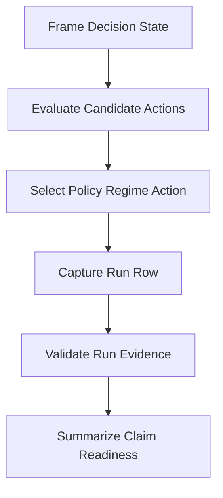

# MOGT Agentic Conversation Module

## Mission

Model multi-objective game-theoretic conversation decisions as a research
evidence module. The module defines the concepts, operations, workflows, and
rules needed to compare heuristic, weighted-sum, Pareto-guided, and
bargaining-guided policy regimes without upgrading claims before live evidence
exists.

## Ownership Boundary

- Owns: MOGT decision-state concepts, policy-regime contracts, run-row shape,
  fixture validation workflow, and dry-run/live evidence boundaries.
- Does Not Own: source discovery, canonical Arcanum capability promotion,
  paper narrative rewriting, or live experiment execution approval.

## Capability Map

## Capabilities

| Capability | Outcome | Key Contracts | Detail |
| --- | --- | --- | --- |
| Decision State Framing | Make each conversation decision inspectable as context, actions, objectives, and constraints. | `DecisionState`, `ObjectiveVector`, `CandidateActionSet` | Based on MOGT-D1 through MOGT-D4. |
| Policy Regime Selection | Select an action using a named policy regime. | `PolicyRegime`, `SelectPolicyAction` | Compares heuristic, weighted-sum, Pareto-guided, and bargaining-guided regimes. |
| Evidence Capture | Record policy decisions as append-only run rows. | `MOGTRunRow`, `CaptureRunRow` | Conforms to `experiments/schema/mogt-run.schema.json`. |
| Fixture Validation | Prove data mechanics before live runs. | `ValidateRunJsonl`, `FixtureValidationFlow` | Uses passing/failing synthetic fixtures and dependency-free validator. |
| Claim Readiness | Separate fixture proof from live evidence support. | `EvidenceClass`, `EvidenceStatusBoundaryPolicy` | Blocks evidence-status upgrades from synthetic fixtures. |

## Concept Model

| Concept | Type | Key Constraints |
| --- | --- | --- |
| `DecisionState` | Record | Must include context, candidate actions, objectives, and constraints. |
| `ObjectiveVector` | Value Type | Scores are normalized 0..1; required keys are quality, cost, latency, safety, escalation risk. |
| `CandidateAction` | Record | Must have stable `action_id` and objective vector. |
| `PolicyRegime` | Enumeration | `heuristic`, `weighted_sum`, `pareto_guided`, `bargaining_guided`. |
| `MOGTRunRow` | Record | Must include common metadata, objective vector, selected action, policy trace, reviewer scores, overhead fields, and experiment-specific fields. |
| `EvidenceClass` | Enumeration | `synthetic_fixture`, `dry_run`, `live_experiment`. |

## Concept Index

| Concept | ID | Type | Source |
| --- | --- | --- | --- |
| DecisionState | `mogt.DecisionState` | Record | `concept-model.md` |
| ObjectiveVector | `mogt.ObjectiveVector` | Value Type | `concept-model.md` |
| CandidateAction | `mogt.CandidateAction` | Record | `concept-model.md` |
| PolicyRegime | `mogt.PolicyRegime` | Enumeration | `concept-model.md` |
| MOGTRunRow | `mogt.MOGTRunRow` | Record | `concept-model.md` |
| EvidenceClass | `mogt.EvidenceClass` | Enumeration | `concept-model.md` |
| SelectPolicyAction | `mogt.SelectPolicyAction` | Action | `operations.md` |
| CaptureRunRow | `mogt.CaptureRunRow` | Action | `operations.md` |
| ValidateRunJsonl | `mogt.ValidateRunJsonl` | Action | `operations.md` |
| FixtureValidationFlow | `mogt.FixtureValidationFlow` | Flow | `flows-policies.md` |
| EvidenceStatusBoundaryPolicy | `mogt.EvidenceStatusBoundaryPolicy` | Policy | `flows-policies.md` |

## Relationship Map

| From | Edge | To | Evidence | Notes |
| --- | --- | --- | --- | --- |
| `mogt.DecisionState` | contains | `mogt.CandidateAction` | `definitions/DEFINITIONS.md`, MOGT-D2/D4 | Decision state defines available actions. |
| `mogt.CandidateAction` | scored-by | `mogt.ObjectiveVector` | `definitions/DEFINITIONS.md`, MOGT-D3 | Higher normalized values are preferred. |
| `mogt.PolicyRegime` | governs | `mogt.SelectPolicyAction` | `definitions/DEFINITIONS.md`, MOGT-D9 | Regime is the operational decision rule. |
| `mogt.SelectPolicyAction` | produces | `mogt.MOGTRunRow` | `experiments/schema/mogt-run.schema.json` | Run rows preserve selection metadata. |
| `mogt.ValidateRunJsonl` | validates | `mogt.MOGTRunRow` | `tools/validate-mogt-run-jsonl.py` | Validator enforces the first schema proof. |
| `mogt.EvidenceClass` | constrains | `mogt.EvidenceStatusBoundaryPolicy` | `TASK-MOGT-HARNESS-001-RESULT.md` | Synthetic fixtures cannot support claims. |

## Supporting Contracts

| Contract Document | Purpose |
| --- | --- |
| [concept-model.md](concept-model.md) | Structural records, values, and enumerations for MOGT decision evidence. |
| [operations.md](operations.md) | Actions/read views for policy selection, row capture, and validation. |
| [flows-policies.md](flows-policies.md) | Fixture validation workflow and evidence boundary policies. |
| [formal-runtime-definition.md](formal-runtime-definition.md) | Formal and runtime definition of how MOGT is applied inside an agentic conversation. |
| [runtime-decision-receipt.md](runtime-decision-receipt.md) | Concrete receipt emitted by one runtime MOGT decision. |
| `../definitions/DEFINITIONS.md` | Canonical MOGT definition authority. |
| `../experiments/schema/mogt-run.schema.json` | Run-row schema contract. |
| `../tools/validate-mogt-run-jsonl.py` | Current executable validation operation. |
| `../development/TASK-MOGT-HARNESS-001-RESULT.md` | First schema/validator proof. |

## External Dependencies

| Capability | Depends On | Via | Why |
| --- | --- | --- | --- |
| Fixture Validation | Python 3 | validator script | Local dependency-free validation. |
| Research Evidence Harness | `arcana/research-evidence-harness` | draft sigil | Candidate owner for schema and fixture validation. |
| Publication Pipeline | `spells/publication-research-pipeline` | draft spell | Composes tower, evidence harness, and task execution. |

## Provides To

| Consumer | Consumes Capability | Via | Delivered Value |
| --- | --- | --- | --- |
| `SWU-MOGT-HARNESS-002` | Fixture shape and policy-regime rules | `flows-policies.md` | Scenario and regime fixture design baseline. |
| `SWU-MOGT-HARNESS-003` | Objective-vector and Pareto concepts | `concept-model.md`, `operations.md` | Metric calculator contract seed. |
| Paper evidence workflow | Evidence boundary policy | `flows-policies.md` | Prevents overclaims from fixture data. |

## Scenario Coverage

- Primary scenarios: E1 traceability baseline, E2 Pareto arbitration quality,
  E3 negotiation stability, E4 overhead feasibility.
- Completion checks: `../development/TASK-MOGT-HARNESS-001-RESULT.md` and the
  next SWUs in `../development/WORK-PACK.md`.

## Change History

| Date | Change |
| --- | --- |
| 2026-06-07 | Initial Invoke Module Formulae model for MOGT rule, workflow, and operation contracts. |
| 2026-06-08 | Refreshed from runtime-definition refine output; added runtime decision receipt contract. |
