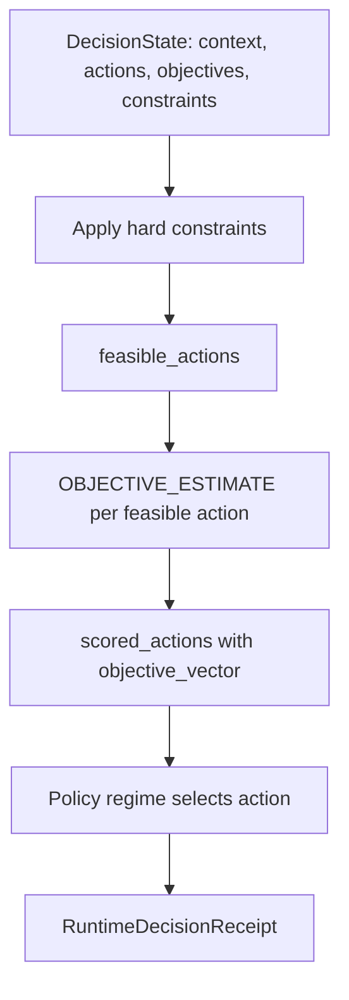

# Objective Estimator Contract

## Purpose

Define the contract for the component that produces an `ObjectiveVector` for each
feasible candidate action before a policy regime selects one. This is the
enforcement surface named by runtime invariant RR-2:

> RR-2 — Every feasible selected action must have an objective vector. Enforcement:
> Objective estimator contract.

Until this contract existed, the receipt and run-row artifacts assumed objective
vectors as inputs without defining where they come from or what makes an estimate
admissible. This contract closes that gap as a **design contract only**. It does
not implement an estimator and does not authorize live experiment evidence.

## Position In The Runtime Loop



The estimator runs after hard-constraint filtering and before policy selection.
It is the only sanctioned producer of `scored_actions[].objective_vector` in
[runtime-decision-receipt.md](runtime-decision-receipt.md).

## Estimator Signature

```text
ObjectiveVector = OBJECTIVE_ESTIMATE(decision_state, candidate_action, estimator_config)
```

| Input | Type | Required | Description |
| --- | --- | --- | --- |
| `decision_state` | `DecisionState` | yes | Context, objectives, and constraints for the turn. |
| `candidate_action` | `CandidateAction` | yes | One feasible action to score. |
| `estimator_config` | `EstimatorConfig` | yes | Estimator identity, version, and method parameters. |

| Output | Type | Description |
| --- | --- | --- |
| `objective_vector` | `ObjectiveVector` | Normalized scores for quality, cost, latency, safety, escalation risk. |

## Output Constraints

| ID | Constraint | Rationale |
| --- | --- | --- |
| OE-1 | Output must include all five required keys: quality, cost, latency, safety, escalation_risk. | Matches `mogt.ObjectiveVector` and `mogt-run.schema.json`. |
| OE-2 | Each score is normalized to `0..1` where higher is more preferred. | Keeps Pareto and weighted-sum comparison well-defined. |
| OE-3 | Every feasible action must receive a vector; blocked actions are not scored. | Enforces RR-2 and keeps scored_actions aligned to feasible_actions. |
| OE-4 | The estimator must be deterministic given identical `(decision_state, candidate_action, estimator_config)`. | Enables replay and fixture stability. |
| OE-5 | `estimator_config` identity and version must be recordable for provenance. | Lets receipts and run rows attribute scores to an estimator method. |

## Estimator Methods

The contract is method-agnostic. A conforming estimator declares one of:

| Method | Description | Evidence Class Ceiling |
| --- | --- | --- |
| `fixture_authored` | Scores authored by hand for synthetic fixtures. | `synthetic_fixture` |
| `rubric_scored` | Scores derived from a documented reviewer rubric. | `dry_run` |
| `model_estimated` | Scores produced by a model or heuristic scorer at runtime. | `dry_run` until live calibration |
| `measured` | Scores derived from measured signals in a live run. | `live_experiment` |

The method does not by itself upgrade evidence status. Evidence-class ceilings are
advisory bounds; `EvidenceStatusBoundaryPolicy` in
[flows-policies.md](flows-policies.md) remains the authority.

## EstimatorConfig Shape

| Field | Type | Required | Description |
| --- | --- | --- | --- |
| `estimator_id` | `string` | yes | Stable estimator identity. |
| `version` | `string` | yes | Estimator version. |
| `method` | enum | yes | One of `fixture_authored`, `rubric_scored`, `model_estimated`, `measured`. |
| `parameters` | `object` | no | Method-specific settings (rubric id, model name, calibration set). |

## Relationship To Existing Artifacts

| Artifact | Relationship |
| --- | --- |
| [runtime-decision-receipt.md](runtime-decision-receipt.md) | Consumes estimator output as `scored_actions[].objective_vector`; RR-2 points here. |
| [concept-model.md](concept-model.md) | `mogt.ObjectiveVector` value type is the estimator output shape. |
| `../experiments/schema/mogt-runtime-decision-receipt.schema.json` | Validates the receipt that embeds estimator output. |
| `../development/MOGT-REVIEWER-RUBRIC-DRAFT.md` | Candidate source for `rubric_scored` method parameters. |
| [flows-policies.md](flows-policies.md) | Owns the evidence-status boundary the estimator method cannot bypass. |

## Open Items

- No executable estimator implementation exists; this is a contract only.
- `rubric_scored` parameters are not yet bound to the reviewer rubric draft.
- Live calibration of `model_estimated` against `measured` scores is unspecified.

## Change History

| Date | Change |
| --- | --- |
| 2026-06-10 | Initial objective estimator contract authored to satisfy runtime invariant RR-2. |
