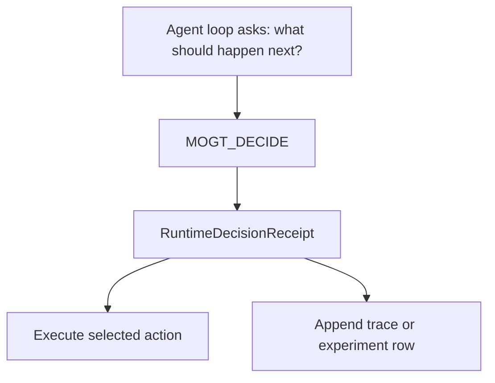

# Runtime Decision Receipt

## Purpose

Define the concrete output emitted by one MOGT runtime decision. This is the
operator-facing bridge between the formal definition and an actual agent loop.

The receipt answers:

```text
Given this conversation state, these available actions, these objective scores,
and this policy regime, what action did MOGT choose and why?
```

This is not experiment evidence by itself. In experiments, one receipt can be
converted into a `MOGTRunRow`. In a production-like system, the same receipt can
be an audit log or observability event.

## Runtime Placement



## Receipt Shape

| Field | Type | Required | Description |
| --- | --- | --- | --- |
| `receipt_id` | `string` | yes | Stable receipt id. |
| `timestamp` | `DateTime` | yes | Decision time. |
| `conversation_turn_id` | `string` | yes | Turn or decision point being governed. |
| `decision_state` | `DecisionState` | yes | Context, actions, objectives, and constraints at the turn. |
| `roles` | `RuntimeRole[]` | no | Active roles when scoring or bargaining uses role perspectives. |
| `policy_regime` | `PolicyRegime` | yes | Runtime decision rule applied. |
| `regime_parameters` | `object` | no | Weights, tie-breakers, max cycles, or regime-specific settings. |
| `feasible_actions` | `ActionId[]` | yes | Candidate actions that passed hard constraints. |
| `blocked_actions` | `BlockedAction[]` | yes | Candidate actions removed by hard constraints. |
| `scored_actions` | `ScoredAction[]` | yes | Objective-vector scores for feasible actions. |
| `selected_action` | `SelectedAction` | yes | Final action selected for execution. |
| `selection_reason` | `string` | yes | Short human-readable reason. |
| `principal_tradeoff` | `string` | yes | Main tradeoff accepted by the policy. |
| `policy_trace` | `PolicyTraceStep[]` | yes | Auditable decision trace. |
| `runtime_status` | `RuntimeStatus` | yes | `selected`, `blocked`, `escalated`, or `fallback_selected`. |
| `overhead` | `OverheadEnvelope` | yes | Token, latency, turn, and tool-call metadata. |
| `protocol_deviations` | `string[]` | yes | Runtime deviations, empty if none. |

## Runtime Status

| Value | Meaning |
| --- | --- |
| `selected` | Normal MOGT decision selected a feasible action. |
| `blocked` | No feasible action remained after hard constraints. |
| `escalated` | MOGT selected escalation because constraints or uncertainty required it. |
| `fallback_selected` | Bargaining or tie-break failed and fallback policy selected an action. |

## Policy-Specific Required Trace

| Policy Regime | Required Receipt Additions |
| --- | --- |
| `heuristic` | Baseline rule name and reason. |
| `weighted_sum` | Weights and per-action scalar scores. |
| `pareto_guided` | Frontier members, dominated actions, tie-breaker used. |
| `bargaining_guided` | Roles, cycle count, convergence status, fallback reason if any. |

## Minimal JSON Example

```json
{
  "receipt_id": "mogt-receipt-001",
  "timestamp": "2026-06-08T03:55:26Z",
  "conversation_turn_id": "scenario-clarify-001:t3",
  "policy_regime": "pareto_guided",
  "regime_parameters": {
    "frontier_tie_breaker": "quality_then_safety"
  },
  "feasible_actions": ["answer_now", "ask_clarifying_question", "escalate_or_defer"],
  "blocked_actions": [],
  "scored_actions": [
    {
      "action_id": "answer_now",
      "objective_vector": {
        "quality": 0.62,
        "cost": 0.95,
        "latency": 0.95,
        "safety": 0.55,
        "escalation_risk": 0.60
      },
      "frontier_member": true
    },
    {
      "action_id": "ask_clarifying_question",
      "objective_vector": {
        "quality": 0.86,
        "cost": 0.75,
        "latency": 0.70,
        "safety": 0.90,
        "escalation_risk": 0.82
      },
      "frontier_member": true
    }
  ],
  "selected_action": {
    "action_id": "ask_clarifying_question",
    "selection_reason": "frontier action with better quality and safety under the tie-breaker"
  },
  "selection_reason": "Pareto-guided runtime selected a frontier action that improved quality and safety without maximum overhead.",
  "principal_tradeoff": "accept one extra turn for higher answer quality and lower safety risk",
  "policy_trace": [
    {
      "step": "frame_state",
      "summary": "three candidate actions available"
    },
    {
      "step": "compute_frontier",
      "summary": "no action strictly dominated ask_clarifying_question"
    },
    {
      "step": "tie_break",
      "summary": "quality_then_safety selected ask_clarifying_question"
    }
  ],
  "runtime_status": "selected",
  "overhead": {
    "token_cost": 420,
    "latency_ms": 1800,
    "turn_count": 3,
    "tool_calls": 1
  },
  "protocol_deviations": []
}
```

## Conversion To MOGTRunRow

| Receipt Field | MOGTRunRow Field |
| --- | --- |
| `policy_regime` | `policy_regime` |
| `scored_actions` | `candidate_actions` |
| `selected_action` | `selected_action` |
| selected scored action vector | `objective_vector` |
| `policy_trace` | `policy_trace` |
| `overhead.token_cost` | `token_cost` |
| `overhead.latency_ms` | `latency_ms` |
| `overhead.turn_count` | `turn_count` |
| `overhead.tool_calls` | `tool_calls` |
| `protocol_deviations` | `protocol_deviations` |

## Runtime Invariants

| ID | Invariant | Enforcement |
| --- | --- | --- |
| RR-1 | Selected action must be feasible unless runtime status is `blocked` or `escalated`. | Runtime validator or fixture review. |
| RR-2 | Every feasible selected action must have an objective vector. | Objective estimator contract. |
| RR-3 | Hard constraints run before policy selection. | Runtime flow contract. |
| RR-4 | Policy-specific trace fields must be present. | Fixture validation for SWU-MOGT-HARNESS-002. |
| RR-5 | Receipt alone cannot update claim evidence status. | Evidence boundary policy. |

## How This Makes MOGT Work

At runtime, MOGT is not a paper claim and not a general "agent discussion"
pattern. It is a callable decision procedure:

```text
RuntimeDecisionReceipt = MOGT_DECIDE(context, actions, objectives, constraints, regime)
execute(RuntimeDecisionReceipt.selected_action)
```

The receipt is the concrete thing that lets another system inspect, replay, or
measure the decision.
