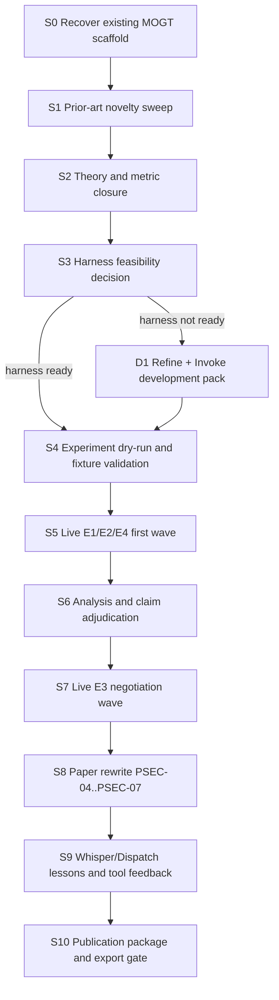

# MOGT Publication Research Strategy

## Objective

Make `papers/mogt-agentic-conversation-paper.md` publication-ready by closing the missing evidence loop: prior-art novelty, executable experiment protocols, live run data, analysis results, claim adjudication, paper rewrite, and export packaging.

The current scaffold is strong but evidence-gated. The project already has claims, definitions, experiment bundles, paper contracts, source governance, and a research graph. What it does not yet have is live experiment evidence or a validated route from planned experiments to paper-ready claims.

## Current Diagnosis

| Lane | Status | Evidence |
| --- | --- | --- |
| Project scaffold | present | `README.md`, `PROJECT.yaml`, `registry/RESEARCH-GRAPH.md` |
| Paper contract | present | `papers/PAPER-SPEC.md`, `papers/PAPER-STORIES.md`, `papers/PAPER-TEST-SPEC.md`, `papers/PAPER-REVIEW.md` |
| Experiment bundles | present but unrun | `experiments/E1-*` through `experiments/E4-*` |
| Empirical evidence | missing | `results/MOGT-EVIDENCE-STATUS.md` marks all claims insufficient |
| Publication readiness | blocked | result-facing sections PSEC-04 through PSEC-06 require live runs |

## Web Research Read

Initial web research found adjacent work but not an obvious exact duplicate of the intended paper.

Closest related lanes:

- Multi-objective Markov games and Pareto-Nash equilibrium: formal multi-agent multiple-objective theory exists, but is not LLM-agent conversation specific.
- Multi-agent LLM debate and equilibrium: LLM debate and Bayesian/Nash-style coordination exist, but are typically optimized around scalar correctness or reasoning metrics.
- Multi-issue LLM negotiation: multi-party and multi-issue negotiation work exists, but it usually evaluates agreement, success, or time cost rather than a general conversation-decision objective vector.
- Multi-objective LLM optimization: preference and alignment work exists, but it is mostly model/policy optimization rather than strategic multi-agent conversational protocol design.
- Agent orchestration frameworks: AutoGen-style frameworks support multi-agent conversation and tools, but do not by themselves supply MOGT metrics or publication evidence.

Likely novelty frame:

> Agentic conversation decisions as multi-objective games, evaluated with traceability, Pareto/dominance behavior, negotiation stability, and operational overhead rather than only scalar outcome quality.

This novelty claim must stay provisional until a full source ledger expansion and related-work matrix are completed.

## Research DAG

## Work Lanes

### S0. Recover Existing Scaffold

Inputs:

- `README.md`
- `registry/RESEARCH-GRAPH.md`
- `experiments/EXPERIMENTS.md`
- `papers/PAPER-REVIEW.md`
- `results/MOGT-EVIDENCE-STATUS.md`

Output:

- `development/scaffold-readiness.md`

Acceptance:

- Every current blocker has an owner and next route.
- No result-facing claim is treated as supported without live data.

### S1. Prior-Art Novelty Sweep

Inputs:

- Existing source ledger and inventory.
- Web search clusters for MOGT, Pareto-Nash, LLM debate, equilibrium, multi-issue negotiation, multi-objective preference optimization, and agent frameworks.

Output:

- `sources/MOGT-NOVELTY-LEDGER.md`
- `inventory/mogt-related-work-matrix.md`

Acceptance:

- Every related-work cluster has at least one source-backed entry or explicit missing-source residue.
- The paper's novelty sentence is downgraded, strengthened, or reframed from evidence.

### S2. Theory And Metric Closure

Inputs:

- `definitions/DEFINITIONS.md`
- `foundations/METHODOLOGY-AND-THEORY.md`
- S1 novelty outputs.

Output:

- `foundations/MOGT-METRIC-MODEL.md`

Acceptance:

- Objective vector dimensions are fixed for E1-E4.
- Pareto dominance, hypervolume or coverage, scalarization sensitivity, stability, exploitability/regret proxy, and overhead metrics are defined or explicitly rejected.

### S3. Harness Feasibility Decision

Use `experiment-harness` first if it can initialize, validate, and report realistic prompt/run examples for this research project. If the harness cannot run the needed experiments without new tooling, block execution and route through `refine` plus `invoke`.

Decision output:

- `development/HARNESS-FEASIBILITY.md`

Pass condition:

- The harness can create run directories, execute or replay one bounded example, preserve raw logs/data, validate output shape, and write reports.

Reroute condition:

- If the harness cannot score objective vectors, compute Pareto metrics, execute multi-agent protocols, or preserve experiment JSONL, produce a development pack rather than pretending the scaffold is enough.

### D1. Refine + Invoke Development Pack

Use this only if S3 blocks.

Outputs:

- `development/refinement-runs/<run-id>/REFINE-DISPATCH.json`
- `development/refinement-runs/<run-id>/stages/09-invoke-plan.md`
- `development/WORK-PACK.md`

Minimum build targets:

- MOGT run schema and JSONL validator.
- Pareto/objective metric calculator.
- Agent protocol runner or replay harness.
- Result summary generator.
- Claim/evidence updater.
- Paper section update checklist.

### S4. Experiment Dry-Run And Fixture Validation

Inputs:

- E1-E4 protocols.
- Harness or development-pack runner.

Output:

- `development/dry-runs/`
- `development/fixture-validation-report.md`

Acceptance:

- At least one synthetic fixture proves each policy regime can be logged and scored.
- Dispatch validation passes for this publication DAG.
- Any subagents used for research lanes return closeout receipts.

### S5. Live E1/E2/E4 First Wave

Run the first wave before the deeper negotiation experiment:

1. E1 traceability baseline.
2. E2 Pareto arbitration quality.
3. E4 overhead envelope.

Outputs:

- `experiments/*/data/*.jsonl`
- `experiments/*/results/*.md`

Acceptance:

- Every run records model, prompts, policy regime, objective vector, trace fields, scoring artifacts, and protocol deviations.
- E4 confirms whether MOGT gains remain operationally plausible before the more expensive E3 wave.

### S6. Analysis And Claim Adjudication

Outputs:

- `results/MOGT-EVIDENCE-STATUS.md`
- `registry/RESEARCH-GRAPH.md` result nodes and evidence-status edges.
- `registry/TRACEABILITY-MATRIX.md` updates.

Acceptance:

- C1, C2, and C4 are marked supported, partially supported, insufficient, or contradicted from live analysis.
- Unsupported claims stay visibly unsupported.

### S7. Live E3 Negotiation Wave

Inputs:

- E3 protocol.
- Lessons from S5/S6.

Output:

- `experiments/E3-negotiation-stability-under-conflict/data/*.jsonl`
- `experiments/E3-negotiation-stability-under-conflict/results/*.md`

Acceptance:

- Measures oscillation, deadlock, convergence, stability, and disagreement residue.
- Separates agent discussion performance from actual MOGT metric gains.

### S8. Paper Rewrite

Outputs:

- Updated `papers/mogt-agentic-conversation-paper.md`
- Updated `papers/PAPER-REVIEW.md`

Acceptance:

- PSEC-04 through PSEC-06 synthesize concrete result nodes.
- PSEC-07 names validity threats from real execution, not only design-time anticipation.
- Abstract and contribution claims match evidence status exactly.

### S9. Whisper And Dispatch Spec Feedback

Whisper:

- Reuse the idea of objective-scored candidate tournaments and rejected-alternative residue.
- Do not reuse Whisper's writing-specific objectives as general MOGT metrics.
- Potential update: experiment-report transport or review HTML payload for MOGT result inspection.

Dispatch Spec:

- Keep Dispatch Spec as route validator, not Pareto computer or experiment runner.
- Add MOGT-shaped fixtures only after the publication DAG proves useful.
- Preserve subagent lifecycle closeout requirements for all delegated lanes.

Outputs:

- `development/TOOL-LESSONS-FOR-WHISPER.md`
- `development/TOOL-LESSONS-FOR-DISPATCH-SPEC.md`

### S10. Publication Package

Outputs:

- `exports/paper/`
- `exports/data/`
- `exports/protocols/`

Acceptance:

- Paper, data, run protocols, source ledger, and replication notes are exportable.
- Every empirical claim links to evidence and every missing result is disclosed.

## Subagent Strategy

Subagents are useful for S1, S2, S4, S6, S8, and S9 because the lanes are separable and evidence-heavy. They should not be the experiment engine.

Recommended roles:

- `literature-cartographer`: prior-art and novelty ledger.
- `theory-metric-critic`: objective vector, metric model, and theory consistency.
- `experiment-runner-designer`: harness feasibility and runner requirements.
- `paper-synthesis-reviewer`: paper section obligations and evidence-gated wording.
- `tool-feedback-analyst`: Whisper and Dispatch Spec lessons.

Closeout rule:

- Every spawned subagent must have `spawn_status`, `join_status`, `receipt_artifact`, `close_status`, `residue`, and `reroute`.
- Parent success is blocked while any spawned lane is hidden, pending, unjoined, or unclosed.

## Immediate Next Move

Validate `development/mogt-publication-research.dispatch.json`, then run S0-S3. If S3 passes, execute dry-run fixtures. If S3 blocks, run `refine` and `invoke plan` to create the missing development pack before live experiments.
