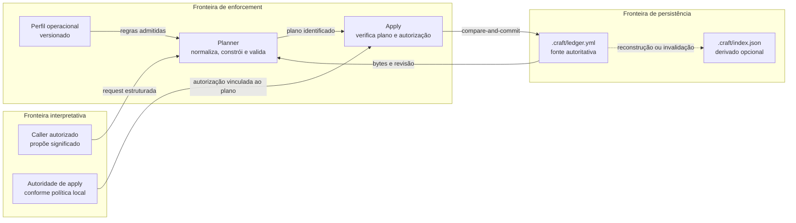
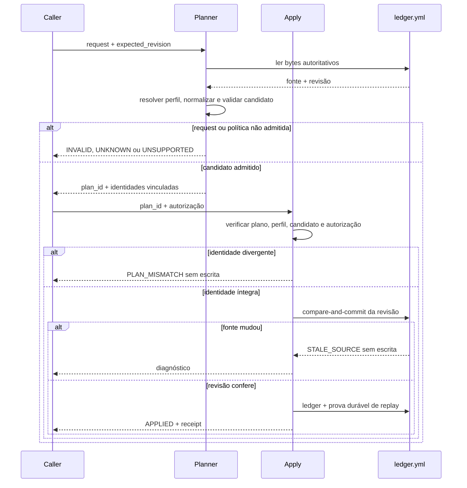

# Discovery — Mutação determinística do Craft ledger

## Objetivo

O Craft existe para manter a memória estruturada de um projeto útil entre
sessões, contextos recursivos e capacidades diferentes. Esta feature contribui
para esse objetivo retirando do modelo a responsabilidade de editar o arquivo físico do ledger, sem retirar a responsabilidade do Craft registrar as decisões.

Este discovery descreve uma direção para `runtime/craft-ledger`: receber uma
operação Craft estruturada, construir e validar o estado candidato e atualizar o
ledger de maneira determinística e fail-closed.

## 1. Contexto de negócio

O Craft separa trabalho que ainda precisa de julgamento — por exemplo, decidir
se uma descoberta é um gap ou blocker e escolher seu tratamento — de estado que
precisa permanecer estável e navegável. Hoje essa memória vive principalmente em
`.craft/ledger.yml`, mas sua manutenção depende de edição disciplinada pelo modelo. O pacote canônico declara métodos, famílias de linhas, referências, índices e regras de lifecycle, porém não entrega um runner público, um aplicador de patches nem um gerador de índices empacotado ([arquitetura atual](../../../../../arcana/craft/ARCHITECTURE.md#explicitly-absent-today)).

Essa lacuna mistura duas responsabilidades diferentes. O modelo é adequado para
interpretar contexto e propor que determinado fato seja registrado como gap,
blocker, decisão, definição ou próximo movimento. Ele não deveria precisar
preservar manualmente sintaxe YAML, referências, unicidade, transições,
representações derivadas e concorrência entre escritores. Quando essas
obrigações mecânicas também dependem do modelo, o contrato existe, mas sua
execução não é garantida
([avaliação do ledger](../../../../../docs/analysis/craft-ledger-evaluation/analysis.md#onde-há-julgamento-interpretativo-e-onde-deveria-haver-enforcement-mecânico)).

O ganho esperado é tornar as mutações previsíveis ao impedir que o modelo altere de maneira errada o arquivo YAML. A recomendação do que ser incluído no ledger ainda vai ser algo determinado pelo usuário ou pelo modelo, e não há necessariamente uma garantia que um mesmo pedido para o modelo atualizar o ledger gere as mesmas entradas.

## 2. Mudança pretendida

Depois da mudança, o modelo ou outro caller interpretativo continuará escolhendo
o que deseja registrar. Em vez de escrever diretamente no YAML, enviará ao
runtime uma requisição estruturada que identifica a operação, o escopo Craft, os
valores propostos, as evidências e a revisão da fonte sobre a qual a proposta foi
formulada.

O runtime deverá:

- carregar a fonte autoritativa do escopo selecionado;
- reconhecer a versão e as políticas necessárias para aquela operação;
- construir uma representação candidata sem alterar o arquivo;
- validar estrutura, referências, identidade e transições cobertas pelo perfil;
- reconstruir no candidato os índices embutidos cuja política esteja definida;
- devolver um plano ou diagnóstico estável;
- exigir uma solicitação explícita de `apply` para o plano validado;
- comparar a revisão esperada dentro da fronteira de commit;
- substituir atomicamente o estado de `.craft/ledger.yml` ou não escrever nada;
- devolver um resultado identificável e idempotente.

O modelo deixa de ser o executor da integridade, não o autor da interpretação.
Por exemplo, ao adicionar um gap, ele pode propor `severity`, `treatment`, rota
de responsabilidade, resumo e evidências. O runtime confirma que os valores são
permitidos e coerentes com um perfil aceito; ele não escolhe o tratamento porque
o caller o omitiu.

## 3. Sistema atual e restrições

### 3.1 Autoridade e representações derivadas

O contrato canônico estabelece `.craft/ledger.yml` como única fonte local de
verdade. Dentro desse arquivo, as coleções de linhas carregam o estado-fonte e a
seção `indexes` é uma projeção reconstruível, embora esteja fisicamente no mesmo
YAML. `CRAFT.md` e `.craft/index.json` também são derivados
([Source Authority](../../../../../arcana/craft/ARCHITECTURE.md#source-authority)).

Uma mutação segura precisa, portanto, distinguir duas coisas ao preservar uma
única unidade de persistência:

- linhas-fonte, que expressam o estado Craft autoritativo;
- índices embutidos, que devem corresponder às linhas quando sua regra de
  derivação for conhecida.

O commit de `ledger.yml` não pode publicar primeiro as linhas e depois corrigir
os índices embutidos. Ambos pertencem à mesma substituição atômica do arquivo.
O índice externo opcional pode ser produzido depois, com identidade ou hash da
fonte que o originou
([contrato de índice](../../../../../arcana/craft/templates/schemas/index.schema.yml)).

### 3.2 Métodos declarados sem executor empacotado

O Craft declara operações como `add_blocker`, `open_decision`, `add_gap`,
`add_definition`, `next`, `link`, `validate` e `recompose`, mas o próprio pacote
informa que ainda não possui command runner ou renderer completo
([métodos canônicos](../../../../../arcana/craft/SKILL.md#core-methods)). A
arquitetura também registra como ausentes o row-update planner, a aplicação
automatizada de YAML, a CLI, o index builder e fixtures de mutação
([Explicitly Absent Today](../../../../../arcana/craft/ARCHITECTURE.md#explicitly-absent-today)).

O runtime proposto não pode assumir que a presença de um schema equivale a um
validator executável. Ele precisará interpretar explicitamente o contrato
admitido e devolver `UNKNOWN` quando uma regra necessária ainda não tiver
política suficiente.

### 3.3 Divergências de interface

Há diferenças entre os nomes usados pelos métodos e os campos persistidos. Por
exemplo, `add_gap` recebe `context_id`, `owner_route` e `evidence`, enquanto a
linha de gap usa `scope_id`, `owner` e campos definidos pelo schema. De modo
semelhante, a interface de definição fala em `meaning`, enquanto o schema atual
persiste `statement`. Essas diferenças foram observadas na avaliação existente
e impedem que o runtime trate a operação como simples serialização dos argumentos
([avaliação de compatibilidade](../../../../../docs/analysis/craft-ledger-evaluation/analysis.md#o-principal-problema-atual)).

O runtime precisa possuir adapters de operação versionados. Cada adapter traduz
a intenção pública da operação para a forma persistida sem mudar seu significado.
Quando não existir tradução governada para a combinação de operação e versão, a
resposta é `UNKNOWN` quando a combinação é reconhecida mas sua política está
incompleta, e `UNSUPPORTED` quando a operação ou versão está fora do suporte
declarado. Uma violação de regra conhecida é `INVALID`. Nenhum desses casos
autoriza uma normalização inferida.

### 3.4 Compatibilidade incompleta

O entrypoint de schema menciona compatibilidade com `0.2.0` e `0.3.0`, mas o
corpus atual não oferece semântica executável completa para ambas. A análise
conclui que já é possível reconhecer invariantes inequívocas de `0.3.0`, mas não
validar ou reindexar universalmente ledgers legados
([limite de evidência](../../../../../docs/analysis/craft-ledger-evaluation/analysis.md#limite-da-análise)).

Por isso, esta feature não deve migrar ou “corrigir” automaticamente uma versão
legada. Uma versão pode ser sintaticamente reconhecida e ainda não possuir um
perfil operacional suficiente para determinada mutação.

### 3.5 Propriedade de resultados externos

Craft pode registrar handoffs, receipts, evidências e memória de rota, mas a
capability chamada continua dona de seu artefato e veredito nativos. O runtime de
ledger pode armazenar uma referência ou aplicar efeitos Craft permitidos; não
pode reescrever o resultado de origem
([interaction boundary](../../../../../arcana/craft/SKILL.md#interaction-boundary)).

O contrato de interação em `development/craft` é evidência candidate-local para
operações baseadas em receipts, não autoridade canônica do runtime
([Craft Interaction Contract](../../../../../development/craft/CRAFT-INTERACTION-CONTRACT.md)).

## 4. Direção de design

Não há registros aplicáveis em `authority/decisions/` no estado observado deste
repositório. Consequentemente, as escolhas abaixo são direção provisória deste
discovery. Elas não autorizam implementação nem alteram o contrato canônico do
Craft.

O desenho separa três fronteiras. O caller e a autoridade de `apply` fornecem
julgamento e permissão; o runtime aplica somente regras admitidas por um perfil
operacional; e o ledger permanece a única persistência autoritativa. O índice
externo continua derivado e não participa da decisão semântica.



Artefatos do diagrama: [fonte editável](../../../../../output/diagrams/20260828-craft-ledger-mutation-boundaries/diagram.mmd) e [preview](../../../../../output/diagrams/20260828-craft-ledger-mutation-boundaries/diagram.png).

### 4.1 Caller interpretativo

O caller pode ser um modelo, um humano assistido por modelo ou outra capability
que já possua autoridade para propor a operação. Sua responsabilidade é fornecer
o significado que não pode ser derivado mecanicamente:

- qual operação Craft deseja realizar;
- em qual contexto ou escopo a informação pertence;
- classificação, resumo, impacto e evidência pertinentes;
- campos semânticos da família escolhida, como tratamento de gap ou lane de
  blocker;
- autorização de `apply`, quando a política local permitir que esse caller a
  conceda.

O caller não precisa enviar toda a conversa. Ele referencia o contexto Craft
existente, e o runtime relê o estado autoritativo antes de construir o candidato.

### 4.2 Requisição de mutação

A requisição é o limite entre interpretação e enforcement. Sua forma conceitual
é:

```yaml
request_id: MUT-20260828-001
operation: add_gap
target:
  workspace: <workspace-craft-resolvido>
  context_id: CTX-CRAFT-LEDGER-INTEGRITY
  expected_revision: sha256:<identidade-da-fonte>
values:
  gap_id: GAP-LEDGER-ID-UNIQUENESS
  summary: Política de unicidade dos IDs ainda não está definida
  severity: block
  treatment: plan
  owner_route: governance
  status: active
evidence: docs/analysis/craft-ledger-evaluation/analysis.md
```

`request_id` identifica a tentativa lógica e sustenta idempotência.
`expected_revision` identifica os bytes ou a revisão da instância lida pelo
caller; não é `schema_version`. O caller identifica o workspace, não fornece um
caminho de ledger livre. O runtime deriva `.craft/ledger.yml` do workspace já
resolvido, verifica contenção pelo caminho canônico e volta a verificar a
identidade do arquivo dentro da fronteira de commit.

O exemplo pressupõe um perfil aceito que traduz `context_id` para `scope_id` e
`owner_route` para `owner`. O ID é uma proposta explícita do caller, `status` não
é preenchido silenciosamente e `evidence` conserva a forma string exigida pela
linha de gap atual. Se esse perfil ou qualquer dessas traduções não existir, o
resultado esperado é `UNKNOWN`, não um plano parcialmente inferido.

### 4.3 Perfil operacional versionado

Um perfil operacional reúne apenas regras cuja semântica já foi aceita para uma
combinação de versão e operação:

- forma da requisição;
- mapeamento entre argumentos do método e campos persistidos;
- enums, campos obrigatórios e referências;
- transições de estado permitidas;
- política de identidade e domínio de unicidade aplicável;
- política de derivação dos índices embutidos;
- condições de no-op, bloqueio e idempotência.

Conhecer a versão do schema não basta. Se a mutação precisa reindexar uma família
cuja completude ainda não está definida, o perfil é insuficiente e a operação
deve retornar `UNKNOWN` sem escrita.

### 4.4 Candidato e plano de mutação

O runtime constrói uma cópia candidata em memória a partir da fonte e da
requisição normalizada. A validação é feita sobre o candidato completo, antes de
qualquer commit. Um plano de mutação deve permitir que o caller compreenda:

- qual é o `plan_id` e o fingerprint da requisição normalizada;
- qual fonte e revisão foram lidas;
- qual operação, `request_id` e perfil originaram o plano;
- qual identidade e versão do serializer produziram o candidato;
- quais linhas seriam adicionadas ou alteradas;
- quais índices embutidos seriam reconstruídos;
- quais invariantes foram verificadas;
- qual é a identidade dos bytes candidatos;
- qual escopo de autorização pode aplicar o plano;
- se o efeito é mudança, `NO_OP` ou `ALREADY_APPLIED`;
- quais políticas ficaram fora do perfil.

Produzir um plano não concede autorização de escrita. Dry-run e apply são
operações distintas, mesmo quando o mesmo processo de runtime executa ambas.
O `plan_id` deve vincular de modo estável o fingerprint da requisição
normalizada, a revisão da fonte, a identidade e versão do perfil e do
serializer, a identidade dos bytes candidatos e o escopo de autorização. O
runtime não pode reconstruir um plano sob um perfil mais novo e tratá-lo como o
mesmo plano. Qualquer divergência produz `PLAN_MISMATCH` sem escrita.

### 4.5 Fronteira explícita de apply

`apply` recebe um plano validado ou sua identidade imutável, mais a autorização
exigida pela política local e vinculada ao mesmo `plan_id`, alvo e efeito. Se o
runtime precisar reconstruir o plano, deve reproduzir as mesmas identidades de
requisição, perfil, serializer e candidato; caso contrário, retorna
`PLAN_MISMATCH`. Antes de escrever, ele executa a comparação da revisão esperada
dentro da própria fronteira atômica de commit.

Uma checagem seguida de uma escrita independente não é suficiente: a fonte pode
mudar entre as duas ações. A propriedade exigida é compare-and-commit, por lock,
compare-and-swap ou mecanismo equivalente ainda a decidir. Se a revisão divergir,
o resultado é `STALE_SOURCE` e nenhum byte deve ser publicado.

### 4.6 Resultado e idempotência

Toda execução retorna um resultado estável. Os estados conceituais mínimos são:

| Resultado | Significado | Efeito persistente |
|---|---|---|
| `PLAN` | Candidato válido disponível para inspeção | Nenhum |
| `APPLIED` | Compare-and-commit concluído | Novo `ledger.yml` |
| `NO_OP` | Uma request diferente produz estado efetivo já presente | Nenhum |
| `ALREADY_APPLIED` | O mesmo `request_id` e fingerprint já foi aplicado | Nenhum efeito duplicado; devolve o resultado original |
| `CONFLICT` | O `request_id` já existe com outro fingerprint | Nenhum |
| `PLAN_MISMATCH` | Plano, perfil, candidato ou autorização não corresponde ao `plan_id` | Nenhum |
| `INVALID` | A requisição ou candidato viola regra conhecida | Nenhum |
| `UNKNOWN` | Falta política para decidir mecanicamente | Nenhum |
| `UNSUPPORTED` | A versão ou operação não é suportada pelo runtime | Nenhum |
| `STALE_SOURCE` | A revisão autoritativa mudou antes do commit | Nenhum |

O receipt de sucesso deve ligar `request_id`, identidade da fonte anterior,
fingerprint da requisição, identidade do resultado, operação, perfil e plano
aplicado. O mesmo `request_id` com o mesmo fingerprint devolve esse resultado;
o mesmo ID com fingerprint diferente retorna `CONFLICT`. Uma request diferente
cujo candidato já corresponde ao estado corrente retorna `NO_OP`.

A garantia sobre replay só existe quando o perfil define uma prova durável de
aplicação que participa da mesma unidade atômica do ledger ou pode ser derivada
sem ambiguidade do estado commitado. Sem essa prova, `apply` retorna `UNKNOWN`:
não basta gravar o ledger e tentar persistir depois o dado necessário à
idempotência. Resultados sem escrita podem continuar efêmeros, desde que sua
reexecução seja determinística.

O fluxo abaixo torna visíveis as duas recusas que protegem o commit: revisão
obsoleta e divergência da identidade do plano.



Artefatos do diagrama: [fonte editável](../../../../../output/diagrams/20260828-craft-ledger-plan-apply-flow/diagram.mmd) e [preview](../../../../../output/diagrams/20260828-craft-ledger-plan-apply-flow/diagram.png).

### 4.7 Identidade de linhas

O runtime sempre pode validar padrão e colisão quando essas regras estiverem
definidas. Ele só pode gerar IDs quando houver uma política de alocação e um
domínio de unicidade aceitos para a família. Até essa decisão existir, a
requisição pode trazer um ID proposto pelo caller; o runtime o aceita ou rejeita,
mas não inventa uma política geral.

Essa separação preserva duas necessidades diferentes: IDs podem continuar
semanticamente úteis para humanos, enquanto unicidade e colisões são verificadas
deterministicamente.

## 5. Especificações técnicas

### 5.1 Contrato funcional

O runtime deve expor, no mínimo, duas capacidades conceitualmente separadas:

| Capacidade | Entrada | Saída | Pode escrever? |
|---|---|---|---|
| `plan` | requisição estruturada e fonte esperada | plano ou diagnóstico | Não |
| `apply` | plano admitido, revisão esperada e autorização | receipt ou diagnóstico | Somente por compare-and-commit |

Uma interface futura pode oferecer comandos específicos como `add-gap` ou
`open-decision`, mas eles devem convergir para o mesmo contrato interno de
candidato, validação, plano e apply. A escolha entre CLI, biblioteca ou adapter
de skill permanece aberta; nenhuma delas deve criar semântica paralela.

#### Identidade de bytes e serialização

`expected_revision` é o SHA-256 dos bytes exatos lidos da fonte. A identidade do
candidato é o SHA-256 dos bytes exatos que seriam publicados. O perfil
operacional deve fixar a identidade e versão do serializer e todas as regras que
possam alterar bytes, incluindo encoding, finais de linha, ordenação, quoting,
valores nulos e tratamento de campos desconhecidos ou comentários. A mesma
fonte, request normalizada, perfil e serializer devem produzir o mesmo
`plan_id`, os mesmos bytes candidatos e o mesmo diagnóstico.

O formato concreto pode preservar a representação existente ou emitir uma
forma canônica. Essa escolha permanece por perfil; se o runtime não conseguir
produzir bytes determinísticos sem perder conteúdo que a política manda
preservar, a operação retorna `UNKNOWN`.

### 5.2 Fluxo de execução

O contrato operacional da mutação é:

1. resolver o caminho real do workspace, derivar `.craft/ledger.yml`, comprovar
   sua contenção e prender a identidade do alvo;
2. ler bytes, calcular a revisão e interpretar o ledger;
3. resolver o perfil da versão e da operação;
4. normalizar a requisição sem preencher escolhas semânticas ausentes;
5. construir o candidato em memória;
6. validar o candidato completo;
7. derivar no candidato os índices embutidos governados pelo perfil;
8. detectar `NO_OP` ou reaplicação idempotente;
9. produzir o plano sem escrita;
10. mediante `apply` explícito, verificar `plan_id`, perfil, candidato e
    autorização;
11. dentro da operação atômica, revalidar o caminho e a identidade do arquivo e
    comparar a revisão esperada;
12. substituir `ledger.yml` e registrar sua prova durável de replay como uma
    unidade ou falhar sem publicação parcial;
13. emitir o resultado e, quando aplicável, o receipt;
14. opcionalmente reconstruir ou invalidar `.craft/index.json` a partir do ledger commitado,
    preservando a identidade da fonte.

Essa ordem descreve comportamento requerido, não um plano de implementação.

### 5.3 Invariantes

- `.craft/ledger.yml` permanece a única fonte de verdade do escopo.
- Nenhuma mutação parte de `CRAFT.md` ou `.craft/index.json`.
- O candidato é validado antes do commit.
- Política ausente nunca é completada por inferência silenciosa.
- Linhas-fonte e índices embutidos são publicados juntos no mesmo `ledger.yml`.
- Uma revisão obsoleta nunca sobrescreve a fonte corrente.
- Um `plan_id` nunca é aplicado com request, perfil, serializer, candidato ou
  autorização divergente.
- Repetir o mesmo `request_id` e fingerprint não duplica efeitos nem perde a
  identidade do resultado original.
- Reutilizar um `request_id` com outro fingerprint falha como `CONFLICT`.
- O ledger resolvido permanece contido no workspace durante o commit.
- A mesma entrada admitida produz os mesmos bytes candidatos.
- Uma falha não deixa YAML parcialmente escrito.
- O runtime não reclassifica o significado proposto para tornar a operação
  válida.
- Referências a artefatos e vereditos nativos não transferem sua propriedade ao
  Craft.

### 5.4 Tratamento do contexto

`context_id` na requisição identifica o contexto Craft ao qual a operação deve
ser ligada. O adapter pode convertê-lo para `scope_id`, `owner_context_id`,
`source_id` ou outro campo persistido exigido pela família, desde que o
mapeamento esteja declarado no perfil e preserve o significado.

Antes de planejar, o runtime deve verificar que:

- o contexto existe no ledger selecionado;
- o caller não apontou acidentalmente para outro workspace;
- o estado atual permite a operação conhecida;
- evidências e IDs referenciados resolvem ou são links externos explícitos;
- a revisão pertence à mesma instância lida para formar a proposta.

### 5.5 Validação por família

As regras semânticas permanecem específicas por família:

- um gap usa severidade, tratamento, owner/rota e evidência;
- um blocker usa tipo, lane, condição de fechamento e lifecycle de refinamento;
- uma decisão preserva pergunta, opções, blocking state e, quando fechada,
  seleção, rationale e evidência;
- uma definição permanece candidate-local até promoção pela autoridade dona;
- recomposição exige evidência antes de sustentar fechamento do contexto filho.

O runtime não deve oferecer um objeto genérico que apague essas diferenças. Ele
pode compartilhar a mecânica de mutation planning, mas cada operação conserva o
contrato da família correspondente.

### 5.6 Compatibilidade e migração

O primeiro perfil operacional pode ser menor que o schema completo, desde que
declare seu limite e falhe fechado. Um ledger legado deve ser:

- aceito por um perfil explícito;
- recusado como `UNSUPPORTED`; ou
- bloqueado como `UNKNOWN` quando a versão é reconhecida, mas falta política.

Ele nunca deve ser normalizado para `0.3.0` por adivinhação. Migração de versão é
uma operação própria, com política, plano e autorização diferentes de uma
mutação ordinária.

### 5.7 Critérios comportamentais

A direção poderá avançar para planejamento de implementação quando houver
evidência de que o contrato consegue especificar, sem invenção:

- um caso válido que produz plano determinístico;
- um caso inválido que não altera bytes;
- um caso de política desconhecida que retorna `UNKNOWN`;
- um caso de versão não suportada que retorna `UNSUPPORTED`;
- um caso sem mudança que retorna `NO_OP`;
- uma reaplicação com o mesmo ID e fingerprint que retorna o resultado original;
- uma colisão de `request_id` com outro fingerprint que retorna `CONFLICT`;
- um plano, perfil, candidato ou autorização divergente recusado como
  `PLAN_MISMATCH`;
- uma colisão de ID e uma referência quebrada bloqueadas antes do commit;
- um alvo fora do workspace ou trocado durante o commit recusado sem escrita;
- uma fonte concorrente recusada como `STALE_SOURCE` dentro do commit;
- duas execuções com a mesma fonte, request, perfil e serializer que produzem
  `plan_id` e bytes candidatos idênticos;
- uma interrupção após o commit cuja reaplicação recupera a prova durável e não
  duplica o efeito;
- uma escrita em que linhas e índices embutidos aparecem juntos ou não aparecem;
- preservação do veredito nativo ao registrar sua referência no Craft.

## Fora de escopo

- decidir semanticamente se uma descoberta é gap, blocker ou outra família;
- escolher automaticamente severidade, tratamento, lane ou autoridade;
- promover definições candidate-local;
- definir uma política universal de IDs sem decisão de governança;
- transformar `index.json` em fonte de verdade;
- mutar ledgers a partir de `CRAFT.md`;
- executar a capability externa cujo resultado o Craft registra;
- migrar automaticamente ledgers `0.2.0`;
- escolher neste discovery linguagem, biblioteca, lock ou formato final de CLI.

## Questões abertas

1. Qual componente será o owner canônico do runtime mutável: o pacote Craft, um
   adapter separado ou uma superfície compartilhada de runtime?
2. Qual é o inventário inicial de operações suportadas e qual delas fornece o
   menor slice útil sem fingir cobertura completa?
3. Qual autoridade fecha o domínio de unicidade e a política de alocação de IDs
   por família?
4. Quem pode autorizar `apply` em cada ambiente: o mesmo caller, um humano, uma
   policy engine ou uma combinação deles?
5. Quais famílias compõem cada índice embutido e quais filtros definem itens
   ativos por versão?
6. Qual é a semântica operacional definitiva para ledgers `0.2.0`?
7. Qual mecanismo fornecerá compare-and-commit e substituição atômica nas
   plataformas suportadas?
8. Como `.craft/index.json` será atualizado ou invalidado após o commit sem
   ampliar a transação autoritativa?
9. Qual superfície admitida pelo schema guardará a prova durável de replay na
   mesma unidade atômica do ledger, e por quanto tempo ela será retida?
10. O plano de dry-run será um artefato serializado estável ou uma resposta
    efêmera sem perder a identidade imutável exigida por `apply`?
11. Quais perfis preservarão a representação YAML existente e quais adotarão
    serialização canônica?

## Evidência consultada

- [Craft Architecture](../../../../../arcana/craft/ARCHITECTURE.md)
- [Craft Skill](../../../../../arcana/craft/SKILL.md)
- [Ledger schema entrypoint](../../../../../arcana/craft/templates/ledger.schema.yml)
- [Ledger core schema](../../../../../arcana/craft/templates/schemas/ledger-core.schema.yml)
- [Index schema](../../../../../arcana/craft/templates/schemas/index.schema.yml)
- [Craft Ledger Analysis](../../../../../docs/analysis/craft-ledger-evaluation/analysis.md)
- [Review da análise](../../../../../docs/analysis/craft-ledger-evaluation/review/analysis-assessment/review.md)
- [Handoff histórico de lifecycle](../../../../../development/craft/CRAFT-HANDOFF-AUTO-ARTIFACT-LIFECYCLE-2026-06-13.md)
- [Interaction contract candidate-local](../../../../../development/craft/CRAFT-INTERACTION-CONTRACT.md)
