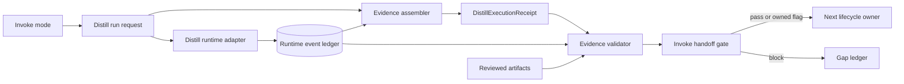

# Design: Distill Execution Evidence

## Design Intent

Introduce a fail-closed evidence path between Distill execution and Invoke handoff without
changing Distill's role policy or pretending one serialization is already canonical. The
recommended architecture uses a versioned receipt backed by runtime-owned append-only events;
Spellcraft must accept or narrow it before implementation.

## Smallest Coherent Architecture Unit

At the interface/lifecycle-enforcement level, the smallest coherent unit is:

> Only a validator-derived result over provenance-resolvable, contract-complete Distill
> evidence may authorize Invoke handoff.

The run request, runtime event substrate, receipt projection, validator implementation, and
handoff gate below are candidate child mechanisms that realize this rule. Lifecycle acceptance
may combine, replace, or remove a mechanism while preserving the validator-authoritative rule.
In particular, a separate receipt projection may be folded into validation.

## 1. Context View



## 2. Capability View

| Capability | Input | Output | Failure Behavior |
| --- | --- | --- | --- |
| Run request builder | Invoke mode artifacts and Distill budget | immutable run request handle | block if target set is incomplete |
| Runtime adapter | run request and capability availability | append-only role/process events | block if neither path can be evidenced |
| Evidence assembler | request, events, result artifacts | versioned receipt candidate | no pass authority |
| Evidence validator | receipt, events, reviewed inputs, Invoke result | validator-owned result and diagnostics | fail closed on unresolved evidence |
| Handoff gate | validator result and owned gaps | mutation-capable route or blocked route | never trusts authored verdict text |

## 3. Information And Type View

```text
DistillRunRequest
  run_id, parent_invoke_run_id, invoke_mode, distill_mode
  round_budget, reviewed_inputs[], requested_techniques[]

RuntimeEvent
  event_id, run_id, sequence, event_type
  execution_path, role, invocation_ref?, payload_ref, emitted_at

DistillExecutionReceipt
  schema_version, request_ref, event_refs[]
  role_trace[], objections[], reconciliations[]
  technique_trace[], termination, verdict, gaps[], recomposition, next_route
  reviewed_input_provenance[]

DistillValidationResult
  validator_version, receipt_ref, status
  checks[], diagnostics[], owned_gaps[], mutation_handoff_allowed
```

The exact topology and serialization are selected by lifecycle acceptance. The proposed JSON representation
must be schema-valid, but schema validity alone is never sufficient.

## 4. Operation And Flow View

1. Invoke freezes the reviewed target set and emits `DistillRunRequest`.
2. The runtime adapter records a capability probe.
3. If subagents are supported, it records distinct Proposer and Balancer invocation events.
4. Otherwise, it records ordered labeled simulation-pass boundaries and no native identities.
5. Distill records objections, reconciliation, technique outcomes, termination, and result.
6. The assembler projects receipt fields from the request and event handles.
7. The validator resolves every referenced event and reviewed input.
8. The validator recomputes semantic checks and compares the receipt, Invoke result,
   observability state, work-pack identity, verdict, and counts.
9. The handoff gate consumes only `DistillValidationResult`.
10. Replay appends a new result and references the historical Workbench record.

## 5. State View

| State | Entry Condition | Allowed Transition | Forbidden Transition |
| --- | --- | --- | --- |
| requested | reviewed target set exists | executing | directly to validated |
| executing | runtime probe emitted | assembled, blocked | directly to handoff |
| assembled | receipt candidate references events | validating | directly to mutation-ready |
| validating | validator resolves inputs/events | validated, flagged, blocked | self-authored pass |
| validated | all required checks pass | handoff-eligible | rewrite history |
| flagged | only owned repairable gaps remain | bounded handoff or repair | ownerless mutation route |
| blocked | missing/invalid/inconsistent evidence | repair or stop | mutation route |
| superseded | newer replay result references record | historical query only | deletion or in-place rewrite |

## 6. Dependency And Interface View

| Boundary | Producer | Consumer | Contract |
| --- | --- | --- | --- |
| Invoke -> Distill | mode contract | runtime adapter | run request and reviewed target handles |
| Runtime -> evidence | runtime adapter | assembler/validator | append-only ordered events |
| Evidence -> validation | assembler | validator | versioned receipt candidate |
| Validation -> handoff | validator | Invoke gate | validator-owned result only |
| Canonical -> generated | public Arcanum source | bootstrap/generator | regenerate after accepted canonical changes |
| Invoke -> lifecycle | authored package | Spellcraft | acceptance packet, gaps, layering, work-pack |

## Validation Rules

- Require a finite round budget and a valid termination reason.
- Resolve role events for both execution paths; reject invented or same invocation IDs.
- Require categorized objections and one reconciliation disposition per objection.
- Require always-on technique evidence or an explicit readiness downgrade.
- Recompute reviewed-input provenance according to the lifecycle-accepted mechanism.
- Reject disagreement among receipt, validator result, Invoke output, work-pack, and
  observability counts.
- `flag` requires owner and repair route; `block` sets
  `mutation_handoff_allowed = false`.

## Design Decisions

| ID | Decision | Status | Owner |
| --- | --- | --- | --- |
| DEC-DEE-001 | Adopt versioned receipt plus runtime-event architecture and exact immutable identity after acceptance | pending | Spellcraft |
| DEC-DEE-002 | Keep anti-bias bounded; enforce Distill role opposition separately | accepted by review | Invoke/Distill owners |
| DEC-DEE-003 | Preserve historical Workbench evidence and append replay result | accepted by review | Workbench owner |
| DEC-DEE-004 | Keep deferred modes unsupported rather than implementing them here | accepted by review | Invoke owner |

## Design Gate

**FLAG.** The six views, validation boundary, failure states, and owner split are complete.
`DEC-DEE-001` remains a lifecycle acceptance gate, so implementation cannot begin yet.
