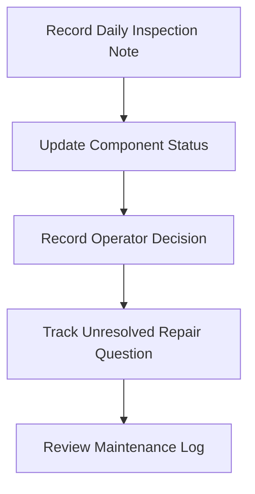
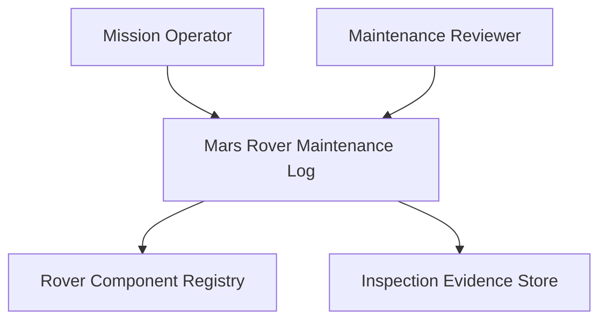
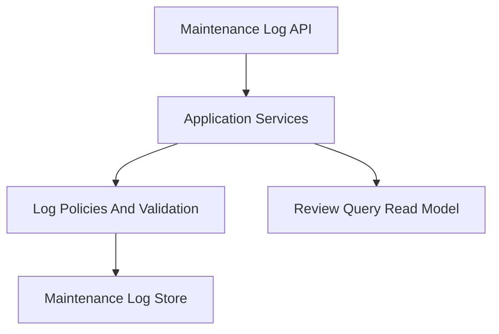
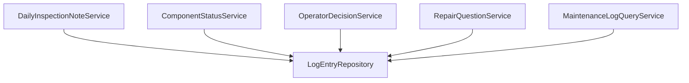
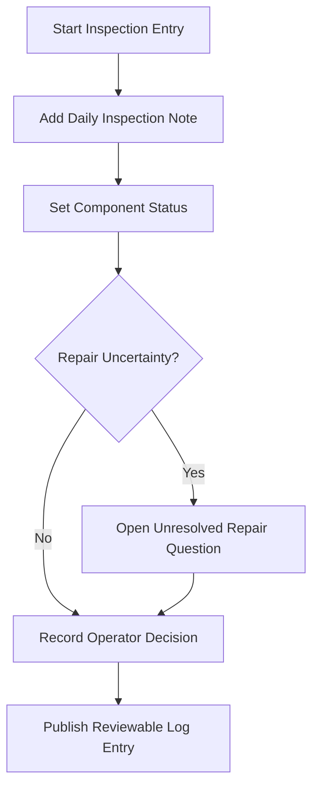
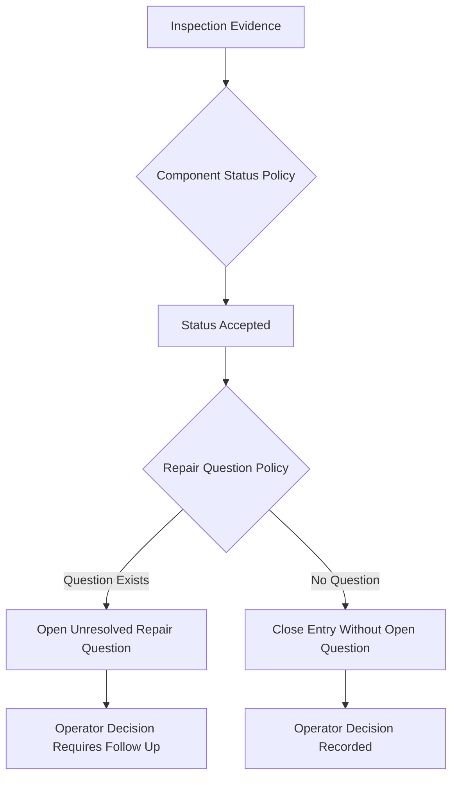
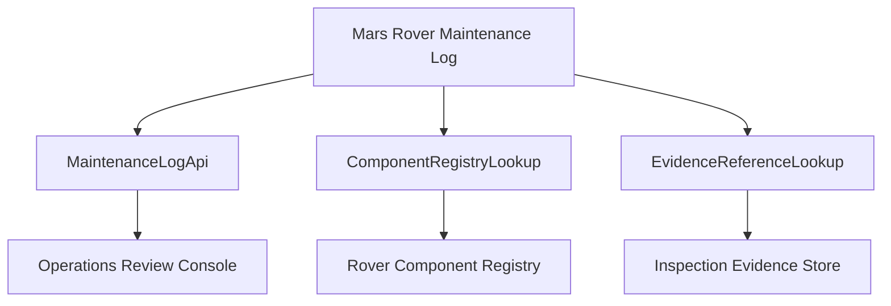

## Invoke Result

- Mode: define
- Spell: invoke
- Canonical ID: invoke
- Scope: library
- Phase status: pass
- Mode contract: spells/invoke/define.md
- Outputs: arcanum/spells/invoke/development/example-outputs/invoke-define-design-plan-live-pass/module-spec.md, arcanum/spells/invoke/development/example-outputs/invoke-define-design-plan-live-pass/glossary-ontology.md, arcanum/spells/invoke/development/example-outputs/invoke-define-design-plan-live-pass/implementation-layering-seed.md, arcanum/spells/invoke/development/example-outputs/invoke-define-design-plan-live-pass/define-transport.md
- Template selection: Module Formulae discovery profile selected because the request asks to define a bounded module and requires spec evidence plus glossary evidence before design.
- Decisions: Define scope approved for a Mars rover maintenance log module covering daily inspection note capture, component status tracking, operator decision recording, and unresolved repair question routing.
- Unresolved gaps: none
- Next route: deferred

### Define Evidence

- Spec evidence: produced in `module-spec.md`; includes mission, ownership boundary, capability map, concept model, contracts, scenarios, and acceptance evidence.
- Glossary evidence: produced in `glossary-ontology.md`; includes required terms with deterministic link statuses.
- Define transport evidence: produced in `define-transport.md`; records source request, selected template, produced artifacts, decisions, and no-silent-upstream-mutation status.
- Implementation layering seed: produced in `implementation-layering-seed.md`; seed is informational for downstream design and plan.

## Invoke Result

- Mode: design
- Spell: invoke
- Canonical ID: invoke
- Scope: library
- Phase status: pass
- Mode contract: spells/invoke/design.md
- Outputs: arcanum/spells/invoke/development/example-outputs/invoke-define-design-plan-live-pass/architecture-bundle.md, n/a, arcanum/spells/invoke/development/example-outputs/invoke-define-design-plan-live-pass/glossary-consistency.md, arcanum/spells/invoke/development/example-outputs/invoke-define-design-plan-live-pass/design-transport.md
- Design views: context | high-level structure | low-level components | workflow process | decision flow | dependency interface
- Template/profile selection: Module Formulae architecture profile selected; architecture-bundle template is eligible because approved define outputs exist and six design views are required.
- Implementation layering: seed consumed from define and refined as plan input
- Work-pack: n/a
- Decisions: Design consumes approved define outputs. Source contracts selected for Log Entry Contract, Component Status Contract, Operator Decision Contract, Repair Question Contract, and Maintenance Log Query Contract.
- Unresolved gaps: none
- Next route: plan

### Design Evidence

- Approved define outputs consumed: `module-spec.md`, `glossary-ontology.md`, `implementation-layering-seed.md`, `define-transport.md`.
- Source contracts produced: Log Entry Contract, Component Status Contract, Operator Decision Contract, Repair Question Contract, Maintenance Log Query Contract.
- All six design views produced in `architecture-bundle.md`.
- Glossary consistency evidence produced in `glossary-consistency.md`.
- Design transport evidence produced in `design-transport.md`.

## Invoke Result

- Mode: plan
- Spell: invoke
- Canonical ID: invoke
- Scope: library
- Phase status: pass
- Mode contract: spells/invoke/plan.md
- Outputs: arcanum/spells/invoke/development/example-outputs/invoke-define-design-plan-live-pass/implementation-plan.md, arcanum/spells/invoke/development/example-outputs/invoke-define-design-plan-live-pass/implementation-layering.md, arcanum/spells/invoke/development/example-outputs/invoke-define-design-plan-live-pass/work-pack.md, arcanum/spells/invoke/development/example-outputs/invoke-define-design-plan-live-pass/plan-transport.md
- Design views: context | high-level structure | low-level components | workflow process | decision flow | dependency interface
- Glossary consistency: pass
- Implementation layering: arcanum/spells/invoke/development/example-outputs/invoke-define-design-plan-live-pass/implementation-layering.md with L0, L1, L2, and L3 global layer boundaries
- Work-pack: arcanum/spells/invoke/development/example-outputs/invoke-define-design-plan-live-pass/work-pack.md and single-file
- Complexity: low
- Per-layer planning: compact
- Template/profile selection: implementation-plan, standalone implementation-layering, and standalone work-pack templates selected; execution-pack deferred because low complexity permits single-file work-pack output.
- Validation strategy: slice validation covers schema checks, decision policy checks, query behavior checks, and traceability from design contracts.
- Decisions: Plan consumes approved design outputs and keeps implementation execution deferred.
- Unresolved gaps: none
- Next route: task-session

### Plan Evidence

- Approved design outputs consumed: `architecture-bundle.md`, `glossary-consistency.md`, `design-transport.md`.
- Implementation plan evidence: produced in `implementation-plan.md`.
- Implementation layering evidence: produced in `implementation-layering.md`.
- Work-pack evidence: produced in `work-pack.md`; low-complexity single-file work-pack with compact layer mapping.
- Validation strategy: produced in `implementation-plan.md` and mirrored in `work-pack.md`.
- Plan transport evidence: produced in `plan-transport.md`.
- Implementation execution deferred: plan mode produces governed planning artifacts only and performs no source mutation.

# Module Spec: Mars Rover Maintenance Log

## Mission

The Mars rover maintenance log module records rover maintenance observations and decisions in a durable, reviewable form. It supports daily inspection note capture, component status tracking, operator decision recording, and unresolved repair question follow-up without executing repairs itself.

## Ownership Boundary

- Owns: maintenance log records, daily inspection note entries, component status snapshots, operator decision records, unresolved repair question tracking, and read views for operations review.
- Does Not Own: physical rover repair execution, telemetry ingestion, command uplink scheduling, spare-part inventory, or mission-control authorization outside the log workflow.

## Capability Map

## Capabilities

| Capability | Outcome | Key Contracts | Detail |
| --- | --- | --- | --- |
| Daily Inspection Capture | Operators can record inspection observations for a rover sol. | DailyInspectionNote action, MaintenanceLog read view | Captures note text, inspected components, operator identity, timestamp, and rover context. |
| Component Status Tracking | Component state is visible and traceable to the latest inspection evidence. | ComponentStatus record, SetComponentStatus action | Supports nominal, watch, degraded, failed, and repaired statuses. |
| Operator Decision Recording | Operational judgments are recorded with rationale. | OperatorDecision record, RecordOperatorDecision action | Stores decision, rationale, linked component, and follow-up requirement. |
| Repair Question Follow-Up | Open technical uncertainty is preserved until resolved. | UnresolvedRepairQuestion record, ResolveRepairQuestion action | Prevents ambiguous repair questions from being hidden inside free text. |
| Maintenance Log Review | Reviewers can inspect current and historical maintenance context. | MaintenanceLog read view | Provides log entries filtered by sol, component, status, decision, and unresolved question state. |

## Concept Model

| Concept | Type | Key Constraints |
| --- | --- | --- |
| MarsRoverMaintenanceLog | Record | One log stream per rover mission asset; entries are append-only except explicit corrections. |
| DailyInspectionNote | Record | Must reference rover ID, sol, operator, timestamp, and observation text. |
| ComponentStatus | Enumeration | Values: nominal, watch, degraded, failed, repaired. |
| OperatorDecision | Record | Must include decision label, rationale, operator, timestamp, and linked evidence. |
| UnresolvedRepairQuestion | Record | Must include question text, affected component, opened timestamp, owner, and current state. |

## Concept Index

| Concept | ID | Type | Source |
| --- | --- | --- | --- |
| Mars rover maintenance log | mars-rover-maintenance-log.MarsRoverMaintenanceLog | Record | module-spec.md |
| daily inspection note | mars-rover-maintenance-log.DailyInspectionNote | Record | module-spec.md |
| component status | mars-rover-maintenance-log.ComponentStatus | Enumeration | module-spec.md |
| operator decision | mars-rover-maintenance-log.OperatorDecision | Record | module-spec.md |
| unresolved repair question | mars-rover-maintenance-log.UnresolvedRepairQuestion | Record | module-spec.md |

## Source Contracts

| Contract Type | Contract Name | Summary |
| --- | --- | --- |
| Action | AddDailyInspectionNote | Appends a daily inspection note to the Mars rover maintenance log. |
| Action | SetComponentStatus | Records the latest component status and source evidence. |
| Action | RecordOperatorDecision | Records an operator decision with rationale and traceability. |
| Action | OpenRepairQuestion | Opens an unresolved repair question tied to a component or inspection. |
| Action | ResolveRepairQuestion | Marks an unresolved repair question resolved with evidence. |
| Read View | MaintenanceLogReview | Reads log entries by sol, component, status, decision, and open question state. |
| Policy | RepairQuestionPolicy | Requires explicit unresolved repair question records when a note identifies repair uncertainty. |
| Interface | MaintenanceLogApi | Provides append and query operations for the module. |

## Scenario Coverage

| Scenario | Acceptance Evidence |
| --- | --- |
| Operator adds a daily inspection note with nominal component status. | Log entry exists, component status is nominal, no unresolved repair question is opened. |
| Operator records a degraded component status and an operator decision to continue monitoring. | Component status is degraded, operator decision rationale is linked to the note. |
| Operator identifies an unresolved repair question during inspection. | Unresolved repair question is opened and visible in review. |
| Reviewer resolves a repair question after analysis. | Question status changes to resolved with resolution evidence. |

# Glossary And Ontology: Mars Rover Maintenance Log

## Plain Language Terms

| Term | Meaning In This Module | Related Concepts |
| --- | --- | --- |
| Mars rover maintenance log | The governed record of maintenance observations, status changes, decisions, and open repair questions for a rover. | MarsRoverMaintenanceLog |
| daily inspection note | A structured note entered during routine rover inspection. | DailyInspectionNote |
| component status | The recorded condition of a rover component at a point in time. | ComponentStatus |
| operator decision | A human operational judgment recorded with rationale and evidence. | OperatorDecision |
| unresolved repair question | A repair uncertainty that needs follow-up before it can be closed. | UnresolvedRepairQuestion |

## Formal Terms

| Term | Category | Definition | Source Or Rationale | Linked Authority Concepts | Link Status | No Match Reason | Usage References | Status | Created At | Updated At |
| --- | --- | --- | --- | --- | --- | --- | --- | --- | --- | --- |
| Mars rover maintenance log | business | A durable module-owned record of rover maintenance observations, statuses, decisions, and open repair questions. | User request and module boundary. | mars-rover-maintenance-log.MarsRoverMaintenanceLog | linked | n/a | module-spec.md, architecture-bundle.md, implementation-plan.md | candidate | 2026-05-18 | 2026-05-18 |
| daily inspection note | business | A structured inspection entry for a rover sol that captures observations and related component evidence. | User request. | mars-rover-maintenance-log.DailyInspectionNote | linked | n/a | module-spec.md, architecture-bundle.md | candidate | 2026-05-18 | 2026-05-18 |
| component status | shared | A normalized condition value assigned to a rover component from inspection or repair evidence. | User request and status policy. | mars-rover-maintenance-log.ComponentStatus | linked | n/a | module-spec.md, architecture-bundle.md | candidate | 2026-05-18 | 2026-05-18 |
| operator decision | business | A recorded operational choice with rationale, operator identity, and source evidence. | User request. | mars-rover-maintenance-log.OperatorDecision | linked | n/a | module-spec.md, architecture-bundle.md | candidate | 2026-05-18 | 2026-05-18 |
| unresolved repair question | business | An open repair uncertainty that remains visible until resolved with evidence. | User request and repair question policy. | mars-rover-maintenance-log.UnresolvedRepairQuestion | linked | n/a | module-spec.md, architecture-bundle.md, implementation-plan.md | candidate | 2026-05-18 | 2026-05-18 |

# Define Transport Report

## Source Request

Define, design, and plan a Mars rover maintenance log module using the required terms.

## Template Selection Evidence

| Template | Eligibility | Decision |
| --- | --- | --- |
| Module Formulae discovery profile | Eligible for producing module spec and glossary baseline. | selected |
| Standalone implementation-layering seed | Eligible as downstream seed. | selected |
| Candidate family templates | Not needed for define phase. | deferred |

## Produced Define Artifacts

| Artifact | Evidence |
| --- | --- |
| module-spec.md | Spec evidence produced. |
| glossary-ontology.md | Glossary evidence produced with deterministic link statuses. |
| implementation-layering-seed.md | Downstream layering seed produced. |
| define-transport.md | Define transport evidence produced. |

## Governance

- No upstream files edited.
- No glossary terms promoted automatically.
- No unresolved blocker gaps remain.

# Architecture Bundle: Mars Rover Maintenance Log

## Design Intent

The design turns approved define outputs into a small append-oriented module with explicit contracts for inspection notes, component status, operator decisions, and repair questions. The module favors traceability and reviewability over automated repair behavior.

## Inputs

- module-spec.md
- glossary-ontology.md
- implementation-layering-seed.md
- define-transport.md

## Source Contracts

| Contract ID | Contract | Responsibility |
| --- | --- | --- |
| SC-001 | Log Entry Contract | Stores append-only daily inspection note entries. |
| SC-002 | Component Status Contract | Normalizes and exposes component status changes. |
| SC-003 | Operator Decision Contract | Stores operator decision rationale and evidence links. |
| SC-004 | Repair Question Contract | Opens, tracks, and resolves unresolved repair questions. |
| SC-005 | Maintenance Log Query Contract | Provides review queries across notes, statuses, decisions, and repair questions. |

## 1. Context View

## 2. High-Level Structure View

## 3. Low-Level Components View

## 4. Workflow Process View

## 5. Decision Flow View

## 6. Dependency Interface View

## Decisions

| Decision | Selected Option | Rationale |
| --- | --- | --- |
| Persistence shape | Append-only log entries with explicit correction records later. | Preserves operational traceability. |
| Status values | nominal, watch, degraded, failed, repaired. | Keeps status policy compact and reviewable. |
| Repair uncertainty handling | Create explicit unresolved repair question records. | Prevents hidden uncertainty in note text. |
| Execution readiness | Defer implementation execution to task-session after plan approval. | Plan mode must not mutate source code. |

## Risks

| Risk ID | Risk | Impact | Mitigation |
| --- | --- | --- | --- |
| R-ARCH-1 | Operators may put repair uncertainty only in free text. | medium | RepairQuestionPolicy requires explicit unresolved repair question when uncertainty is detected or selected. |
| R-ARCH-2 | Component naming may drift from registry terms. | low | ComponentRegistryLookup validates component identifiers. |

## Planning Notes

- Direct implementation constraints: keep module single-file for first implementation slice if local project conventions permit.
- Boundary rules: no repair command execution, no telemetry ingestion, no glossary promotion.
- Testability implications: validate append behavior, status transitions, decision rationale, and unresolved repair question visibility.

# Glossary Consistency Report

## Result

- Status: pass
- Checked terms: Mars rover maintenance log, daily inspection note, component status, operator decision, unresolved repair question.
- Conflicts: none
- Silent promotions: none

| Term | Define Status | Design Usage | Consistency |
| --- | --- | --- | --- |
| Mars rover maintenance log | linked candidate | Module boundary and API naming. | pass |
| daily inspection note | linked candidate | Entry workflow and service naming. | pass |
| component status | linked candidate | Status policy and read model. | pass |
| operator decision | linked candidate | Decision contract and workflow output. | pass |
| unresolved repair question | linked candidate | Repair question contract and decision flow. | pass |

# Design Transport Report

## Consumed Approved Define Outputs

| Artifact | Status |
| --- | --- |
| module-spec.md | approved for design |
| glossary-ontology.md | approved for design |
| implementation-layering-seed.md | approved as seed |
| define-transport.md | consumed |

## Produced Design Outputs

| Artifact | Evidence |
| --- | --- |
| architecture-bundle.md | All six design views produced. |
| glossary-consistency.md | Glossary consistency evidence produced. |
| design-transport.md | Design transport evidence produced. |

## Governance

- Design consumes approved define outputs.
- No upstream define artifacts edited.
- No implementation work-pack or executable task mutation produced in design mode.
- Next route is plan.

# Implementation Layering: Mars Rover Maintenance Log

## Purpose

Define a compact L0-L3 layer model for implementing the Mars rover maintenance log module while preserving traceability and deferring implementation execution.

## Target And Scope

- Target: Mars rover maintenance log module
- Scope: feature
- Current state: greenfield
- Complexity: low

## Layer Decision Table

| Layer | Decision Question | Minimum Working Unit | Included Scope | Deferred Scope | Exit Evidence | Promotion Decision |
| --- | --- | --- | --- | --- | --- | --- |
| L0 (POC) | After this layer, we know whether a daily inspection note can be recorded and reviewed. | Single append and read path for a daily inspection note. | Log record shape, append action, basic read view. | Component status policy, operator decision details, repair question lifecycle. | Unit or contract test showing note append and read. | Continue to L1 if append/read traceability works. |
| L1 | After this layer, we know whether component status and operator decision capture are repeatable. | Repeatable status and decision entries linked to notes. | Component status validation and operator decision rationale. | Full repair question resolution workflow. | Tests for status values and decision rationale links. | Harden to L2 if status and decision links are stable. |
| L2 | After this layer, we know whether unresolved repair question governance holds. | Open and resolve repair questions tied to log evidence. | Repair question policy, visibility in review, closure evidence. | Packaging and broader rollout. | Tests for open, visible, and resolved repair question states. | Package to L3 if governance checks pass. |
| L3 | After this layer, we know whether the module is ready for adoption by the operations surface. | Packaged interface with documented query behavior. | API polish, integration documentation, release checklist. | Future telemetry ingestion or repair automation. | Integration review and documentation acceptance. | Pilot or defer based on acceptance evidence. |

## Recommended Next Layer

- Next layer: L0
- Key decision unlocked: daily inspection note append and read behavior works.
- Major deferred scope: repair automation, telemetry ingestion, and production rollout.

# Implementation Plan: Mars Rover Maintenance Log

## Implementation Objective

Implement the Mars rover maintenance log module planning slice for append-only maintenance entries, component status, operator decision, and unresolved repair question behavior. Implementation execution remains deferred until a task-session or equivalent execution route is approved.

## Source Design References

| Ref ID | Source | Required | Notes |
| --- | --- | --- | --- |
| SD-001 | architecture-bundle.md | yes | All six design views approved. |
| SD-002 | glossary-consistency.md | yes | Glossary consistency passed. |
| SD-003 | design-transport.md | yes | Confirms approved design outputs. |

## Delivery Boundary

- Included: single-module implementation plan, global implementation layering artifact, single-file work-pack, validation strategy.
- Excluded: code execution, source mutation, telemetry ingestion, physical repair action, production rollout.
- Deferral rules: implementation begins only after plan handoff approval.

## Delivery Slices

| Slice ID | Outcome | Dependencies | Validation |
| --- | --- | --- | --- |
| S-001 | Daily inspection note append and read behavior planned. | SD-001, SD-002 | Schema and append/read validation. |
| S-002 | Component status and operator decision capture planned. | S-001 | Status policy and decision rationale validation. |
| S-003 | Unresolved repair question open and resolve behavior planned. | S-001, S-002 | Repair question lifecycle validation. |

## Dependency Plan

| Dependency | Needed By | Readiness | Risk |
| --- | --- | --- | --- |
| Component registry identifier shape | S-002 | partial | Use placeholder interface until registry contract is available. |
| Evidence reference identifier shape | S-001, S-003 | partial | Validate as opaque reference in first slice. |

## Task Decomposition

| Task ID | Slice ID | Task | Done When |
| --- | --- | --- | --- |
| T-001 | S-001 | Define module record types and append/read contract. | Daily inspection note can be represented and queried. |
| T-002 | S-002 | Add component status validation and operator decision record. | Status and decision entries link to inspection evidence. |
| T-003 | S-003 | Add unresolved repair question open/resolve behavior. | Open questions are visible and can be resolved with evidence. |
| T-004 | S-001, S-002, S-003 | Add focused validation coverage. | Validation checks cover planned behavior and traceability. |

## Validation Strategy

| Check ID | Check | Scope | Tool Or Evidence |
| --- | --- | --- | --- |
| V-001 | Daily inspection note append/read check. | S-001 | Unit or contract test evidence. |
| V-002 | Component status allowed-value check. | S-002 | Unit test or schema validation evidence. |
| V-003 | Operator decision rationale required check. | S-002 | Unit test evidence. |
| V-004 | Unresolved repair question lifecycle check. | S-003 | Unit or workflow test evidence. |
| V-005 | Glossary term usage traceability check. | All slices | Review evidence against glossary-consistency.md. |

## Closure Criteria

| Criterion | Evidence |
| --- | --- |
| Implementation plan maps to approved design outputs. | SD-001 through SD-003 present. |
| Global implementation layering exists. | implementation-layering.md produced. |
| Low-complexity work-pack exists. | work-pack.md produced with single-file output mode. |
| Execution remains deferred. | Plan transport states no source mutation performed. |

## Gate Result

- Status: pass
- Reason: Approved design outputs are present, complexity is low, compact layer mapping is sufficient, validation strategy is defined, and no blocker affects acceptance criteria.

# WORK-PACK: mars-rover-maintenance-log

## Control Fields

| Field | Value | Notes |
| --- | --- | --- |
| workPackGateStatus | pass | Ready for later mutation-capable execution after explicit handoff. |
| complexity | low | Four tasks, single module, no migration, no unresolved blocker gates. |
| outputMode | single-file | Low-complexity scope permits compact single-file work-pack. |
| implementationPlanRef | implementation-plan.md | Source implementation-plan artifact. |
| executionPackRef | n/a | Deferred because low complexity does not require split execution-pack. |
| layeringArtifactRef | implementation-layering.md | Global L0-L3 decision artifact. |
| activeLayerWindow | L0 | First execution slice should prove append/read behavior. |
| readinessProfile | pilot | First implementation target is pilot readiness, not production rollout. |

## Objective Summary

- Objective: Prepare execution-ready planning for the Mars rover maintenance log module.
- Primary inputs: approved architecture bundle, glossary consistency report, implementation layering, implementation plan.
- Success condition: implementation can be started later with tasks, validation, and layer boundaries already mapped.

## Compact Layer Mapping

| Task ID | Layer | Layer Rationale |
| --- | --- | --- |
| T-001 | L0 | Proves daily inspection note append/read behavior. |
| T-002 | L1 | Adds repeatable component status and operator decision capture. |
| T-003 | L2 | Adds unresolved repair question governance and lifecycle behavior. |
| T-004 | L0-L2 | Validates each implemented behavior before promotion. |

## Task Status Board

| Task ID | Goal | Layer | Complexity | Waves | Gate Status | Status |
| --- | --- | --- | --- | --- | --- | --- |
| T-001 | Define module record types and append/read contract. | L0 | low | W1 | ready | not-started |
| T-002 | Add component status validation and operator decision record. | L1 | low | W1 | ready-after-T-001 | not-started |
| T-003 | Add unresolved repair question open/resolve behavior. | L2 | low | W1 | ready-after-T-002 | not-started |
| T-004 | Add focused validation coverage. | L0-L2 | low | W1 | ready-after-implementation | not-started |

## Blockers

| Blocker ID | Scope | Description | Owner | Next Action | Target Date |
| --- | --- | --- | --- | --- | --- |
| none | n/a | No blocker affects acceptance criteria. | n/a | n/a | n/a |

## Gate Checks

1. `workPackGateStatus` is pass before later mutation-capable execution.
2. Complexity remains low, so `executionPackRef = n/a` is valid.
3. Layer mappings are consistent with `implementation-layering.md`.
4. No unresolved blocker affects acceptance criteria.

# Plan Transport Report

## Consumed Approved Design Outputs

| Artifact | Status |
| --- | --- |
| architecture-bundle.md | approved for plan |
| glossary-consistency.md | pass |
| design-transport.md | consumed |

## Produced Plan Outputs

| Artifact | Evidence |
| --- | --- |
| implementation-plan.md | Implementation plan evidence produced. |
| implementation-layering.md | Global implementation-layering evidence produced. |
| work-pack.md | Low-complexity single-file work-pack evidence produced. |
| plan-transport.md | Plan transport evidence produced. |

## Governance

- Plan consumes approved design outputs.
- Implementation execution is deferred.
- No source code edited.
- No upstream define or design artifacts silently mutated.
- Candidate glossary terms are not promoted automatically.
- Recommended next route: task-session.