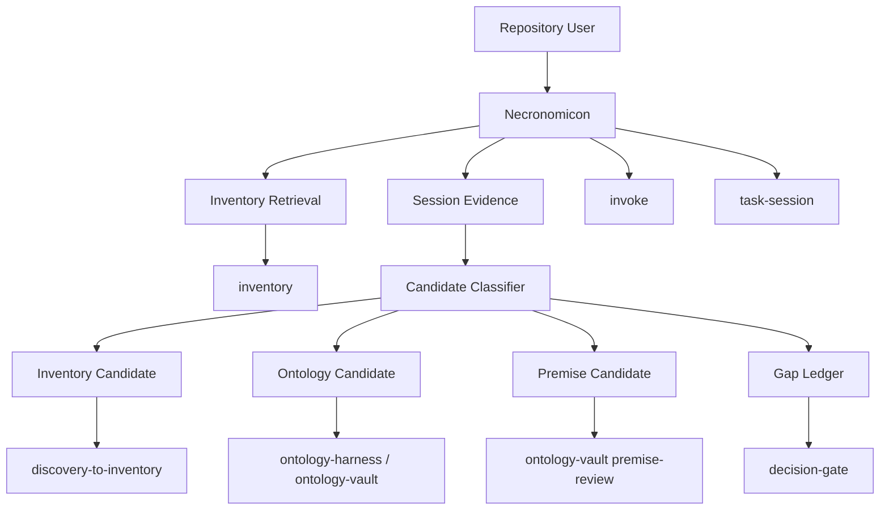

# Necronomicon Define

## Mission

Necronomicon is the repository-local knowledge harness for Arcanum. It helps a user resume work by retrieving durable project knowledge, separating source-backed facts from candidates, routing ontology-sensitive claims through governance, and preserving enough session context that future work does not restart from raw chat or broad file search.

The MVP is an Inventory And Ontology Substrate Loop. Routing, setup profiles, active-interaction state, research, and maintenance exist to support that substrate; they are not the starting proof of value.

## Corrected Center Of Gravity

The earlier Necronomicon framing treated session memory and routing as the first product slice. That made the harness useful, but too close to a command router. The corrected framing starts with the knowledge question:

> What do we already know, what is source-backed, what is only a candidate, what conflicts, and which owner should handle the next step?

Necronomicon should first prove that it can move work through this authority ladder:

```text
raw interaction
  -> session evidence
  -> inventory retrieval or inventory candidate
  -> ontology candidate or premise candidate
  -> gap / contradiction / decision route
  -> governed handoff
```

It must not promote inventory entries, ontology concepts, premises, constitutions, axioms, glossary terms, or lifecycle artifacts by itself.

## Ownership Boundary

| Owns | Does Not Own |
| --- | --- |
| Repository-local harness state | Canonical Arcanum definitions |
| Inventory-first retrieval workflow | Inventory promotion authority |
| Session evidence and checkpoint candidates | Ontology promotion authority |
| Candidate classification and gap tracking | Lifecycle authoring outputs |
| Ontology and inventory handoff context | Task execution |
| Route rationale and route history | Reusable spell or sigil lifecycle |
| Side-note and active-context capture | Source-of-truth project facts |

## Product Scope

### MVP: Inventory And Ontology Substrate Loop

The MVP must answer:

> Can Necronomicon turn a normal repository question or working note into retrieved knowledge, candidate knowledge, governance gaps, and a next route without creating false authority?

MVP responsibilities:

1. Require an available inventory substrate before active Necronomicon substrate work begins.
2. Search inventory before any broad repository search for durable knowledge questions.
3. Capture session evidence as low-authority context.
4. Classify durable outputs into source-backed fact, inventory candidate, ontology candidate, premise candidate, contradiction, decision gap, or route gap.
5. Record unresolved gaps in a machine-readable gap ledger.
6. Prepare handoffs to `inventory`, `discovery-to-inventory`, `feature-glossary`, `ontology-harness`, `ontology-vault`, `decision-gate`, `invoke`, or `task-session`.
7. Preserve no-promotion guardrails.

### Continuation: Stateful Workbench Harness

After the substrate loop works, Necronomicon adds:

- setup profiles and dependency policy,
- active interaction state,
- side-note and unblocker queues,
- checkpoint artifacts,
- bounded research packets,
- route presets,
- maintenance reports from observed gaps and signals.

## Capability Map



## Core Capabilities

| Capability | Outcome | Key Contracts |
| --- | --- | --- |
| Inventory Detection | Knows whether reusable knowledge exists and where to query. | `capabilities.json`, inventory root policy |
| Inventory Retrieval | Answers "what do we know?" from durable entries first. | inventory lookup output with selectors and confidence |
| Session Evidence Capture | Preserves useful context without treating it as truth. | session evidence record or checkpoint draft |
| Candidate Classification | Separates facts, claims, gaps, contradictions, and governance candidates. | authority ladder and candidate schema |
| Gap Tracking | Keeps missing coverage and contradictions explicit. | `.arcanum/necronomicon/gaps.json` |
| Governance Handoff | Routes claims to the authority that can promote, reject, or revise them. | ontology/inventory/decision handoff packets |
| Lifecycle Handoff | Sends sufficiently grounded authoring work to `invoke`. | define/design/plan context packet |
| Execution Handoff | Sends bounded implementation work to `task-session`. | task handoff with source-backed context |

## Concept Model

| Concept | Type | Key Constraints |
| --- | --- | --- |
| KnowledgeQuestion | Input | A user request asking what is known, true, decided, conflicting, or reusable. |
| InventorySource | Record | Durable knowledge substrate root, entry path, selector, or query result. |
| SessionEvidence | Record | Low-authority summary of interaction evidence; never canonical by itself. |
| SourceBackedFact | Claim | Supported by a cited source selector or inventory entry. |
| InventoryCandidate | Candidate | Durable enough to propose for inventory, but not yet promoted. |
| OntologyCandidate | Candidate | Concept, relationship, bridge edge, constitution, or axiom candidate. |
| PremiseCandidate | Candidate | Working bet needing premise review or confidence handling. |
| Contradiction | Gap | Conflict between sources, memory, inventory, ontology, or user correction. |
| Gap | Record | Unresolved question, missing source, missing capability, blocked decision, or route miss. |
| HandoffPacket | Record | Context packet for the owner that can act next. |

## Concept Index

| Concept | ID | Type | Source |
| --- | --- | --- | --- |
| KnowledgeQuestion | necronomicon.KnowledgeQuestion | Input | this spec |
| InventorySource | necronomicon.InventorySource | Record | this spec |
| SessionEvidence | necronomicon.SessionEvidence | Record | this spec |
| SourceBackedFact | necronomicon.SourceBackedFact | Claim | this spec |
| InventoryCandidate | necronomicon.InventoryCandidate | Candidate | this spec |
| OntologyCandidate | necronomicon.OntologyCandidate | Candidate | this spec |
| PremiseCandidate | necronomicon.PremiseCandidate | Candidate | this spec |
| Contradiction | necronomicon.Contradiction | Gap | this spec |
| Gap | necronomicon.Gap | Record | this spec |
| HandoffPacket | necronomicon.HandoffPacket | Record | this spec |

## Substrate Loop Contract

Incoming substrate work follows this order:

1. Classify the user turn as knowledge question, working note, lifecycle request, execution request, or explicit command.
2. For knowledge questions, query inventory before broad repository search.
3. Cite retrieved durable entries or source selectors.
4. Capture useful new interaction material as session evidence.
5. Classify every durable-looking claim by authority level.
6. Write gaps for missing sources, contradictions, unsupported claims, missing owners, or capability absence.
7. Recommend the next owner and explain why Necronomicon is not promoting the claim itself.

## Authority Rules

| Item | Necronomicon May Create | Necronomicon May Promote |
| --- | --- | --- |
| Session evidence | yes | no |
| Inventory candidate | yes | no |
| Glossary candidate | yes | no |
| Ontology candidate | yes | no |
| Premise candidate | yes | no |
| Constitution candidate | yes | no |
| Axiom candidate | yes | no |
| Gap ledger entry | yes | n/a |
| Route decision | yes | n/a |

## Supporting Contracts

| Contract Document | Purpose |
| --- | --- |
| [README.md](../README.md) | Canonical spell contract and runtime rules. |
| [KNOWLEDGE-SUBSTRATE-FLOW.md](KNOWLEDGE-SUBSTRATE-FLOW.md) | Existing substrate rationale and authority ladder. |
| [USAGE-VISION.md](USAGE-VISION.md) | Day-to-day user flow and workbench ergonomics. |
| [DESIGN.md](DESIGN.md) | Architecture bundle derived from this definition. |
| [GLOSSARY.md](GLOSSARY.md) | Corrected terminology baseline. |
| [IMPLEMENTATION-LAYERING.md](IMPLEMENTATION-LAYERING.md) | Progressive implementation boundary model. |

## External Dependencies

| Capability | Role |
| --- | --- |
| `inventory` | Retrieval, durable entries, inventory lint, source-backed knowledge. |
| `discovery-to-inventory` | Turns vague discovery into reusable inventory material. |
| `feature-glossary` | Stabilizes vocabulary before ontology or lifecycle authoring. |
| `ontology-harness` | Orchestrates ontology governance and business/system bridge checks. |
| `ontology-vault` | Owns premise review, confidence promotion, conventions, axioms, and bridge validation. |
| `decision-gate` | Resolves consequential choices and commitment decisions. |
| `invoke` | Authors define/design/plan artifacts after substrate context is explicit. |
| `task-session` | Executes bounded work after planning is ready. |
| observability stack | Supplies route and gap signals for later maintenance. |

## Provides To

| Consumer | Delivered Value |
| --- | --- |
| Repository user | Fast answer to what is known, missing, conflicting, or ready to route. |
| `inventory` | Candidate entries with source hints and rationale. |
| `ontology-harness` / `ontology-vault` | Candidate claims, premises, bridge edges, and contradictions. |
| `invoke` | Grounded lifecycle authoring context with gaps and authority status. |
| `task-session` | Execution context that does not require rediscovery. |
| maintenance loop | Gap and route patterns for evidence-backed harness improvement. |

## Scenario Coverage

- Ask what is already known about a project concept.
- Capture a durable working note without derailing active work.
- Detect a contradiction between session memory and inventory.
- Propose an inventory candidate from source-backed discovery.
- Route a governance claim to ontology review.
- Prepare an invoke handoff once knowledge, vocabulary, and gaps are explicit.

## Decisions

| Decision | Status | Rationale |
| --- | --- | --- |
| MVP starts with inventory and ontology substrate handling. | selected | This is Necronomicon's distinct value beyond routing. |
| Session memory is low-authority evidence. | selected | Prevents chat residue from becoming truth. |
| Inventory retrieval precedes broad search for durable questions. | selected | Reduces rediscovery and makes memory inspectable. |
| Ontology promotion remains downstream. | selected | Prevents false authority and preserves governance. |
| Routing and bootstrap are support layers. | selected | They configure and carry the substrate rather than define it. |
| Invoke is lifecycle authoring only. | selected | It consumes grounded context instead of becoming general research. |

## Unresolved Gaps

| Gap ID | Gap | Impact | Next Step |
| --- | --- | --- | --- |
| N-DEF-001 | Exact substrate record schemas are not finalized. | Blocks implementation precision. | Define JSON/Markdown shapes in plan. |
| N-DEF-002 | Inventory is required for Necronomicon, but setup/install behavior must define how missing inventory is handled. | Blocks active substrate use in repos without inventory. | Plan required-inventory setup and blocked-state guidance. |
| N-DEF-003 | Ontology candidate routing needs a compact handoff shape. | Blocks governance handoff readiness. | Define handoff packet in design and plan. |
| N-DEF-004 | Gap ledger schema must separate source gaps, contradiction gaps, capability gaps, and decision gaps. | Blocks durable maintenance signals. | Define schema in plan. |

## Change History

| Date | Change |
| --- | --- |
| 2026-05-23 | Re-authored around inventory and ontology substrate as the MVP center of gravity. |
