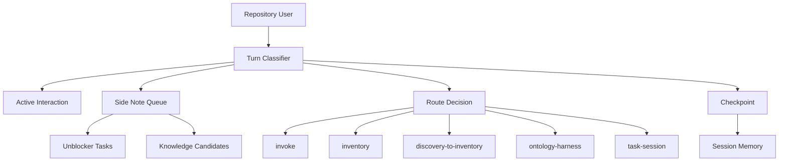

# Necronomicon Define

## Mission

Necronomicon is the repository-local harness that preserves active work state, routes user turns, captures side-channel knowledge, retrieves reusable memory, and hands work to the correct Arcanum capability. It exists so a user can work across repeated sessions without remembering every sigil or replaying prior context.

The MVP is a Session Memory Router. The continuation build is a Workbench State Manager.

## Ownership Boundary

- Owns: repository harness state, session memory, active interaction classification, side-note capture, route decisions, checkpoint candidates, gap tracking, bounded research packets, unblocker task queueing, and handoff context.
- Does Not Own: canonical sigil/spell definitions, ontology promotion, inventory promotion, lifecycle authoring, task execution, reusable spell/sigil authoring, or source-of-truth project facts.

## Product Scope

### MVP: Session Memory Router

The MVP must answer:

> Is this user turn a continuation, fresh route, side note, unblocker, checkpoint, or close/resume request?

It must preserve enough state that the next turn or next session can continue cleanly.

### Continuation: Workbench State Manager

The continuation build adds explicit working lanes:

- main thread,
- side notes,
- unblocker tasks,
- research seeds,
- inventory candidates,
- ontology candidates,
- deferred reminders,
- gaps and contradictions.

## Capability Map

## Capabilities

| Capability | Outcome | Key Contracts | Detail |
| --- | --- | --- | --- |
| Resume Harness | User sees where the repository work stands. | `memory.md`, checkpoints, gaps, route history | Loads compact state and suggests next routes. |
| Classify Turn | User messages continue, route, capture, or interrupt correctly. | `active-interaction.json`, route rules | Honors active pending prompts before fresh routing, except explicit interrupts and side-note markers. |
| Route Work | User does not need command catalog knowledge. | `routes.jsonl`, selected capabilities | Delegates to installed capabilities and records confidence and result. |
| Capture Side Notes | Useful mid-run facts do not derail active work. | `side-notes.jsonl`, checkpoint queue | Captures project facts, research seeds, reminders, contradictions, and active-task input. |
| Queue Unblockers | Small blocking tasks can run or queue without losing context. | unblocker task records | Handles bounded tasks such as getting current API prices or confirming one vendor limit. |
| Retrieve Inventory | Existing knowledge is used before rediscovery. | inventory lookup output | Queries inventory before broad source search for durable project questions. |
| Checkpoint Work | Sessions become resumable without raw transcript storage. | checkpoint markdown, gap ledger | Separates facts, inferences, decisions, contradictions, gaps, and candidates. |
| Handoff | Owning capabilities receive enough context to proceed. | handoff records, invoke transport reports | Sends lifecycle work to `invoke`, durable knowledge to `inventory`, governance to `ontology-harness`, execution to `task-session`. |
| Maintain Harness | Route misses and repeated gaps improve future behavior. | observability, maintenance reports | Proposes route/capability changes only with explicit approval. |

## Concept Model

| Concept | Type | Key Constraints |
| --- | --- | --- |
| Session | Record | Belongs to one repository harness; has stable ID, status, memory, route ledger, and checkpoints. |
| ActiveInteraction | Record | At most one primary active interaction per session; can be awaiting-user, running, handoff-ready, blocked, completed, or abandoned. |
| RouteDecision | Record | Must include request summary, candidates, selected route, confidence, result, validation, and follow-up. |
| SideNote | Record | Captured without replacing active interaction unless the user explicitly switches. |
| UnblockerTask | Record | Must be bounded, related, and either blocking or explicitly queued. |
| ResearchSeed | Record | Requires a question or idea; may have scope/source/stop-condition gaps. |
| InventoryCandidate | Record | Durable knowledge candidate; not promoted by Necronomicon. |
| OntologyCandidate | Record | Candidate premise, confidence change, constitution, axiom, or bridge edge; never auto-promoted. |
| Checkpoint | Record | Durable distillation, not canonical truth. |
| Gap | Record | Unresolved question, contradiction, blocked decision, missing capability, or promotion gap. |
| Handoff | Record | Context packet for the owning capability. |

## Concept Index

| Concept | ID | Type | Source |
| --- | --- | --- | --- |
| Session | necronomicon.Session | Record | this spec |
| ActiveInteraction | necronomicon.ActiveInteraction | Record | this spec |
| RouteDecision | necronomicon.RouteDecision | Record | this spec |
| SideNote | necronomicon.SideNote | Record | this spec |
| UnblockerTask | necronomicon.UnblockerTask | Record | this spec |
| ResearchSeed | necronomicon.ResearchSeed | Record | this spec |
| InventoryCandidate | necronomicon.InventoryCandidate | Record | this spec |
| OntologyCandidate | necronomicon.OntologyCandidate | Record | this spec |
| Checkpoint | necronomicon.Checkpoint | Record | this spec |
| Gap | necronomicon.Gap | Record | this spec |
| Handoff | necronomicon.Handoff | Record | this spec |

## Turn Classification Contract

Incoming user turns are classified in this order:

1. Explicit interrupt or command.
2. Side note or parking-lot capture.
3. Pending response to active interaction.
4. Handoff continuation.
5. Fresh route.
6. Ambiguous turn requiring one focused clarification.

Side-note markers include "side note", "aside", "for later", "research idea", "parking lot", "remember", and equivalent phrasing.

## Side Note Lifecycle

| State | Meaning | Next Owner |
| --- | --- | --- |
| `captured` | Recorded but not triaged. | Necronomicon |
| `attached` | Applied to active artifact or interaction. | Active capability |
| `inventorize-candidate` | Durable enough for inventory. | `inventory` or `discovery-to-inventory` |
| `research-candidate` | Worth bounded research later. | Necronomicon research |
| `unblocker-task` | Small enough to run or queue. | Necronomicon or task owner |
| `ontology-candidate` | May affect governed knowledge. | `ontology-harness` / `ontology-vault` |
| `deferred` | Parked reminder. | Necronomicon |

## Unblocker Contract

An unblocker task may run or queue directly when it is:

- related to the active work,
- bounded enough to complete without broad discovery,
- useful for a current decision, definition, design, plan, or task,
- safe to execute under the current tool and permission policy.

If the unblocker is broad or ambiguous, Necronomicon asks one scope question before running it.

## Relationship Map

| From | Edge | To | Evidence | Notes |
| --- | --- | --- | --- | --- |
| necronomicon.Session | contains | necronomicon.ActiveInteraction | README interaction state model | One active primary flow per session. |
| necronomicon.Session | contains | necronomicon.SideNote | USAGE-VISION side-note ergonomics | Side notes do not derail active work. |
| necronomicon.SideNote | may become | necronomicon.UnblockerTask | USAGE-VISION related unblockers | Small blocking work can run or queue directly. |
| necronomicon.SideNote | may become | necronomicon.InventoryCandidate | KNOWLEDGE-SUBSTRATE-FLOW | Durable facts route to inventory. |
| necronomicon.SideNote | may become | necronomicon.OntologyCandidate | KNOWLEDGE-SUBSTRATE-FLOW | Governance claims stay candidate-only. |
| necronomicon.RouteDecision | delegates to | invoke | README routing rules | Lifecycle authoring belongs to invoke. |
| necronomicon.RouteDecision | delegates to | inventory | README governed substrate | Retrieval and durable compiled knowledge belong to inventory. |
| necronomicon.RouteDecision | delegates to | ontology-harness | README governed substrate | Ontology promotion and bridge validation belong downstream. |
| necronomicon.Checkpoint | updates | necronomicon.Gap | README checkpoint policy | Gaps remain explicit and resumable. |

## Supporting Contracts

| Contract Document | Purpose |
| --- | --- |
| [README.md](../README.md) | Canonical spell contract and runtime rules. |
| [USAGE-VISION.md](USAGE-VISION.md) | Day-to-day UX and MVP/continuation behavior. |
| [KNOWLEDGE-SUBSTRATE-FLOW.md](KNOWLEDGE-SUBSTRATE-FLOW.md) | Inventory, ontology, premise, confidence, and side-note substrate flow. |
| [RESEARCH-DISCOVERY.md](RESEARCH-DISCOVERY.md) | Evidence brief that resolved Necronomicon meaning and boundary. |
| [DESIGN.md](DESIGN.md) | L1 architecture/design bundle derived from this define output. |
| [GLOSSARY.md](GLOSSARY.md) | Define glossary baseline. |

## External Dependencies

| Capability | Depends On | Via | Why |
| --- | --- | --- | --- |
| Turn routing | Runtime command adapters | command surface | Selected capabilities must be invokable. |
| Lifecycle authoring | `invoke` | route/handoff | Define/design/plan/full/validate ownership. |
| Durable knowledge | `inventory`, `discovery-to-inventory` | lookup/ingest | Compiled knowledge layer and discovery persistence. |
| Ontology governance | `ontology-harness`, `ontology-vault` | candidate handoff | Premise, confidence, constitution, axiom, and bridge validation. |
| Execution | `task-session` | handoff | Bounded implementation or documentation work. |
| Decisions | `decision-gate` | blocker resolution | Consequential choices and commitment gates. |
| Maintenance | observability and maintenance flows | route history and signals | Evidence-backed harness improvement. |

## Provides To

| Consumer | Consumes Capability | Via | Delivered Value |
| --- | --- | --- | --- |
| Repository user | resume, route, checkpoint | command surface | Continuity and routing relief. |
| `invoke` | handoff context | transport report | Lifecycle authoring inputs with gaps explicit. |
| `inventory` | inventory candidates | candidate records | Durable reusable knowledge. |
| `ontology-harness` | ontology candidates | candidate records | Governed knowledge review without auto-promotion. |
| `task-session` | execution handoff | route result | Bounded work context and done criteria. |
| maintenance loop | route/gap evidence | observability | Capability and route improvement proposals. |

## Scenario Coverage

- Primary scenarios: start/resume, continue active work, route fresh request, capture side note, run/queue unblocker, retrieve inventory, checkpoint, close.
- Completion checks: route classification confidence, active interaction status, side note triage, handoff target, gap ledger update, checkpoint created when required.

## Decisions

| Decision | Status | Rationale |
| --- | --- | --- |
| MVP scope is Session Memory Router. | selected | Gives a coherent first product without implementing the whole ontology engine. |
| Continuation scope is Workbench State Manager. | selected | Builds naturally from active interaction and side-note lanes. |
| Ontology promotion remains downstream. | selected | Prevents session memory from becoming false authority. |
| Inventory is retrieval and durable knowledge surface. | selected | Prevents rediscovery while keeping source-backed ownership. |
| Invoke is lifecycle authoring only. | selected | Avoids making invoke the default research engine. |
| Research remains a Necronomicon mode for MVP. | selected | Bounded evidence gathering is needed before a reusable research sigil is justified. |

## Unresolved Gaps

| Gap ID | Gap | Impact | Next Step |
| --- | --- | --- |
| N-DEF-001 | Exact JSON schema for `active-interaction.json` is not finalized. | Blocks implementation precision. | Define schema during plan layer. |
| N-DEF-002 | Exact JSONL schema for `side-notes.jsonl` and unblocker task records is not finalized. | Blocks reliable tooling. | Define schema during plan layer. |
| N-DEF-003 | Inventory install/adoption path may vary by repository. | Requires setup detection. | Use inventory install/adapt contract. |

## Change History

| Date | Change |
| --- | --- |
| 2026-05-18 | Created invoke define artifact for Necronomicon MVP and continuation build. |
