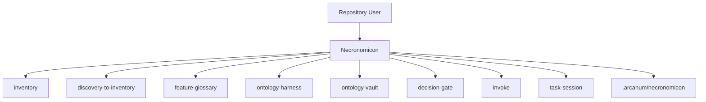
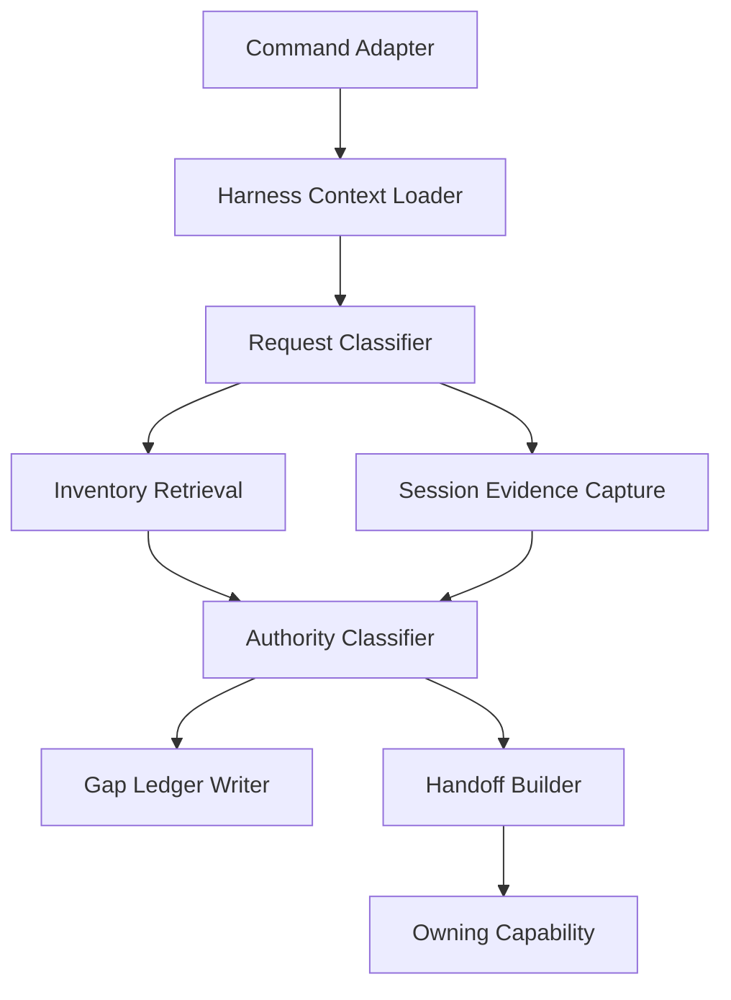
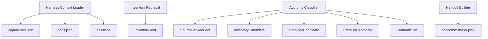
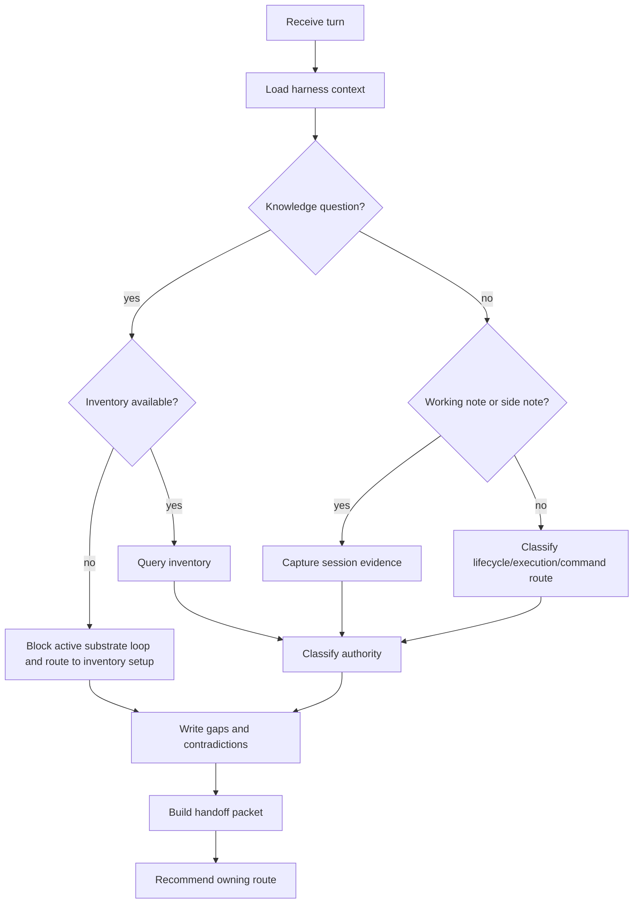
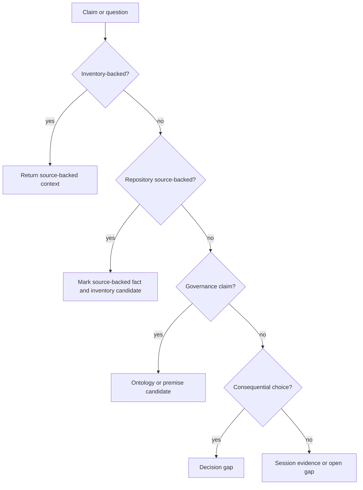

# Necronomicon Design

## Design Intent

Design Necronomicon as a repository-local knowledge substrate harness. Its first useful behavior is not broad routing; it is a governed loop that retrieves inventory, captures session evidence, classifies authority, records gaps, and routes candidates to the owner that can safely promote, reject, or use them.

The architecture favors explicit files, deterministic classification, and inspectable handoff packets. Runtime adapters may mediate behavior first, but the design starts from knowledge authority rather than command dispatch.

## Inputs

- [DEFINE.md](DEFINE.md)
- [GLOSSARY.md](GLOSSARY.md)
- [KNOWLEDGE-SUBSTRATE-FLOW.md](KNOWLEDGE-SUBSTRATE-FLOW.md)
- [USAGE-VISION.md](USAGE-VISION.md)
- [RESEARCH-DISCOVERY.md](RESEARCH-DISCOVERY.md)
- [README.md](../README.md)

## Source Contracts

| Source | Contract |
| --- | --- |
| `DEFINE.md` | Corrected MVP and ownership boundary. |
| `GLOSSARY.md` | Authority and substrate vocabulary. |
| `KNOWLEDGE-SUBSTRATE-FLOW.md` | Authority ladder and inventory/ontology flow. |
| `spells/necronomicon/README.md` | Canonical spell behavior and mode surface. |
| `tools/bootstrap_arcanum.sh` | Current generated state and adapter command surface. |

## View 1: Context



Necronomicon sits around local Arcanum capabilities as a knowledge and continuity boundary. It requires an inventory substrate, then asks: what is already known, what is missing, what is candidate-only, and who owns the next move?

## View 2: High-Level Structure



| Component | Responsibility |
| --- | --- |
| Command Adapter | Entry point from local runtime commands. |
| Harness Context Loader | Reads manifest, inventory root, sessions, gaps, and prior handoffs. |
| Request Classifier | Distinguishes knowledge question, working note, lifecycle request, execution request, explicit command, or side note. |
| Inventory Retrieval | Queries durable inventory before broad search for knowledge questions. |
| Session Evidence Capture | Records useful interaction material with low authority. |
| Authority Classifier | Labels facts, candidates, contradictions, gaps, and governance claims. |
| Gap Ledger Writer | Writes machine-readable unresolved gaps and contradictions. |
| Handoff Builder | Creates context packets for inventory, ontology, invoke, decision, or execution owners. |

## View 3: Low-Level Components



### State Files

| File | Format | Writer | Reader |
| --- | --- | --- | --- |
| `.arcanum/necronomicon/capabilities.json` | JSON | setup/update-capabilities | loader, classifier |
| `.arcanum/necronomicon/gaps.json` | JSON | substrate loop, checkpoint, research, maintain | loader, maintain, resume |
| `.arcanum/necronomicon/sessions/<id>/evidence.md` | Markdown | evidence capture | resume, checkpoint, handoff |
| `.arcanum/necronomicon/sessions/<id>/authority-classification.jsonl` | JSONL | authority classifier | checkpoint, maintain |
| `.arcanum/necronomicon/sessions/<id>/handoffs/` | Markdown/JSON | handoff builder | owning capabilities |
| `.arcanum/necronomicon/sessions/<id>/routes.jsonl` | JSONL | route recorder | resume, maintain |

## View 4: Workflow Process



## View 5: Decision Flow



Decision rules:

- Inventory availability is required before Necronomicon answers durable knowledge questions.
- Inventory lookup precedes any broad repository search for durable knowledge questions.
- Session evidence is never treated as truth without source backing.
- Ontology-sensitive claims route downstream and remain candidates.
- Lifecycle authoring routes to `invoke` only after context and gaps are explicit.
- Execution routes to `task-session` only after the work is bounded.

## View 6: Dependency Interface

| Dependency | Interface | Contract |
| --- | --- | --- |
| `inventory` | lookup, ingest candidate, lint | Retrieves durable knowledge and owns promotion. |
| `discovery-to-inventory` | discovery baseline, inventory candidate | Converts discovery into source-backed inventory material. |
| `feature-glossary` | glossary baseline | Stabilizes vocabulary before governance or authoring. |
| `ontology-harness` | ontology map, bridge validation | Handles governance and bridge context. |
| `ontology-vault` | premise review, confidence, convention, axiom | Owns promotion/demotion of governed claims. |
| `decision-gate` | decision record | Resolves consequential choices. |
| `invoke` | define/design/plan | Authors lifecycle artifacts from grounded context. |
| `task-session` | bounded task execution | Executes planned work. |

## State Sketches

### Authority Classification Entry

```json
{
  "id": "ac-20260523-001",
  "captured_at": "2026-05-23T00:00:00Z",
  "input_summary": "Necronomicon should start with ontology and inventory handling.",
  "class": "ontology_candidate",
  "authority": "candidate",
  "source_refs": ["user correction", "KNOWLEDGE-SUBSTRATE-FLOW.md"],
  "owner": "ontology-harness",
  "next_action": "review as product boundary decision"
}
```

### Gap Entry

```json
{
  "id": "gap-20260523-001",
  "kind": "source-gap",
  "summary": "Inventory root detection behavior is not specified.",
  "severity": "medium",
  "owner": "necronomicon",
  "status": "open",
  "next_route": "implementation plan"
}
```

### Handoff Packet

```json
{
  "target": "ontology-vault premise-review",
  "reason": "Claim affects governance authority.",
  "inputs": ["session evidence", "source refs", "candidate classification"],
  "non_authority_note": "Necronomicon is not promoting this claim."
}
```

## Assumptions

- Inventory is required for active Necronomicon substrate behavior. A repository without inventory enters setup/install guidance, not degraded Necronomicon operation.
- Adapter-mediated runtime remains acceptable for the first implementation.
- Ontology handling can start with candidate routing before full promotion workflows are automated.
- A compact file-backed state model is enough for MVP validation.

## Open Risks

| Risk ID | Risk | Impact | Mitigation |
| --- | --- | --- | --- |
| R-DES-001 | Necronomicon becomes a thin inventory wrapper. | medium | Preserve session evidence, authority classification, gaps, and handoffs as its distinct layer. |
| R-DES-002 | Candidate classification feels too abstract for users. | medium | Surface only route-relevant distinctions in normal UX. |
| R-DES-003 | Required inventory raises setup friction. | medium | Make setup guidance direct: install or select inventory before active substrate use. |
| R-DES-004 | Ontology routing creates too much ceremony. | medium | Route only governance-relevant claims, premises, contradictions, bridge evidence, and conventions. |
| R-DES-005 | False authority returns through summaries. | high | Require source refs or candidate labels in every durable answer. |

## Plan-Carried Decisions

| Decision | Status |
| --- | --- |
| Start with substrate loop instead of route/bootstrap proof. | selected |
| Keep bootstrap as configuration layer. | selected |
| Keep session memory low-authority. | selected |
| Require inventory for active substrate operation; missing inventory routes to setup/install guidance. | selected |
| Route ontology promotion downstream. | selected |

## Handoff Targets

- `invoke plan` for executable implementation planning.
- `task-session` for one bounded implementation slice after work-pack approval.
- `inventory` for durable entries about this corrected Necronomicon model.
- `ontology-harness` for governance review if the center-of-gravity decision becomes project ontology.

## Change History

| Date | Change |
| --- | --- |
| 2026-05-23 | Re-authored design around the inventory and ontology substrate loop. |
