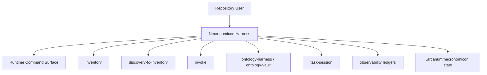
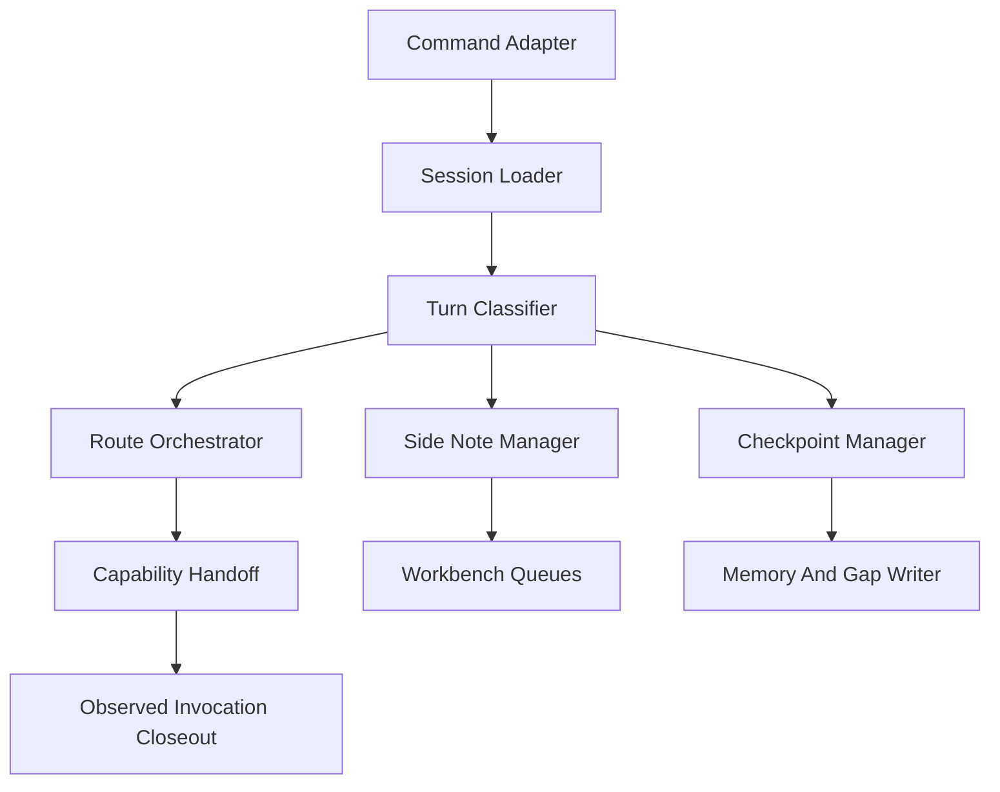
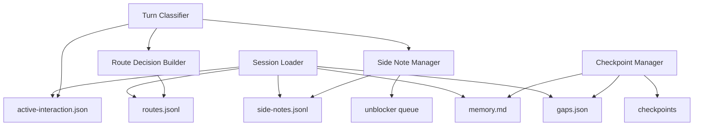
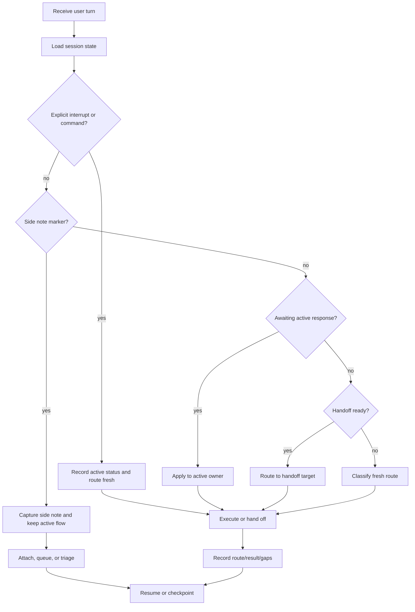
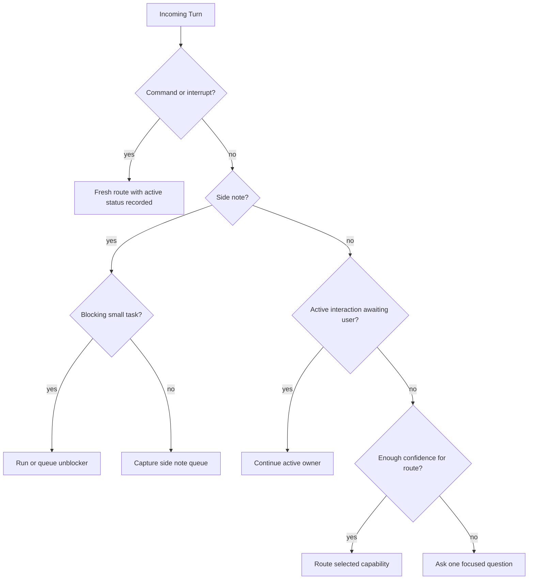
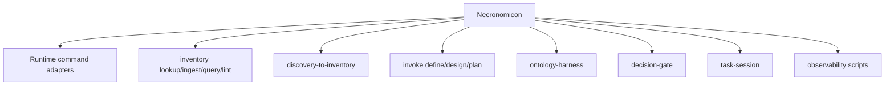

# Necronomicon Design

## Design Intent

Design Necronomicon as a repository-local stateful harness that classifies turns, preserves continuity, and delegates work through installed Arcanum capabilities. The first implementation should favor explicit files, simple state transitions, and inspectable route/checkpoint records over an opaque autonomous runtime.

The design supports the MVP Session Memory Router and leaves clear extension points for the Workbench State Manager.

## Inputs

- [DEFINE.md](DEFINE.md)
- [GLOSSARY.md](GLOSSARY.md)
- [README.md](../README.md)
- [USAGE-VISION.md](USAGE-VISION.md)
- [KNOWLEDGE-SUBSTRATE-FLOW.md](KNOWLEDGE-SUBSTRATE-FLOW.md)
- [RESEARCH-DISCOVERY.md](RESEARCH-DISCOVERY.md)

## Source Contracts

| Source | Contract |
| --- | --- |
| `spells/necronomicon/README.md` | Canonical behavior, modes, routing rules, state paths, guardrails, output contract. |
| `spells/necronomicon/development/DEFINE.md` | Approved MVP and continuation scope. |
| `spells/necronomicon/development/GLOSSARY.md` | Define-stage terminology baseline. |
| `spells/necronomicon/development/USAGE-VISION.md` | User-facing flows and side-note ergonomics. |
| `spells/necronomicon/development/KNOWLEDGE-SUBSTRATE-FLOW.md` | Inventory, ontology, research, side-note, and unblocker substrate rules. |

## Required View Set

### 1. Context View



Necronomicon sits between the user and selected local capabilities. It does not replace the capabilities; it records state, chooses routes, and hands context to the owner.

### 2. High-Level Structure View



| Component | Responsibility |
| --- | --- |
| Command Adapter | Entry point from `necronomicon`, `arcanum-necronomicon`, or runtime-local aliases. |
| Session Loader | Reads setup decisions, capability manifest, memory, active interaction, routes, side notes, gaps, and checkpoints. |
| Turn Classifier | Classifies incoming turns using the ordered interaction policy. |
| Route Orchestrator | Selects installed capability, confidence, fallback policy, and handoff context. |
| Side Note Manager | Captures, attaches, queues, or triages side-channel user input. |
| Checkpoint Manager | Distills durable memory, candidates, contradictions, gaps, and next routes. |
| Workbench Queues | Holds side notes, unblockers, research seeds, inventory candidates, ontology candidates, and deferred reminders. |
| Capability Handoff | Prepares context for `invoke`, `inventory`, `ontology-harness`, `task-session`, or maintenance flows. |
| Observed Invocation Closeout | Preserves telemetry and validation result for the harness and routed command. |

### 3. Low-Level Components View



#### State Files

| File | Format | Writer | Reader |
| --- | --- | --- | --- |
| `.arcanum/necronomicon/capabilities.json` | JSON | setup/update-capabilities | router |
| `.arcanum/necronomicon/setup-decisions.md` | Markdown | setup/profile update | resume/setup/maintain |
| `.arcanum/necronomicon/gaps.json` | JSON | checkpoint/research/maintain | route/resume/maintain |
| `.arcanum/necronomicon/sessions/<id>/active-interaction.json` | JSON | turn classifier/active owner | turn classifier/resume |
| `.arcanum/necronomicon/sessions/<id>/side-notes.jsonl` | JSONL | side note manager | checkpoint/workbench |
| `.arcanum/necronomicon/sessions/<id>/routes.jsonl` | JSONL | route orchestrator | resume/observability |
| `.arcanum/necronomicon/sessions/<id>/memory.md` | Markdown | checkpoint/close | resume/context |
| `.arcanum/necronomicon/sessions/<id>/checkpoints/` | Markdown | checkpoint/close | resume/maintain |

### 4. Workflow Process View



### 5. Decision Flow View



Decision rules:

- Explicit user commands win over implicit continuation.
- Side-note markers avoid derailment unless the user asks to switch.
- Related unblockers can run or queue when small and blocking.
- Inventory lookup precedes broad search for "what do we know" questions.
- Lifecycle authoring routes to `invoke`.
- Ontology promotion candidates route downstream and remain candidate-only.

### 6. Dependency Interface View



| Dependency | Interface | Contract |
| --- | --- | --- |
| Runtime command adapters | command path and adapter contract | Must exist before selected route is marked successful. |
| `inventory` | lookup, query, ingest, lint | Retrieval and durable compiled knowledge. |
| `discovery-to-inventory` | discovery baseline to inventory | Converts vague discovery into reusable knowledge. |
| `invoke` | define, design, plan | Lifecycle authoring; consumes research/inventory/gap context. |
| `ontology-harness` / `ontology-vault` | map, premise-review, confidence, convention, validate | Candidate governance and bridge validation. |
| `decision-gate` | approval/choice records | Consequential commitments and blocker choices. |
| `task-session` | bounded execution handoff | Executes scoped tasks after enough definition exists. |
| Observability scripts | invocation envelope | Records capability usage and maintenance evidence. |

## State Sketches

### Active Interaction

```json
{
  "interaction_id": "2026-05-18-necronomicon-define",
  "owning_capability": "invoke",
  "mode": "define",
  "status": "handoff-ready",
  "pending_prompt": null,
  "expected_response_shape": null,
  "continuation_policy": "continue-by-default",
  "handoff_target": "invoke design",
  "side_note_queue": {
    "path": "side-notes.jsonl",
    "open_count": 0
  }
}
```

### Side Note

```json
{
  "id": "sn-20260518-001",
  "captured_at": "2026-05-18T00:00:00Z",
  "raw_summary": "Get current API prices while design continues.",
  "class": "related-unblocker",
  "state": "unblocker-task",
  "related_interaction_id": "active",
  "blocking": true,
  "owner": "necronomicon",
  "next_route": "research",
  "durability": "attach-to-research-packet"
}
```

### Route Decision

```json
{
  "request_summary": "Define and design Necronomicon from existing docs.",
  "candidates": ["invoke define", "invoke design"],
  "selected_route": "invoke define",
  "confidence": "high",
  "reason": "User explicitly invoked lifecycle authoring.",
  "result": "pass",
  "follow_up": "invoke design"
}
```

## Assumptions

- The first implementation remains adapter-mediated and file-backed.
- A single primary active interaction is enough for MVP.
- Side notes and unblockers are queued in session state rather than requiring a full scheduler.
- Inventory and ontology promotion are downstream owner responsibilities.
- Web-backed unblockers are allowed only when the active runtime has web access and the task is bounded.

## Open Risks

| Risk ID | Risk | Impact | Mitigation |
| --- | --- | --- | --- |
| R-ARCH-1 | Turn classification becomes too magical and misroutes user replies. | high | Keep ordered classifier, route confidence, and one-question ambiguity rule. |
| R-ARCH-2 | Side-note queue becomes a dumping ground. | medium | Triage at checkpoint and expose compact queue counts. |
| R-ARCH-3 | Unblocker tasks expand into unbounded research. | medium | Require small/blocking/safe criteria and one scope question when broad. |
| R-ARCH-4 | Session memory is mistaken for canonical truth. | high | Preserve candidate-only promotion and source-backed handoff rules. |
| R-ARCH-5 | Too many downstream capability assumptions make MVP brittle. | medium | MVP can queue handoffs when capability is missing and record capability gaps. |

## Plan-Carried Decisions

| Decision | Options | Current Status |
| --- | --- | --- |
| Schema strictness for state files | permissive draft, JSON schema, typed validator | JSON schema drafts selected for plan; typed validator deferred until implementation needs it. |
| Side-note processing cadence | every checkpoint, user-triggered, automatic thresholds | checkpoint plus user-triggered selected; automatic thresholds deferred. |
| Unblocker execution model | run inline, queue only, agent side task | run or queue when narrow and blocking; full parallel side-task orchestration deferred. |
| Research extraction | keep as Necronomicon mode, extract reusable sigil | keep as harness mode for MVP; extraction deferred until repeated non-Necronomicon reuse. |

## Planning Notes

- Direct implementation constraints: keep file writes explicit; preserve `.arcanum/necronomicon/` as state, not canonical definitions.
- Boundary rules: do not promote inventory, ontology, constitutions, axioms, or lifecycle artifacts silently.
- Testability implications: classification fixtures should cover active response, explicit interrupt, side note, unblocker, fresh route, ambiguous route, and checkpoint closeout.
- Runtime implications: command adapters can implement first pass by reading/writing state files and delegating selected routes.

## Handoff Targets

- `invoke plan` for implementation schema and task breakdown.
- `task-session` for a bounded MVP implementation slice after plan approval.
- `inventory` for durable glossary/spec/design entries if this development pack becomes repository knowledge.

## Design Decisions

| Decision | Status | Reason |
| --- | --- | --- |
| Use explicit file-backed state. | selected | Inspectable, easy to recover, matches current Arcanum runtime style. |
| Keep turn classifier deterministic first. | selected | Reduces surprise and makes misroutes debuggable. |
| Treat side notes as first-class but non-derailing. | selected | Supports natural mid-work user behavior. |
| Allow bounded unblockers. | selected | Captures the user need for small tasks like current API pricing. |
| Defer full scheduler/parallel orchestration. | selected | Not needed for MVP; queue state is enough. |
| Carry schema and fixture detail into plan. | selected | Define/design should settle product and architecture; plan should specify concrete state contracts and validation fixtures. |

## Implementation Layering Seed

| Layer | Goal | Evidence Required To Promote |
| --- | --- | --- |
| L0 State Contracts | Define JSON/JSONL/Markdown shapes for session, active interaction, side notes, routes, gaps, checkpoints. | Schema review and fixture examples. |
| L1 Classifier | Implement ordered turn classification against state and user input. | Classification fixtures pass. |
| L2 Route And Handoff | Delegate to installed capabilities and write route records. | Adapter resolution and route record validation. |
| L3 Workbench Queues | Process side notes, unblockers, research seeds, inventory candidates, ontology candidates. | Queue lifecycle fixtures and checkpoint summaries. |
| L4 Maintenance | Propose route/capability improvements from telemetry and gaps. | Observability signals and maintenance report checks. |

## Change History

| Date | Change |
| --- | --- |
| 2026-05-18 | Created invoke design artifact from Necronomicon define output. |
