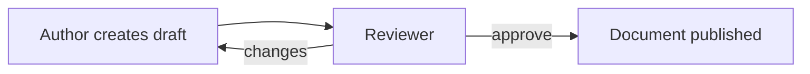

# Experiment Prompt: review-medium

Use `$evidence-grounded-diagrams` from
`transmutations/evidence-grounded-diagrams` in review mode. Do not modify or
persist a corrected revision.

Review this Mermaid source against the evidence below:

Evidence:

- `POL-12 §3`: reviewer may approve that version or request changes.
- `POL-12 §4`: author may submit a new version after requested changes.

Return a read-only verdict, first blocker, and smallest corrections.
